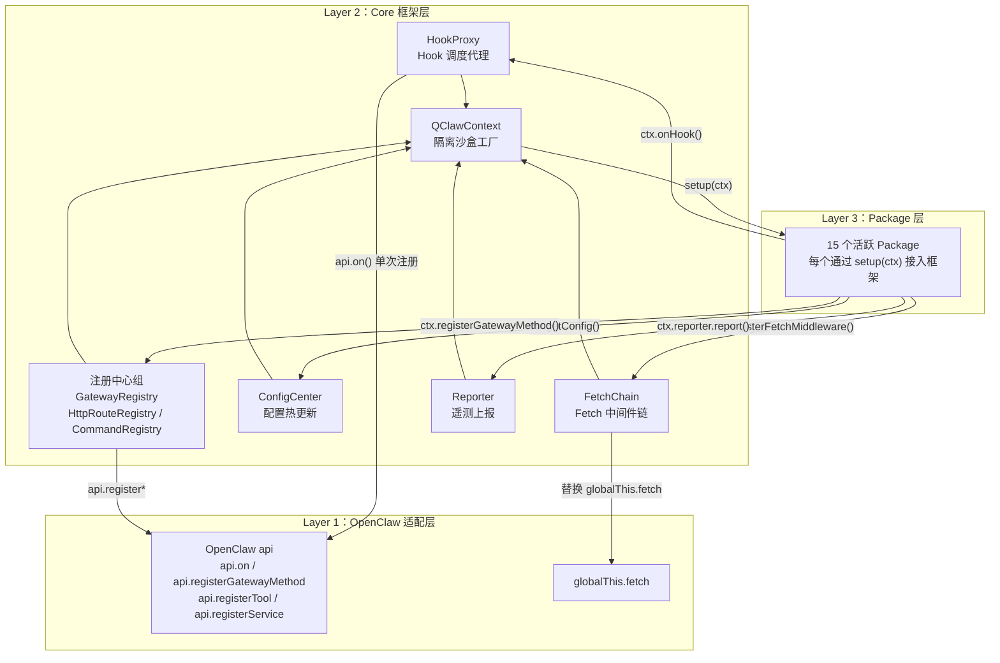
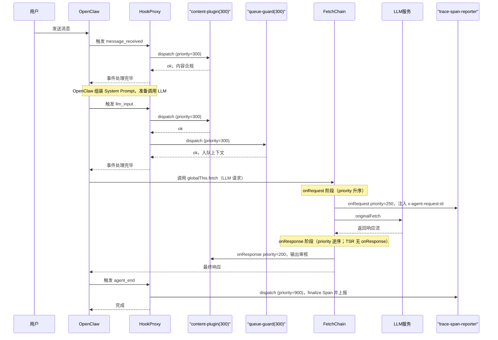

# qclaw-plugin 架构探索


## 一、qclaw-plugin 是什么 ？

**qclaw-plugin** 是一个标准 OpenClaw，它在内部构建了一个调度管理机制，管理着 Qclaw多个功能模块，每个模块独立开发。所以 qclaw-plugin对外是普通 OpenClaw 插件，对内其实是一套管理调度框架。

---

## 二、qclaw-plugin 文件结构

阅读 qclaw-plugin 源码，整体目录结构如下：

```
qclaw-plugin/
├── index.ts                    ← 插件主入口
├── openclaw.plugin.json        ← OpenClaw 插件声明
├── package.json / tsconfig.json / vitest.config.ts
│
├── core/                       ← 框架核心层（基础设施）
│   ├── types.ts
│   ├── hook-proxy.ts
│   ├── fetch-chain.ts
│   ├── config-center.ts
│   ├── context.ts
│   ├── reporter.ts + reporter-types.ts + reporter-constants.ts + reporter-utils.ts
│   ├── logger.ts
│   ├── gateway-registry.ts
│   ├── http-route-registry.ts
│   └── command-registry.ts
│
└── packages/                   ← 功能模块层（15 个活跃 Package + 1 个公共库；tool-sandbox 已下线）
    ├── shared/                 ← 公共工具库（非 Package）
    ├── trace-span-reporter/
    ├── error-response-handler/
    ├── content-plugin/
    ├── pcmgr-ai-security/
    ├── skill-interceptor/
    ├── tool-sandbox/             ← 已下线，不在 index.ts PACKAGES 中
    ├── queue-guard/
    ├── qmemory/
    ├── auto-memory/
    ├── prompt-optimizer/
    ├── prompt-inspector/
    ├── cron-delivery-guard/
    ├── workspace-summary/
    ├── data-sync-report/
    ├── skill-usage-analyzer/
    └── agent-browser-reporter/
```

### 2.1 顶层文件

| 文件 | 作用 |
|------|------|
| `index.ts` | 插件主入口：维护 `PACKAGES` 数组、实现 `register(api)`、初始化所有核心模块、按序调用每个 Package 的 `setup(ctx)` |
| `openclaw.plugin.json` | OpenClaw 插件声明文件，告知运行时插件 id、入口路径和所需权限 |
| `package.json` / `tsconfig.json` | 工程依赖与 TypeScript 编译配置 |
| `vitest.config.ts` | 单元测试配置（Package 可独立于 OpenClaw 运行时测试） |

### 2.2 core 层

`core/` 是整个框架的基础设施，Package 层通过 `QClawContext` 间接使用这里的所有能力，而不直接依赖这些类。

| 文件 | 暴露的核心内容 | 职责一句话 |
|------|---------------|-----------|
| `types.ts` | `QClawPackage`、`QClawContext`、`HookEvent`、`FetchMiddleware` 等 | 所有跨模块共享的 TypeScript 类型定义，是整个框架的「契约文件」 |
| `hook-proxy.ts` | `class HookProxy` | Hook 调度代理：对每个事件只向 OpenClaw 注册一次 `api.on()`，内部按 priority 分发给各 Package |
| `fetch-chain.ts` | `class FetchChain` | Fetch 中间件链：进程级单例保护，洋葱模型执行，三段路径（onRequest / onResponse / onError） |
| `config-center.ts` | `class ConfigCenter` | 配置热更新：`fs.watch` + 10s TTL 双保障，按 packageId 精准 diff 通知 |
| `context.ts` | `createQClawContext()` | QClawContext 工厂函数：为每个 Package 创建绑定了 packageId 的专属隔离沙盒 |
| `reporter.ts` | `class QClawReporter` | 遥测上报：初始化上报 SDK，`createPackageReporter()` 为每个 Package 创建自动注入 page_id 的上报代理 |
| `logger.ts` | `createLogger()` | 日志工具：输出携带 `[qclaw-plugin:<packageId>]` 前缀，便于日志溯源 |
| `gateway-registry.ts` | `class GatewayRegistry` | Gateway RPC 方法注册：自动在方法名前加 `qclaw-plugin.<packageId>.` 命名空间前缀 |
| `http-route-registry.ts` | `class HttpRouteRegistry` | HTTP 路由注册：自动在路径前加 `/qclaw-plugin/<packageId>/` 前缀 |
| `command-registry.ts` | `class CommandRegistry` | 聊天命令注册：用户在对话框输入 `/command` 时触发 |

### 2.3 packages 功能模块和划分

每个 Package 是一个实现了 `QClawPackage` 接口的对象，通过 `setup(ctx)` 接入框架。部分复杂 Package 将逻辑拆分到多个辅助文件中。

**可观测性**

| Package | 定位 |
|---------|------|
| `trace-span-reporter` | 重建 Agent 生命周期为 OpenTelemetry Span 并上报；常量和类型独立成文件避免循环依赖 |

**可靠性**

| Package | 定位 |
|---------|------|
| `qmemory` | WAL 检查点记录任务进度，进程崩溃后透明恢复 |
| `auto-memory` | 在 `agent_end` 异步提取对话要点写入 daily/MEMORY.md；下轮对话由模型通过 `read_file` 读取（非 prompt 注入）；DESIGN.md 记录了 djb2 锚点设计 |

**安全与合规**

| Package | 定位 |
|---------|------|
| `content-plugin` | 覆盖 Agent 9 个生命周期事件的内容安全审核与遥测上报 |
| `pcmgr-ai-security` | 对接 LLMShieldClient 做 AI 行为审计，带熔断器（Fail-Open） |
| `skill-interceptor` | 拦截 Skill 调用三种入口，对接四种授权后端；逻辑按职责拆分到多文件 |
| `tool-sandbox` | （已下线）Windows 专属 PowerShell wrapper 降权 exec；源码仍保留于 packages/，未加入 PACKAGES |

**性能与资源治理**

| Package | 定位 |
|---------|------|
| `queue-guard` | LLM 请求排队等待资源；鉴权逻辑（AES / JPrx 签名）独立成文件 |
| `error-response-handler` | 将 LLM 的 HTTP 错误码转换为外部渠道 SDK 能解析的 SSE 格式 |

**Prompt 工程**

| Package | 定位 |
|---------|------|
| `prompt-optimizer` | 重排 System Prompt 减少 KV Cache miss |
| `prompt-inspector` | 开发调试工具，无侵入采集每个 Package 对 Prompt 的修改链 |

**运营支撑**

| Package | 定位 |
|---------|------|
| `cron-delivery-guard` | 纠正 LLM 创建定时任务时的系统性参数偏差 |
| `workspace-summary` | 仅在有 `.md` 产物时触发异步摘要生成 |
| `data-sync-report` | 登录态驱动的后台数据同步服务 |
| `skill-usage-analyzer` | 本地统计 Skill 使用频率，原子写入防脏读 |
| `agent-browser-reporter` | 采集 Agent 浏览器自动化命令的成败数据 |

**公共库（非 Package）**

`shared/` 不实现 `QClawPackage` 接口，是多个 Package 共用的工具函数库：
- `message-utils.ts`：消息处理工具函数
- `security-marker.ts`：安全标记工具，供 content-plugin / pcmgr-ai-security 共用

---

## 三、架构设计与数据流转

### 3.1 三层架构

qclaw-plugin 的内部结构分为三层，**依赖方向单向向下**——Package 层只能通过 QClawContext 访问框架能力，框架层才与 OpenClaw 运行时直接交互：



### 3.2 四个核心模块职责

**HookProxy**：Hook（事件钩子）调度中心。对每个 OpenClaw 事件名只调用一次 `api.on()`，内部维护一张按 `priority` 排序的 handler 列表。每次事件触发时，由 `dispatch()` 按序执行，支持 block 语义（违规时阻断后续 handler）、params 改写语义（将修改后的参数传递给下游）和 Observer 模式（无侵入观察所有 handler 的执行结果）。

**FetchChain**：`globalThis.fetch` 的统一拦截层。采用洋葱模型——请求按 priority 升序流过各中间件的 `onRequest`，到达真实网络后，响应按逆序流过各中间件的 `onResponse`。进程级单例保护确保 OpenClaw 多次调用 `register()` 时不会重复包裹 fetch。执行细节与扩展指南见 [03-qclaw-fetch-chain-deep-dive.md](./03-qclaw-fetch-chain-deep-dive.md)。

**ConfigCenter**：配置热更新中心。合并两层来源（文件配置 + 静态配置），通过 `fs.watch` + 10s TTL 双保障感知变更，按 packageId 做 diff 后精准通知受影响的 Package。

**QClawContext**：Package 的隔离沙盒。`createQClawContext()` 工厂函数为每个 Package 创建专属实例，绑定 packageId 后，所有 logger / reporter / getConfig 调用自动携带身份标识。Package 只依赖 `QClawContext`，不持有任何 OpenClaw API 引用。

### 3.3 数据流转：一次 LLM 请求的完整生命周期

下图展示从用户发送消息到收到 LLM 响应，数据如何在 OpenClaw、HookProxy、各 Package 和 FetchChain 之间流转：



**流程说明**：

- **Hook 阶段**：OpenClaw 在生命周期关键节点（`message_received`、`llm_input`、`agent_end` 等）触发事件，HookProxy 按 priority 顺序调度各 Package 的 handler。如有 Package 返回 `{ block: true }`，后续所有 handler 立即跳过。
- **Fetch 阶段**：LLM 网络请求被 FetchChain 拦截，经过洋葱中间件链处理后发出，响应再逆向流回。
- **两阶段并行存在**：Hook 事件处理和 Fetch 拦截是独立的两条流水线，一个 Package 可以同时参与（如 content-plugin 既注册了 Hook 又注册了 FetchMiddleware）。

---

## 四、设计优势分析

### 4.1 聚合模式的工程价值

`fetch-chain.ts` 开头注释明确写道：

> *"OpenClaw 会为不同运行上下文（多 agent + gateway）多次调用插件的 register()，每次都会创建新的 FetchChain 实例。如果不做单例保护，会导致多层拦截器嵌套，使每个请求被 middleware 重复处理 N 次。"*

这段话揭示了「各功能模块分散管理时」会遇到的根本问题：没有统一调度层时，多个功能各自覆盖 `globalThis.fetch`，其嵌套顺序取决于加载顺序，没有任何文档保证；Hook 注册同理，多个 handler 竞争同一事件时 OpenClaw 无法保证执行顺序，也无法跨 handler 传递 block 语义。

qclaw-plugin 通过聚合框架解决了这些问题，对比效果如下：

| 维度 | 无框架的多功能模式 | qclaw-plugin 聚合模式 |
|------|-------------------|---------------------|
| Hook 执行顺序 | 多个 handler 竞争 `api.on()`，顺序不可控 | HookProxy 按 priority 数值统一调度 |
| Block 语义传递 | handler 之间互不感知，无法跨 handler 传递 | HookProxy dispatch 统一管理 blocked 状态 |
| Fetch 拦截顺序 | 多层嵌套，顺序取决于模块加载顺序 | FetchChain 单层洋葱，顺序由 priority 决定 |
| 重复初始化 | OpenClaw 多次调 `register()` 导致多次包裹 | 进程级单例保护，合并到已安装实例 |
| 配置管理 | 各自为政，N 个 `fs.watch` 实例 | ConfigCenter 统一分发，1 个 watcher |
| 跨模块通讯 | 全局变量或额外 npm 包 | `getPackageApi()` 标准接口 |
| 错误隔离 | 单个功能崩溃影响不可控 | `try/catch` 隔离，单 Package 失败不影响其他 |
| 可测试性 | 必须依赖完整 OpenClaw 运行时 | mock `QClawContext` 即可独立单元测试 |

### 4.2 设计优点

以下设计原则均可在源码注释或代码结构中找到对应证据。

---

**原则一：单一注册点**

多个 Package 注册同一个 Hook 事件时，只有第一个触发 `api.on()`，后续 Package 只追加进内部 handler 列表。这避免了 OpenClaw 层面多 handler 语义的不确定性，也让 block 跨 Package 传递成为可能。

代码证据（`core/hook-proxy.ts` 第 80-86 行）：

```typescript
if (!this.registered.has(event)) {
  this.registered.add(event)
  this.api.on(event, async (...args) => this.dispatch(event, args))
}
```

---

**原则二：Package 自治**

每个 Package 的 `setup()` 只接受 `QClawContext` 一个参数，所有 logger / reporter / getConfig 调用自动绑定 packageId，无需手动传递。Package 不持有 OpenClaw API 引用，因此可以在完全不启动运行时的情况下进行单元测试。

代码证据（`core/context.ts` 第 55-68 行）：每个 Package 获取的 `ctx` 是独立实例，三个自动绑定在工厂函数内完成：

```typescript
ctx.logger.info('...')       // → [qclaw-plugin:pcmgr-ai-security] ...
ctx.reporter.report(event)   // → 自动注入 { page_id: 'pcmgr-ai-security' }
ctx.getConfig<MyConfig>()    // → 只返回 config['pcmgr-ai-security'] 的配置切片
```

---

**原则三：优先级决定执行顺序**

执行顺序通过 `priority` 数值显式声明，与代码位置和注册顺序无关。新 Package 加入时，只需在优先级规范里找到自己的位置，无需阅读其他 Package 的代码。

代码证据（`core/hook-proxy.ts` 第 76-77 行）：

```typescript
list.sort((a, b) => a.priority - b.priority)
```

handler 列表在每次注册后重排——**执行顺序是架构决策，应该显式声明，而不是隐式约定**。

---

**原则四：不阻塞流程**

Package 初始化失败时，框架记录错误日志后继续初始化下一个 Package，不整体阻断。

代码证据（`index.ts` Package 初始化循环）：

```typescript
for (const pkg of PACKAGES) {
  try {
    pkg.setup(ctx)
    initializedPackages.set(pkg.id, pkg)
  } catch (err) {
    console.error(`${LOG_TAG} ✗ ${pkg.id} setup failed:`, err)
    // 继续初始化下一个 package
  }
}
```

对工具而言，**误拦截（false positive）的代价远高于漏拦截（false negative）**——部分模块的不可用，总比整个工具失去能力要好，当然如果必须加载模块要另说。

**原则五：易于扩展**
定义了统一的API，只需要实现相关接口，就可以扩展其它功能模块

```typescript
/**
 * 如何新建一个 Package
 * **/
// packages/my-feature/index.ts
import type { QClawPackage, QClawContext } from '../../core/types.js'

interface MyConfig { enabled?: boolean }

const myFeature: QClawPackage = {
  id: 'my-feature',
  name: '我的功能',
  description: '功能描述',

  configSchema: {
    type: 'object',
    additionalProperties: false,
    properties: { enabled: { type: 'boolean', default: true } },
  },

  setup(ctx: QClawContext): void {
    const { enabled } = ctx.getConfig<MyConfig>()
    if (enabled === false) { ctx.logger.info('disabled'); return }

    ctx.onHook('before_tool_call', async (event) => {
      ctx.logger.info(`tool: ${String(event.toolName)}`)
    }, { priority: 500 })

    ctx.registerFetchMiddleware({
      id: 'my-feature',
      priority: 500,
      match: (input) => String(input).includes('/v1/messages'),
      onRequest: async (reqCtx) => reqCtx,
      onResponse: async ({ response }) => response,
      onError: async () => { /* 可选：originalFetch 抛出时的处理 */ },
    })

    ctx.logger.info('initialized')
  },
}

export default myFeature
```

将 Package 加入主入口的 `PACKAGES` 数组即完成接入：

```typescript
// index.ts
import myFeature from './packages/my-feature/index.js'
const PACKAGES: QClawPackage[] = [ /* ...其他 package... */, myFeature ]
```
---


## 五、： Packages 功能分类

### 5.1 QClawPackage 接口

所有 Package 必须实现的核心契约：

```typescript
export interface QClawPackage {
  id: string           // 全局唯一标识，用于日志前缀、配置分组、跨 Package 通讯
  name: string
  description: string

  // JSON Schema 定义配置结构，additionalProperties: false 强制严格模式
  configSchema?: { type: 'object'; additionalProperties: false; properties: Record<string, unknown> }

  // 配置解析钩子：类型转换、环境变量注入、默认值填充（各 Package 自行实现）
  parseConfig?(raw: unknown, env?: NodeJS.ProcessEnv): unknown

  // 初始化入口（支持异步，但框架不会 await，异步 setup 在后台执行）
  setup(ctx: QClawContext): void | Promise<void>

  // 跨 Package 通讯的唯一合法途径
  getPublicApi?(): unknown

  // 清理钩子：关闭定时器、连接等
  teardown?(): void | Promise<void>
}
```


### 5.3 优先级分配规范

优先级不是随意分配的数字，而是有明确产品语义的架构决策：

| Priority | Package | 事件/类型 | 产品语义 |
|:--------:|---------|:--------:|---------|
| 50 | error-response-handler | FetchMiddleware | 最外层兜底：所有中间件处理完后翻译 HTTP 错误 |
| 100 | trace-span-reporter | 多数 Hook | Span 采集最先执行，时间戳覆盖完整调用链 |
| 200 | content-plugin | FetchMiddleware + 部分 Hook | 内容安全（`before_prompt_build` 等） |
| 250 | trace-span-reporter | FetchMiddleware | 注入 `x-agent-request-id` header |
| 250 | pcmgr-ai-security | `before_tool_call` | AI 安全检测工具调用 |
| 280 | skill-interceptor | Hook | Skill 授权拦截 |
| 300 | queue-guard | FetchMiddleware + `llm_input` | 安全检测通过后才排队等待模型资源 |
| 300 | content-plugin | `before_agent_start` / `llm_input` 等 | 内容安全覆盖 Agent 完整生命周期 |
| 400 | cron-delivery-guard | Hook | Cron 投递参数守卫 |
| 500 | 默认值 | — | 未指定 priority 时的默认值 |
| 500 | pcmgr-ai-security | `llm_input` | 未传 priority 参数，走默认 |
| 900 | prompt-optimizer | FetchMiddleware | 在 onRequest 末段重排 System Prompt |
| 900 | trace-span-reporter | `agent_end` | 延迟 finalize，等待 `llm_output` 写入 usage |
| 950 | prompt-inspector | Hook + FetchMiddleware | 调试工具；Fetch onResponse 最先执行以捕获原始响应 |

**核心原则**：观测（100）→ 安全（200/250/280）→ 排队（300）→ 业务（400~500）→ 调试（950）。兜底层（50）在 onResponse 最外。

---

### 5.4 各 Package 分组介绍

#### 可观测性组

**trace-span-reporter**：*将 Agent 离散的生命周期事件重建为可观测的调用链 Span。*
将 run/turn/llm_request/tool_execution 生命周期重建为 OpenTelemetry Span 并上报。核心挑战是 `agent_end` 事件比 `llm_output` 更早到来——所以 `agent_end` 时只标记 `ended=true`，等 `llm_output` 携带 token usage 后再最终上报（这就是 `agent_end` 的 priority 例外值 900 的原因）。FetchMiddleware 向每个 LLM 请求注入 `x-agent-request-id` header，实现跨服务的 Span 关联。

---

#### 可靠性组

**qmemory**：*用 WAL 检查点记录任务进度，进程崩溃后自动恢复。*
在 `before_tool_call` / `after_tool_call` / `agent_end` 三个时机打点，进程崩溃重启后，通过 FetchMiddleware 在 `onRequest` 阶段透明注入恢复上下文到 LLM 请求的 messages 数组中。提供 `/status`、`/dismiss`、`/cleanup` HTTP 接口和 `/resume` 聊天命令。

**auto-memory**：*自动将对话要点沉淀为长期记忆文件，供下轮对话读取。*
在 `agent_end` 时异步提取对话要点写入 `memory/YYYY-MM-DD.md`，定时合并为 `MEMORY.md`；下轮 session 中模型通过 `read_file` 读取 MEMORY.md（见 DESIGN.md），**不在 `before_prompt_build` 注入**。游标使用 djb2 hash 锚点防漂移——纯行号索引会因 messages compact 而偏移。

---

#### 安全与合规组

**content-plugin**：*覆盖 Agent 完整生命周期的内容安全审核与遥测上报。*
监听 9 个生命周期事件（`message_received` 到 `agent_end`），同时承担 OTLP/OpenTelemetry 遥测。通过 `Symbol.for('openclaw.contentPluginReportBridge')` 对外暴露上报桥接接口，无需 import 即可调用。

**pcmgr-ai-security**：*对接 LLMShieldClient 做 AI 行为审计，安全服务不可用时自动降级放行（Fail-Open）。*
带熔断器保障，安全开关通过独立的远端接口实时拉取，不依赖 ConfigCenter，支持秒级灰度切换。

**skill-interceptor**：*拦截 Skill 调用的三种入口，对接四种授权后端验证使用权限。*
支持 `use_skill` 工具调用 / `read` 读取 / `exec` 执行三种入口，授权结果在 session 维度缓存，PC 端和外部渠道使用不同的阻断 UI 策略。

**tool-sandbox**（已下线）：*Windows 专属，用 PowerShell wrapper 对 exec 工具进行降权执行。*
源码仍保留于 `packages/tool-sandbox/`，但 `index.ts` PACKAGES 注释标明已下线，不再参与运行时调度。

---

#### 性能与资源治理组

**queue-guard**：*高峰期让 LLM 请求排队等待资源，避免并发打爆网关。*
核心工程挑战是跨层上下文传递：Hook 层能获取 `sessionKey`，但 FetchMiddleware 不能——通过 FIFO 队列桥接。用户取消排队时，通过 `shortCircuitResponse` 注入模拟的 LLM 响应而非返回错误。

**error-response-handler**：*将 LLM 服务的 HTTP 错误码转换为外部渠道 SDK 能解析的 SSE 格式。*
严格按 Anthropic SSE 事件序列组装（`message_start` → `content_block_delta` → `message_stop`），错误文案从远端动态拉取，刷新间隔 6h + 随机抖动防止多客户端同时刷新。

---

#### Prompt 工程组

**prompt-optimizer**：*重排 System Prompt 结构，减少因用户差异导致的 KV Cache miss。*
将真实路径替换为 `{workspace_root_dir:agent-xxx}` 占位符，支持 stale-while-revalidate 模式从远端拉取优化策略。

**prompt-inspector**：*开发调试工具，无侵入地采集每个 Package 对 Prompt 和 LLM 请求的完整修改链。*
通过订阅 `onHookHandlerExecuted` 和 `onMiddlewareExecuted` 回调采集数据，三层门控（环境变量 + ConfigCenter + 窗口状态）确保生产环境不会意外启用。

---

#### 运营支撑组

**cron-delivery-guard**：*纠正 LLM 创建定时任务时的系统性参数偏差。*
LLM 经常漏填 `channel/to` 或输出 `mode=none`，Package 通过解析 sessionKey 推断正确渠道参数并自动改写。

**workspace-summary**：*仅在有 `.md` 产物时触发异步摘要生成，避免空跑。*

**data-sync-report**：*登录态驱动的后台数据同步服务，`/login` 开始、`/logout` 停止。*

**skill-usage-analyzer**：*在灰度用户中本地统计 Skill 使用频率，结果原子写入防脏读。*
使用 readline 流式处理 JSONL 历史文件，`tmp + rename` 原子写入。

**agent-browser-reporter**：*采集 Agent 浏览器自动化命令的成败数据，应对不同 CLI 工具的不一致输出。*
采用五级判定策略（`event.error` → JSON ok/success → exit code → Unicode 符号 → 默认成功）。

---


