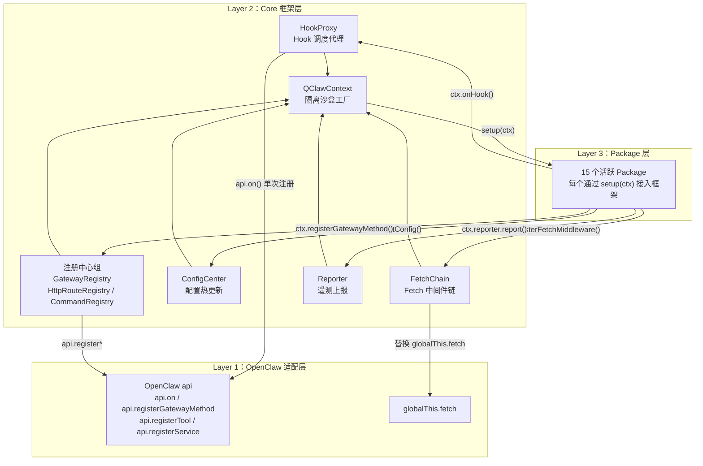
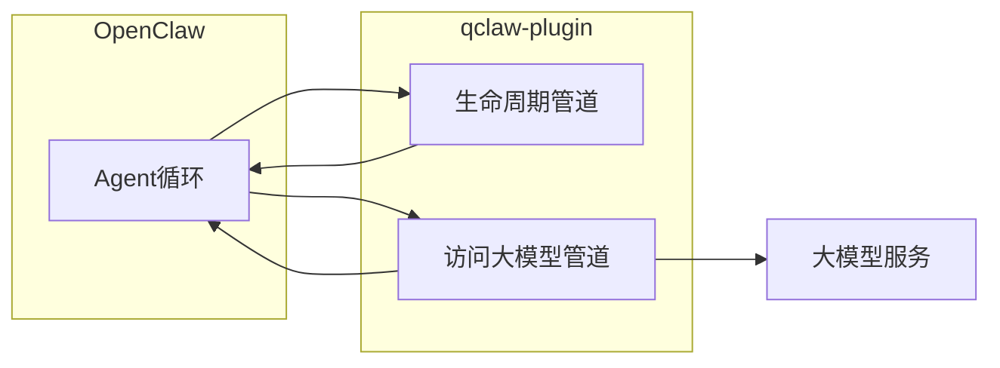

# qclaw-plugin 架构探索

> **阅读提示**
>
> - **Hook（生命周期管道）**：OpenClaw 在固定时机回调插件（如消息进入、即将调模型、工具调用前后）。
> - **Fetch 链（访问大模型管道）**：所有发往 LLM 的 HTTP 请求的统一出入口，按 priority 一层层处理后再上网。
> - **priority**：数字越小越先执行（Fetch 的 onResponse 阶段为逆序，即 priority **大**的先处理返回体）。完整 Hook / Fetch 优先级表以 [02 附录（可选）](./02-qclaw-plugin-data-journey.md#appendix-dev) 为唯一维护点。
> - **与 02 同步（2026-05-30）**：`message_received` 上 content-plugin 为默认 priority **500**（trace-span-reporter 为 **100**，更早执行）；prompt-inspector 的 Fetch 为 **950**；qmemory 的 `session_start` / `session_end` 不经 HookProxy。
> - **版本**：正文基于**未混淆** qclaw-plugin 梳理；QClaw **0.2.5+** 安装包内插件可能已混淆，以设计与行为描述为准，不保证与安装包逐行对照。

---

## 一、qclaw-plugin 是什么 ？

**qclaw-plugin** 是一个标准的 OpenClaw 插件。它在内部构建了一套调度管理机制，管理着 QClaw 的多个功能模块（Package），各模块可独立开发。qclaw-plugin 对外与普通插件一样注册进 OpenClaw；对内则是一套带 Hook 代理与 Fetch 中间件链的**管理调度框架**。

详细时序与 Fetch 关卡见 [02 从发消息到看见回复](./02-qclaw-plugin-data-journey.md)；FetchChain 机制见 [03](./03-qclaw-fetch-chain-deep-dive.md)。

---

## 二、qclaw-plugin 文件结构

不必记住每个文件名，只需建立两层印象：**`core/` = 框架基础设施**，**`packages/` = 15 个活跃功能模块**（另有 `shared/` 公共库，不是 Package）。

整体目录结构如下：

```
qclaw-plugin/
├── index.ts                    ← 插件主入口
├── openclaw.plugin.json        ← OpenClaw 插件声明
├── package.json / tsconfig.json / vitest.config.ts
│
├── core/                       ← 框架核心层（基础设施）
│   ├── types.ts
│   ├── hook-proxy.ts
│   ├── fetch-chain.ts
│   ├── config-center.ts
│   ├── context.ts
│   ├── reporter.ts + reporter-types.ts + reporter-constants.ts + reporter-utils.ts
│   ├── logger.ts
│   ├── gateway-registry.ts
│   ├── http-route-registry.ts
│   └── command-registry.ts
│
└── packages/                   ← 功能模块层（15 个活跃 Package + 1 个公共库；tool-sandbox 已下线）
    ├── shared/                 ← 公共工具库（非 Package）
    ├── trace-span-reporter/
    ├── error-response-handler/
    ├── content-plugin/
    ├── pcmgr-ai-security/
    ├── skill-interceptor/
    ├── tool-sandbox/             ← 已下线，不在 index.ts PACKAGES 中
    ├── queue-guard/
    ├── qmemory/
    ├── auto-memory/
    ├── prompt-optimizer/
    ├── prompt-inspector/
    ├── cron-delivery-guard/
    ├── workspace-summary/
    ├── data-sync-report/
    ├── skill-usage-analyzer/
    └── agent-browser-reporter/
```

### 2.1 顶层文件

| 文件 | 作用 |
|------|------|
| `index.ts` | 插件主入口：维护 `PACKAGES` 数组、实现 `register(api)`、初始化所有核心模块、按序调用每个 Package 的 `setup(ctx)` |
| `openclaw.plugin.json` | OpenClaw 插件声明文件，告知运行时插件 id、入口路径和所需权限 |
| `package.json` / `tsconfig.json` | 工程依赖与 TypeScript 编译配置 |
| `vitest.config.ts` | 单元测试配置（Package 可独立于 OpenClaw 运行时测试） |

### 2.2 core 层

`core/` 是整个框架的基础设施，Package 层通过 `QClawContext` 间接使用这里的所有能力，而不直接依赖这些类。

| 文件 | 暴露的核心内容 | 职责一句话 |
|------|---------------|-----------|
| `types.ts` | `QClawPackage`、`QClawContext`、`HookEvent`、`FetchMiddleware` 等 | 所有跨模块共享的 TypeScript 类型定义，是整个框架的「契约文件」 |
| `hook-proxy.ts` | `class HookProxy` | Hook 调度代理：对每个事件只向 OpenClaw 注册一次 `api.on()`，内部按 priority 分发给各 Package |
| `fetch-chain.ts` | `class FetchChain` | Fetch 中间件链：进程级单例保护，洋葱模型执行，三段路径（onRequest / onResponse / onError） |
| `config-center.ts` | `class ConfigCenter` | 配置热更新：`fs.watch` + 10s TTL 双保障，按 packageId 精准 diff 通知 |
| `context.ts` | `createQClawContext()` | QClawContext 工厂函数：为每个 Package 创建绑定了 packageId 的专属隔离沙盒 |
| `reporter.ts` | `class QClawReporter` | 遥测上报：初始化上报 SDK，`createPackageReporter()` 为每个 Package 创建自动注入 page_id 的上报代理 |
| `logger.ts` | `createLogger()` | 日志工具：输出携带 `[qclaw-plugin:<packageId>]` 前缀，便于日志溯源 |
| `gateway-registry.ts` | `class GatewayRegistry` | Gateway RPC 方法注册：自动在方法名前加 `qclaw-plugin.<packageId>.` 命名空间前缀 |
| `http-route-registry.ts` | `class HttpRouteRegistry` | HTTP 路由注册：自动在路径前加 `/qclaw-plugin/<packageId>/` 前缀 |
| `command-registry.ts` | `class CommandRegistry` | 聊天命令注册：用户在对话框输入 `/command` 时触发 |

### 2.3 packages 功能模块和划分

每个 Package 是一个实现了 `QClawPackage` 接口的对象，通过 `setup(ctx)` 接入框架。部分复杂 Package 将逻辑拆分到多个辅助文件中。

**可观测性**

| Package | 定位 |
|---------|------|
| `trace-span-reporter` | 重建 Agent 生命周期为 OpenTelemetry Span 并上报；常量和类型独立成文件避免循环依赖 |

**可靠性**

| Package | 定位 |
|---------|------|
| `qmemory` | WAL 检查点记录任务进度，进程崩溃后透明恢复 |
| `auto-memory` | 在 `agent_end` 异步提取对话要点写入 daily/MEMORY.md；下轮对话由模型通过 `read_file` 读取（非 prompt 注入）；DESIGN.md 记录了 djb2 锚点设计 |

**安全与合规**

| Package | 定位 |
|---------|------|
| `content-plugin` | 覆盖 Agent 9 个生命周期事件的内容安全审核与遥测上报 |
| `pcmgr-ai-security` | 对接 LLMShieldClient 做 AI 行为审计，带熔断器（Fail-Open） |
| `skill-interceptor` | 拦截 Skill 调用三种入口，对接四种授权后端；逻辑按职责拆分到多文件 |
| `tool-sandbox` | （已下线）Windows 专属 PowerShell wrapper 降权 exec；源码仍保留于 packages/，未加入 PACKAGES |

**性能与资源治理**

| Package | 定位 |
|---------|------|
| `queue-guard` | LLM 请求排队等待资源；鉴权逻辑（AES / JPrx 签名）独立成文件 |
| `error-response-handler` | 将 LLM 的 HTTP 错误码转换为外部渠道 SDK 能解析的 SSE 格式 |

**Prompt 工程**

| Package | 定位 |
|---------|------|
| `prompt-optimizer` | 重排 System Prompt 减少 KV Cache miss |
| `prompt-inspector` | 开发调试工具，无侵入采集每个 Package 对 Prompt 的修改链 |

**运营支撑**

| Package | 定位 |
|---------|------|
| `cron-delivery-guard` | 纠正 LLM 创建定时任务时的系统性参数偏差 |
| `workspace-summary` | 仅在有 `.md` 产物时触发异步摘要生成 |
| `data-sync-report` | 登录态驱动的后台数据同步服务 |
| `skill-usage-analyzer` | 本地统计 Skill 使用频率，原子写入防脏读 |
| `agent-browser-reporter` | 采集 Agent 浏览器自动化命令的成败数据 |

**公共库（非 Package）**

`shared/` 不实现 `QClawPackage` 接口，是多个 Package 共用的工具函数库：
- `message-utils.ts`：消息处理工具函数
- `security-marker.ts`：安全标记工具，供 content-plugin / pcmgr-ai-security 共用

---

## 三、架构设计与数据流转

### 3.1 三层架构

qclaw-plugin 的内部结构分为三层，**依赖方向单向向下**——Package 层只能通过 QClawContext 访问框架能力，框架层才与 OpenClaw 运行时直接交互：



### 3.2 四个核心模块职责

**HookProxy**：Hook（事件钩子）调度中心。对每个 OpenClaw 事件名只调用一次 `api.on()`，内部维护一张按 `priority` 排序的 handler 列表。每次事件触发时，由 `dispatch()` 按序执行，支持 block 语义（违规时阻断后续 handler）、params 改写语义（将修改后的参数传递给下游）和 Observer 模式（无侵入观察所有 handler 的执行结果）。

**FetchChain**：`globalThis.fetch` 的统一拦截层。采用洋葱模型——请求按 priority 升序流过各中间件的 `onRequest`，到达真实网络后，响应按逆序流过各中间件的 `onResponse`。进程级单例保护确保 OpenClaw 多次调用 `register()` 时不会重复包裹 fetch。执行细节与扩展指南见 [03-qclaw-fetch-chain-deep-dive.md](./03-qclaw-fetch-chain-deep-dive.md)。

**ConfigCenter**：配置热更新中心。合并两层来源（文件配置 + 静态配置），通过 `fs.watch` + 10s TTL 双保障感知变更，按 packageId 做 diff 后精准通知受影响的 Package。

**QClawContext**：Package 的隔离沙盒。`createQClawContext()` 工厂函数为每个 Package 创建专属实例，绑定 packageId 后，所有 logger / reporter / getConfig 调用自动携带身份标识。Package 只依赖 `QClawContext`，不持有任何 OpenClaw API 引用。

### 3.3 一条 LLM 请求在框架里怎么走

从用户发消息到看见回复，数据会经过**两条彼此配合的管道**（完整时间线见 [02](./02-qclaw-plugin-data-journey.md)）：

- **生命周期管道（Hook）**：在消息进入、组 Prompt、即将调模型、工具调用、回合结束等节点，各 Package 按 priority 依次执行；可 `block` 阻断同事件后续 handler。
- **访问大模型管道（Fetch）**：每次访问 LLM 的 HTTP 请求按 priority **从小到大**经过恢复注入、内容审核、链路 ID、AI 审计、排队放行、Prompt 优化等关卡，再访问网络；返回时顺序相反。审核未通过或用户取消排队时，可在不发真实 HTTP 的情况下返回模拟流式响应（shortCircuit）。



**本篇不维护 priority 数字表**。各关卡模块名与顺序以 [02 §等模型回复时](./02-qclaw-plugin-data-journey.md#等模型回复时请求经过哪些关卡) 及 [02 附录](./02-qclaw-plugin-data-journey.md#appendix-dev) 为准。

**流程说明**：

- **Hook 阶段**：OpenClaw 在生命周期关键节点（`message_received`、`llm_input`、`agent_end` 等）触发事件，HookProxy 按 priority 顺序调度各 Package 的 handler。如有 Package 返回 `{ block: true }`，后续所有 handler 立即跳过。
- **Fetch 阶段**：LLM 网络请求被 FetchChain 拦截，经过洋葱中间件链处理后发出，响应再逆向流回。
- **两阶段并行存在**：Hook 事件处理和 Fetch 拦截是独立的两条流水线，一个 Package 可以同时参与（如 content-plugin 既注册了 Hook 又注册了 FetchMiddleware）。

---

## 四、设计优势分析

### 4.1 聚合模式的工程价值

QClaw / OpenClaw 在实际运行中可能为**多 Agent、多 Gateway** 等上下文**多次**调用插件的 `register()`。若每个功能各自包裹 `globalThis.fetch` 或重复 `api.on()`，同一用户消息会导致审核、排队、优化等逻辑被**重复执行 N 遍**，且嵌套顺序取决于加载顺序，无法文档化。

聚合框架用 **HookProxy**（每个事件只注册一次 OpenClaw 回调）和 **FetchChain**（进程级单例 + 中间件合并）解决上述问题。FetchChain 设计动机详见 [03 §一](./03-qclaw-fetch-chain-deep-dive.md)。

qclaw-plugin 通过聚合框架解决了这些问题，对比效果如下：

| 维度 | 无框架的多功能模式 | qclaw-plugin 聚合模式 |
|------|-------------------|---------------------|
| Hook 执行顺序 | 多个 handler 竞争 `api.on()`，顺序不可控 | HookProxy 按 priority 数值统一调度 |
| Block 语义传递 | handler 之间互不感知，无法跨 handler 传递 | HookProxy dispatch 统一管理 blocked 状态 |
| Fetch 拦截顺序 | 多层嵌套，顺序取决于模块加载顺序 | FetchChain 单层洋葱，顺序由 priority 决定 |
| 重复初始化 | OpenClaw 多次调 `register()` 导致多次包裹 | 进程级单例保护，合并到已安装实例 |
| 配置管理 | 各自为政，N 个 `fs.watch` 实例 | ConfigCenter 统一分发，1 个 watcher |
| 跨模块通讯 | 全局变量或额外 npm 包 | `getPackageApi()` 标准接口 |
| 错误隔离 | 单个功能崩溃影响不可控 | `try/catch` 隔离，单 Package 失败不影响其他 |
| 可测试性 | 必须依赖完整 OpenClaw 运行时 | mock `QClawContext` 即可独立单元测试 |

### 4.2 设计原则（机制对照）

| 原则 | 机制要点 | 解决什么问题 |
|------|----------|--------------|
| **单一注册点** | 每个 Hook 事件只对 OpenClaw 调用一次 `api.on()`，内部维护 handler 列表 | 顺序可控；`block` 可跨 Package 传递 |
| **Package 自治** | `setup(ctx)` 只收 `QClawContext`；logger / reporter / 配置自动带 packageId | 模块可独立测试；不直接碰 OpenClaw API |
| **priority 显式化** | 数字越小越先执行（Fetch onResponse 逆序） | 新模块加入时不依赖加载顺序 |
| **初始化失败不拖垮整插件** | 某 Package `setup` 抛错只记日志，继续加载下一个 | 非关键模块挂了，聊天/审核/调模型主路径仍可用 |
| **易于扩展** | 实现 `QClawPackage` + 注册 Hook / FetchMiddleware | 见下文五步清单；Fetch 细节见 [03 §七](./03-qclaw-fetch-chain-deep-dive.md) |

**原则四补充（与安全策略区分）**：上述「不拖垮整插件」针对**启动期模块加载**。用户消息是否被内容审核拦截、审核服务不可用时是否 Fail-Open，由 content-plugin、pcmgr-ai-security 等单独定义，见 [05 内容安全与合规](./05-qclaw-content-security-compliance.md)。

**扩展新 Package 五步清单：**

1. 在 `packages/` 下新建模块，实现 `id`、`name`、`description`、`setup(ctx)`（可选 `configSchema`）。
2. 在 `setup` 里用 `ctx.onHook(...)` 和/或 `ctx.registerFetchMiddleware(...)` 声明能力；为 Hook/Fetch 选择合适的 **priority**（对照 [02 附录](./02-qclaw-plugin-data-journey.md#appendix-dev)）。
3. 将模块加入插件入口的 **PACKAGES** 数组（顺序影响初始化先后，不影响运行时 Hook/Fetch 顺序）。
4. 内部再发 HTTP（拉配置、上报）时使用 **`ctx.getOriginalFetch()`**，避免走进自己的 Fetch 链。
5. 中间件异常时 **fail-open**（返回原请求/响应），避免整助手不可用。

---


## 五、Packages 功能分类

### 5.1 QClawPackage 接口（契约摘要）

| 字段 / 方法 | 作用 |
|-------------|------|
| `id` | 全局唯一：日志前缀、配置分组、跨 Package 通讯 |
| `name` / `description` | 展示用 |
| `configSchema` | 可选 JSON Schema，严格模式 |
| `parseConfig` | 可选，解析环境与默认值 |
| `setup(ctx)` | **必选**，注册 Hook / Fetch / 路由等 |
| `getPublicApi` | 可选，跨 Package 通讯唯一合法出口 |
| `teardown` | 可选，释放资源 |

### 5.3 优先级产品语义（简表）

完整 Hook / Fetch priority 表**只在 [02 附录](./02-qclaw-plugin-data-journey.md#appendix-dev) 维护**，避免与 01/03 漂移。

| 语义层 | 典型 priority | 含义 |
|--------|:-------------:|------|
| 观测 | 100 | Span / 采集尽量靠前，覆盖完整链路 |
| 安全 | 200 / 250 / 280 | 内容审核、AI 审计、Skill 授权 |
| 排队 | 300 | 安全相关上下文就绪后再等模型资源 |
| 业务 | 400～900 | 含 Prompt 优化（900，须在审核与排队之后） |
| 调试 | 950 | prompt-inspector；Fetch onResponse 最先 |
| 兜底 | 50 | error-response-handler；onResponse **最外** |

### 5.4 各组设计亮点（详见 §2.3）

§2.3 已按分组列出 15 个活跃 Package 的定位。此处只补充**跨篇值得记住的亮点**：

| 分组 | 亮点一句 |
|------|----------|
| 可观测性 | trace-span-reporter：`agent_end` 故意晚（900），等 `llm_output` 写入 token 后再 finalize |
| 可靠性 | qmemory：Hook 决策恢复、Fetch 改 body；auto-memory 不注入 Prompt，下轮 `read_file` |
| 安全 | 三分法见 [05](./05-qclaw-content-security-compliance.md)；queue-guard Hook→Fetch 队列桥接 |
| 性能 | prompt-optimizer 排在审核与排队之后（先审后发）；见 [04](./04-qclaw-prompt-cache-optimization.md) |
| 运营 | cron-delivery-guard 修正 LLM 建定时任务的渠道参数；workspace-summary 仅有 .md 产物才跑 |

---

*系列导航：时间线 [02](./02-qclaw-plugin-data-journey.md) · FetchChain [03](./03-qclaw-fetch-chain-deep-dive.md) · Prompt Cache [04](./04-qclaw-prompt-cache-optimization.md) · 安全 [05](./05-qclaw-content-security-compliance.md)*

