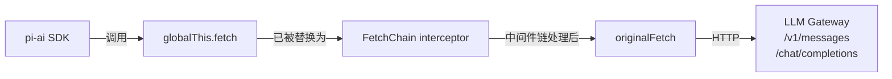
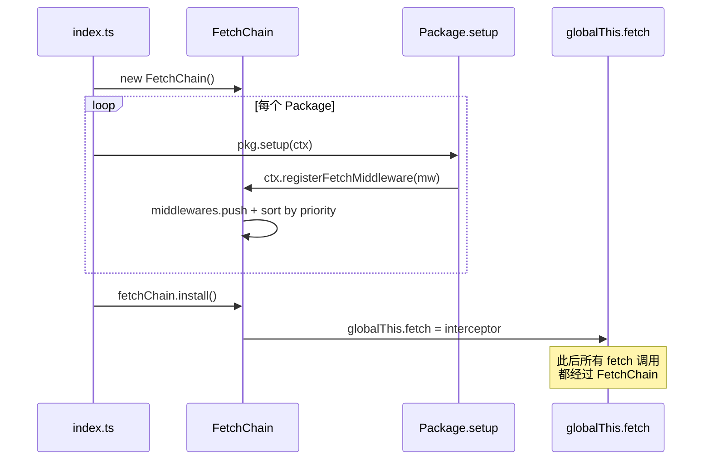
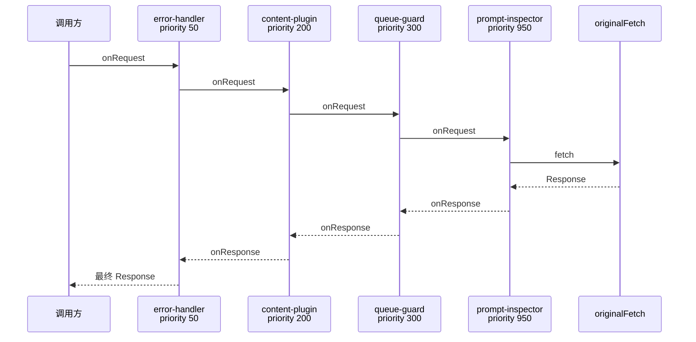
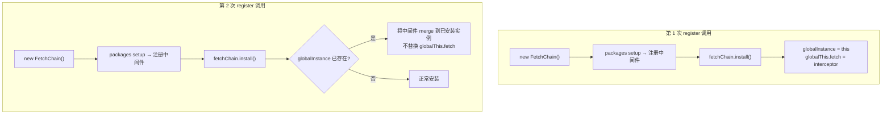
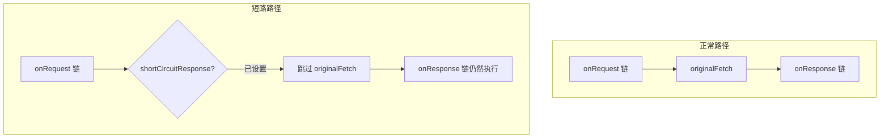
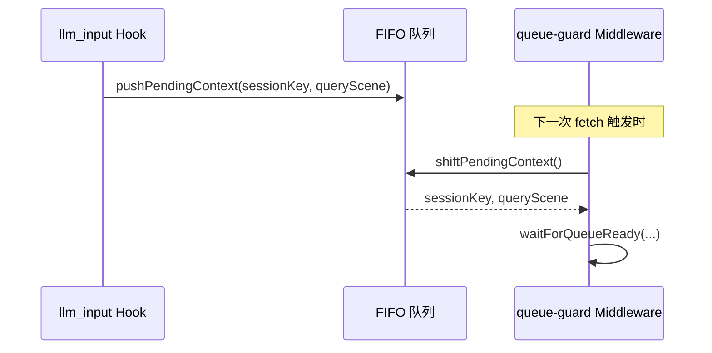

# FetchChain: 用洋葱模型统一管理 Fetch 中间件

> 本文基于 `qclaw-plugin/core/fetch-chain.ts` 源码分析

---

## 一、为什么需要 FetchChain

### 拦截 globalThis.fetch 的原理

OpenClaw 使用 `@mariozechner/pi-ai` SDK 发送 LLM 请求（Anthropic `/v1/messages` 和 OpenAI `/chat/completions`）。SDK 底层直接调用 `globalThis.fetch`。因此，**替换 `globalThis.fetch` 就能拦截所有出站的 LLM 请求和响应**——不需要侵入 OpenClaw 核心代码。




**为什么不用 Hook？**
Hook 事件（`llm_input`、`llm_output` 等）由 OpenClaw 在特定节点触发，**无法修改 HTTP 请求体或响应体**。Fetch 层中间件能做 Hook 做不到的事：


| 能力                     | Hook | FetchChain |
| ---------------------- | ---- | ---------- |
| 修改请求 headers / body    | -    | ✓          |
| 读取 / 替换 Response 对象    | -    | ✓          |
| 在请求发出前阻塞等待             | -    | ✓          |
| 跳过真实请求，返回伪造响应          | -    | ✓          |
| 获取会话级上下文（sessionKey 等） | ✓    | -          |


实际使用中两者互补——Hook 提供业务上下文，FetchMiddleware 做 HTTP 层操控。

### 封装 FetchChain

 封装 FetchChain 之后，方便管理维护和扩展， Package 通过统一管线接入：

| Package                  | priority | 阶段         | 职责                      |
| ------------------------ | -------- | ---------- | ----------------------- |
| `error-response-handler` | 50       | onResponse | HTTP 4xx/5xx → SSE 友好文案 |
| `qmemory`                | 100      | onRequest  | 注入任务恢复指令到 messages      |
| `content-plugin`         | 200      | onRequest  | 认证头、链路追踪、安全审核           |
| `pcmgr-ai-security`      | 250      | onRequest  | 内容安全检测，违规短路             |
| `trace-span-reporter`    | 250      | onRequest  | 注入 `x-agent-request-id` |
| `queue-guard`            | 300      | onRequest  | LLM 请求排队，资源不足时阻塞        |
| `prompt-optimizer`       | 900      | onRequest  | 改写 prompt 结构、路径重写       |
| `prompt-inspector`       | 950      | onResponse | 捕获原始 LLM 响应，全链路追踪       |


---

## 二、架构与执行模型

### 组件关系与生命周期

Package 不直接 `import FetchChain`，只通过 `QClawContext` 的三个方法操作，实现依赖隔离：

```typescript
ctx.registerFetchMiddleware(mw)   → fetchChain.register(mw)
ctx.getOriginalFetch()            → fetchChain.getOriginalFetch()
ctx.onMiddlewareExecuted(obs)     → fetchChain.onMiddlewareExecuted(obs)
```

完整生命周期：




### request-response 执行顺序

request 阶段按 priority **正序**执行，response 阶段按 priority **逆序**执行：




`execute()` 核心逻辑（简化）：

```typescript
private async execute(input, init): Promise<Response> {
  const matched = this.middlewares.filter(m => !m.match || m.match(input, init));
  if (matched.length === 0) return this.originalFetch!(input, init);

  let ctx = { input, init, extra: {} };

  // onRequest 正序
  for (const mw of matched) {
    if (mw.onRequest) ctx = await mw.onRequest(ctx);
  }

  // 短路检测 or 调用原始 fetch
  let response = ctx.shortCircuitResponse
    ?? await this.originalFetch!(ctx.input, ctx.init);

  // onResponse 逆序
  for (let i = matched.length - 1; i >= 0; i--) {
    if (matched[i].onResponse)
      response = await matched[i].onResponse({ ...ctx, response });
  }

  return response;
}
```
---

## 三、关键实现细节

### 3.1 进程级单例保护

**问题**：OpenClaw 会为不同运行上下文（多 agent + gateway）多次调用插件 `register()`，每次都创建新的 `FetchChain` 实例，导致 `globalThis.fetch` 被多层嵌套替换。

**解法**：静态 `globalInstance`，第二个实例调用 `install()` 时，将中间件 merge 进已安装实例，不重复替换 `globalThis.fetch`。




```typescript
install(): void {
  if (FetchChain.globalInstance && FetchChain.globalInstance !== this) {
    const existing = FetchChain.globalInstance;
    for (const mw of this.middlewares) {
      existing.register(mw); // merge 到已安装实例，register() 按 id 去重
    }
    this.installed = true;
    this.originalFetch = existing.originalFetch;
    return; // 不替换 globalThis.fetch
  }
  // ... 正常安装路径
}
```

### 3.2 延迟注册（Late Registration）

**问题**：部分 package 的 `setup()` 是异步的，在 `fetchChain.install()` 之后才完成中间件注册。

**解法**：`execute()` 每次调用时动态读取 `this.middlewares`，而非在 install 时快照。`globalThis.fetch` 指向的闭包始终调用 `this.execute()`，新注册的中间件自动生效。

### 3.3 短路响应（Short-Circuit）

中间件在 `onRequest` 阶段设置 `ctx.shortCircuitResponse`，FetchChain 将**跳过 `originalFetch`**，直接进入 `onResponse` 阶段。




短路后仍然走完整的 `onResponse` 链——保证 `prompt-inspector` 等中间件能捕获每个响应做审计，不管它是真实的还是伪造的。

### 3.4 getOriginalFetch：逃生通道

中间件自身需要发 HTTP 请求（拉配置、调审核接口）时，不能被自己拦截。`getOriginalFetch()` 返回 `install()` 前保存的原始 `fetch` 引用：

```typescript
// packages/error-response-handler/index.ts
const originalFetch = ctx.getOriginalFetch();
await fetchRemoteErrorMessages(originalFetch, ctx.logger, ctx.reporter);
```

同样的模式在 `pcmgr-ai-security`（调用审核接口）和 `queue-guard`（轮询排队接口）中也被使用。

### 3.5 弹性错误隔离

每个阶段独立 try/catch，单个中间件异常不击穿整条链路：


| 阶段                 | 异常处理策略                             |
| ------------------ | ---------------------------------- |
| `onRequest` 异常     | catch 后 **继续执行** 后续中间件             |
| `originalFetch` 异常 | **逆序**尝试各中间件的 `onError`，第一个成功恢复即返回 |
| `onResponse` 异常    | catch 后 **继续执行** 后续中间件，通知 observer |


---

## 四、Package 实战解析

### 4.1 error-response-handler（priority=50）

**角色**：最外层兜底。priority 最小 → `onResponse` 最后执行，作为整条链的兜底错误处理。

```typescript
const middleware: FetchMiddleware = {
  id: 'error-response-handler',
  priority: 50,

  match(input) {
    return isOpenAIUrl(input) || isAnthropicMessagesUrl(input);
  },

  async onResponse(ctx) {
    if (ctx.response.ok) return ctx.response;
    const errorMsg = errorMessages[ctx.response.status] || DEFAULT_ERROR_MSG(status);
    return buildSseErrorResponse(errorMsg, ctx.input);
  },
};
```

**值得关注的细节**：

- `match()` 精确过滤——只处理 `/v1/messages`（Anthropic）和 `/chat/completions`（OpenAI），避免干扰内部 API
- SSE 伪响应要匹配 `pi-ai` SDK 的解析格式（Anthropic 走 `message_start → content_block_delta → message_stop`，OpenAI 走 `chat.completion.chunk`），否则 SDK 会抛 "request ended without sending any chunks"
- 用 `response.clone().text()` 读取 body，不消耗原始 Response 流

### 4.2 queue-guard（priority=300）

**角色**：在 `onRequest` 阶段阻塞 LLM 请求，等后端排队通过后才放行。

```typescript
const middleware: FetchMiddleware = {
  id: 'queue-guard',
  priority: 300,

  match: (input, init) => {
    if ((init?.method || 'GET').toUpperCase() === 'GET') return false;
    if (!init?.body) return false;
    return true;
  },

  onRequest: async (reqCtx) => {
    const jsonBody = tryParseBody(reqCtx.init?.body);
    if (!isLLMRequest(url, jsonBody, builtinLlmBaseUrl)) return reqCtx;

    try {
      const ready = await waitForQueueReady(queryId, queueConfig, ...);
    } catch {
      reqCtx.shortCircuitResponse = buildAbortedLlmResponse(
        jsonBody, '当前为高峰期，已为您暂停任务。');
    }
    return reqCtx;
  },
};
```

**值得关注的细节**：

- **fail-open 策略**：排队接口异常或超时时直接放行，不阻塞用户
- **Hook + Middleware 配合**：Fetch 层拿不到 sessionKey，通过 `llm_input` Hook + FIFO 队列桥接




### 4.3 prompt-inspector（priority=950）

**角色**：开发调试工具。priority 最高 → `onResponse` **最先执行**，捕获未经其他中间件修改的原始 LLM 响应。

```typescript
const middleware: FetchMiddleware = {
  id: 'prompt-inspector',
  priority: 950,

  async onResponse(resCtx) {
    if (!sharedEnabled) return resCtx.response;
    const runId = resCtx.extra?.runId as string | undefined;
    if (runId) {
      rawAssistantContents.set(runId, `[SSE stream captured]`);
    }
    return resCtx.response; // 不修改响应
  },
};
```

同时通过 `ctx.onMiddlewareExecuted()` 订阅所有中间件的 onResponse 执行事件，构建 **Response 修改链审计日志**，无需侵入其他中间件代码：

```typescript
ctx.onMiddlewareExecuted((ev: MiddlewareExecutedEvent) => {
  pendingFetchAuditEntries.push({
    middlewareId: ev.middlewareId,
    priority: ev.priority,
    modified: ev.modified,
    action: ev.action,
    detail: ev.detail,
  });
});
```

---

## 总结

FetchChain 用约 300 行代码解决了一个实际的工程问题：**多个功能模块需要有序、可观测地共享同一个 HTTP 拦截点**。


| 设计点  | 选择                        | 原因                            |
| ---- | ------------------------- | ----------------------------- |
| 拦截方式 | 替换 `globalThis.fetch`     | SDK 直接调用 fetch，这是最小侵入的拦截点     |
| 执行模型 | 洋葱模型 + priority 排序        | 保证 request/response 对称执行，顺序可控 |
| 注册方式 | 通过 QClawContext 间接操作      | Package 与 FetchChain 实现解耦     |
| 多实例  | 进程级单例 + middleware merge  | 应对 OpenClaw 多次调用 register()   |
| 可观测性 | Observer 模式               | 无侵入的执行链审计                     |
| 错误策略 | 逐层 try/catch + onError 恢复 | 单点故障不击穿整条链路                   |


## 附录
```typescript

// ============================================================================
// Fetch 中间件相关类型
// ============================================================================

/** Fetch 请求上下文 */
export interface FetchRequestContext {
  input: RequestInfo | URL
  init: RequestInit | undefined
  /** 中间件可以在 extra 上挂载自定义数据，传递给 onResponse */
  extra: Record<string, unknown>
  /**
   * 短路响应：中间件在 onRequest 中设置此字段后，
   * FetchChain 将跳过 originalFetch 调用，直接进入 onResponse 阶段。
   * 用于输入审核 BLOCK 时直接返回伪造响应等场景。
   */
  shortCircuitResponse?: Response
}

/** Fetch 响应上下文 */
export interface FetchResponseContext {
  input: RequestInfo | URL
  init: RequestInit | undefined
  response: Response
  extra: Record<string, unknown>
}

/** Fetch 错误上下文 */
export interface FetchErrorContext {
  input: RequestInfo | URL
  init: RequestInit | undefined
  error: unknown
  extra: Record<string, unknown>
}

/**
 * Fetch middleware onResponse 执行完毕后的通用观察事件
 * 由 FetchChain 在每个 middleware onResponse 执行后触发，供 prompt-inspector 等工具订阅
 */
export interface MiddlewareExecutedEvent {
  /** 中间件标识 */
  middlewareId: string
  /** 中间件优先级 */
  priority: number
  /** 是否修改了 response 对象 */
  modified: boolean
  /** 执行动作 */
  action: 'transform' | 'pass'
  /** 可选：异常信息或备注 */
  detail?: string
}

/** Fetch 中间件定义 */
export interface FetchMiddleware {
  /** 中间件标识（通常为 packageId） */
  id: string
  /** 执行优先级（数字越小越先执行 onRequest，越后执行 onResponse — 洋葱模型） */
  priority: number
  /** 可选：URL 匹配过滤器，返回 false 则跳过此中间件 */
  match?: (input: RequestInfo | URL, init?: RequestInit) => boolean
  /** 请求拦截（正序执行） */
  onRequest?: (ctx: FetchRequestContext) => Promise<FetchRequestContext>
  /** 响应拦截（逆序执行） */
  onResponse?: (ctx: FetchResponseContext) => Promise<Response>
  /** 错误处理 */
  onError?: (ctx: FetchErrorContext) => Promise<Response | void>
}

/**
 * core/fetch-chain.ts — Fetch 中间件链 实现
 *
 * 单点安装 globalThis.fetch，多 package 注册中间件。
 * 执行顺序（洋葱模型）：
 *   request:  priority 100 → 150 → 200 → 250 → originalFetch
 *   response: priority 250 → 200 → 150 → 100
 */

import type { FetchMiddleware, FetchRequestContext, FetchResponseContext, MiddlewareExecutedEvent } from './types.js'

const LOG_TAG = '[qclaw-plugin:fetch-chain]'
const middlewares:FetchMiddleware[] = []

export class FetchChain {
  /**
   * 进程级单例标记：确保整个进程中只有一个 FetchChain 实例安装到 globalThis.fetch。
   * OpenClaw 会为不同运行上下文（多 agent + gateway）多次调用插件的 register()，
   * 每次都会创建新的 FetchChain 实例。如果不做单例保护，会导致多层拦截器嵌套，
   * 使每个请求被 middleware 重复处理 N 次。
   */
  private static globalInstance: FetchChain | null = null

  /** 已注册的中间件列表（按 priority 升序） */
  private middlewares: FetchMiddleware[] = middlewares
  /** 原始 fetch 引用 */
  private originalFetch: typeof fetch | null = null
  /** 是否已安装 */
  private installed = false
  /** middleware 执行后的通用 observer 列表 */
  private middlewareExecutedObservers: Array<(ev: MiddlewareExecutedEvent) => void> = []

  /**
   * 注册一个 Fetch 中间件
   * 支持在 install() 之前或之后调用（延迟注册）
   */
  register(middleware: FetchMiddleware): void {
    // 按 id 去重：相同 id 的中间件只保留最新注册的实例
    const existingIdx = this.middlewares.findIndex((m) => m.id === middleware.id)
    if (existingIdx !== -1) {
      this.middlewares[existingIdx] = middleware
      console.log(
        `${LOG_TAG} replaced existing middleware: ${middleware.id}(${middleware.priority}), total: ${this.middlewares.length}`,
      )
    } else {
      this.middlewares.push(middleware)
    }
    // 按 priority 升序排列
    this.middlewares.sort((a, b) => a.priority - b.priority)

    if (this.installed) {
      // 延迟注册：install() 已执行，新中间件自动生效（execute() 动态读取 middlewares）
      console.log(
        `${LOG_TAG} late-registered middleware: ${middleware.id}(${middleware.priority}), total: ${this.middlewares.length}`,
      )
    }
  }

  /**
   * 安装 FetchChain，替换 globalThis.fetch
   *
   * 进程级单例保护：如果已有另一个 FetchChain 实例安装过，
   * 则将当前实例的中间件合并到已安装的实例中，不再重复替换 globalThis.fetch。
   */
  install(): void {
    if (this.installed) {
      console.warn(`${LOG_TAG} already installed (same instance), skipping`)
      return
    }

    // ---- 进程级单例保护 ----
    if (FetchChain.globalInstance && FetchChain.globalInstance !== this) {
      // 另一个 FetchChain 实例已经安装过了（OpenClaw 多次调用 register() 导致）
      // 将当前实例的中间件合并到已安装的实例中
      const existing = FetchChain.globalInstance
      let merged = 0
      for (const mw of this.middlewares) {
        existing.register(mw)
        merged++
      }
      // 将当前实例标记为已安装，但不替换 globalThis.fetch
      this.installed = true
      this.originalFetch = existing.originalFetch
      console.warn(
        `${LOG_TAG} another FetchChain instance already installed globally, ` +
        `merged ${merged} middleware(s) into existing instance ` +
        `(total: ${existing.middlewares.length}). Skipping globalThis.fetch replacement.`,
      )
      return
    }

    // 保存原始 fetch
    this.originalFetch = globalThis.fetch

    // 替换 globalThis.fetch
    // 使用 Object.assign 保留原始 fetch 上的静态属性（如 Node.js 22+ 的 preconnect）
    const interceptor = async (
      input: RequestInfo | URL,
      init?: RequestInit,
    ): Promise<Response> => {
      return this.execute(input, init)
    }
    globalThis.fetch = Object.assign(interceptor, this.originalFetch) as typeof fetch

    this.installed = true
    FetchChain.globalInstance = this
    console.log(
      `${LOG_TAG} installed with ${this.middlewares.length} middleware(s)${this.middlewares.length > 0 ? `: [${this.middlewares.map((m) => `${m.id}(${m.priority})`).join(', ')}]` : ' (accepting late registrations)'}`,
    )
  }

  /**
   * 获取原始 fetch（绕过拦截链）
   */
  getOriginalFetch(): typeof fetch {
    if (!this.originalFetch) {
      // 还没安装，返回当前的 globalThis.fetch
      return globalThis.fetch
    }
    return this.originalFetch
  }

  /**
   * 注册 middleware 执行后的通用 observer
   * 每次任意 middleware 的 onResponse 执行完毕后触发，携带 middlewareId、priority、modified 等信息
   * @returns 取消注册的函数
   */
  onMiddlewareExecuted(observer: (ev: MiddlewareExecutedEvent) => void): () => void {
    this.middlewareExecutedObservers.push(observer)
    return () => {
      const idx = this.middlewareExecutedObservers.indexOf(observer)
      if (idx !== -1) this.middlewareExecutedObservers.splice(idx, 1)
    }
  }

  /**
   * 获取已注册的中间件列表（用于调试/测试）
   */
  getMiddlewares(): readonly FetchMiddleware[] {
    return this.middlewares
  }

  /**
   * 从 URL 中提取简短标识（用于日志，避免打印完整 URL）
   */
  private urlTag(input: RequestInfo | URL): string {
    try {
      const s = typeof input === 'string' ? input : input.toString()
      // 只保留路径部分的最后两段，例如 /v1/messages -> v1/messages
      const url = new URL(s)
      const parts = url.pathname.split('/').filter(Boolean)
      return parts.slice(-2).join('/') || url.pathname
    } catch {
      return String(input).slice(0, 80)
    }
  }

  /**
   * 执行 Fetch 中间件链（洋葱模型）
   */
  private async execute(
    input: RequestInfo | URL,
    init?: RequestInit,
  ): Promise<Response> {
    const executeStart = performance.now()
    const urlTag = this.urlTag(input)

    // 筛选匹配的中间件
    const matched = this.middlewares.filter(
      (m) => !m.match || m.match(input, init),
    )

    if (matched.length === 0) {
      // 没有匹配的中间件，直接调用原始 fetch
      return this.originalFetch!(input, init)
    }

    // 构造请求上下文
    let ctx: FetchRequestContext = {
      input,
      init,
      extra: {},
    }

    // ---- 洋葱模型：request 阶段（正序） ----
    for (const mw of matched) {
      if (!mw.onRequest) continue
      const reqStart = performance.now()
      try {
        ctx = await mw.onRequest(ctx)
        if (ctx.shortCircuitResponse) {
          console.log(`${LOG_TAG} [diag] onRequest ${mw.id} SHORT_CIRCUIT url=${urlTag}`)
        }
      } catch (err) {
        console.error(
          `${LOG_TAG} [diag] onRequest ${mw.id} ERROR ${(performance.now() - reqStart).toFixed(1)}ms url=${urlTag}:`,
          err instanceof Error ? err.message : err,
        )
      }
    }

    // ---- 短路检测：onRequest 阶段设置了 shortCircuitResponse 则跳过 originalFetch ----
    let response: Response
    if (ctx.shortCircuitResponse) {
      // SHORT_CIRCUIT 已在 onRequest 中记录
      response = ctx.shortCircuitResponse
    } else {
      // ---- 调用原始 fetch ----
      const fetchStart = performance.now()
      try {
        response = await this.originalFetch!(ctx.input, ctx.init)
      } catch (err) {
        console.error(
          `${LOG_TAG} [diag] originalFetch ERROR ${(performance.now() - fetchStart).toFixed(1)}ms url=${urlTag}:`,
          err instanceof Error ? err.message : err,
        )
        // 尝试让中间件处理错误（逆序）
        for (let i = matched.length - 1; i >= 0; i--) {
          const mw = matched[i]!
          if (!mw.onError) continue
          try {
            const recovered = await mw.onError({
              input: ctx.input,
              init: ctx.init,
              error: err,
              extra: ctx.extra,
            })
            if (recovered) {
              console.log(`${LOG_TAG} [diag] onError ${mw.id} RECOVERED url=${urlTag}`)
              return recovered
            }
          } catch (innerErr) {
            console.error(`${LOG_TAG} [${mw.id}] onError error:`, innerErr)
          }
        }
        throw err
      }
    }

    // ---- 洋葱模型：response 阶段（逆序） ----
    for (let i = matched.length - 1; i >= 0; i--) {
      const mw = matched[i]!
      if (!mw.onResponse) continue
      const respStart = performance.now()
      try {
        const responseCtx: FetchResponseContext = {
          input: ctx.input,
          init: ctx.init,
          response,
          extra: ctx.extra,
        }
        const responseBefore = response
        response = await mw.onResponse(responseCtx)
        const modified = response !== responseBefore
        // 通知 observer：middleware 执行完毕
        if (this.middlewareExecutedObservers.length > 0) {
          const ev: MiddlewareExecutedEvent = {
            middlewareId: mw.id,
            priority: mw.priority,
            modified,
            action: modified ? 'transform' : 'pass',
          }
          for (const obs of this.middlewareExecutedObservers) {
            try { obs(ev) } catch { /* 静默忽略 */ }
          }
        }
      } catch (err) {
        console.error(
          `${LOG_TAG} [diag] onResponse ${mw.id} ERROR ${(performance.now() - respStart).toFixed(1)}ms url=${urlTag}:`,
          err instanceof Error ? err.message : err,
        )
        // 异常时通知 observer（pass + detail）
        if (this.middlewareExecutedObservers.length > 0) {
          const ev: MiddlewareExecutedEvent = {
            middlewareId: mw.id,
            priority: mw.priority,
            modified: false,
            action: 'pass',
            detail: err instanceof Error ? err.message : String(err),
          }
          for (const obs of this.middlewareExecutedObservers) {
            try { obs(ev) } catch { /* 静默忽略 */ }
          }
        }
      }
    }

    return response
  }

  /**
   * 卸载 FetchChain，恢复原始 fetch（用于测试清理）
   */
  uninstall(): void {
    if (!this.installed || !this.originalFetch) return
    // 只有全局实例才需要恢复 globalThis.fetch
    if (FetchChain.globalInstance === this) {
      globalThis.fetch = this.originalFetch
      FetchChain.globalInstance = null
    }
    this.originalFetch = null
    this.installed = false
  }

  /**
   * 重置静态单例状态（仅供测试使用）
   * @internal
   */
  static _resetGlobalInstance(): void {
    FetchChain.globalInstance = null
  }
}

```