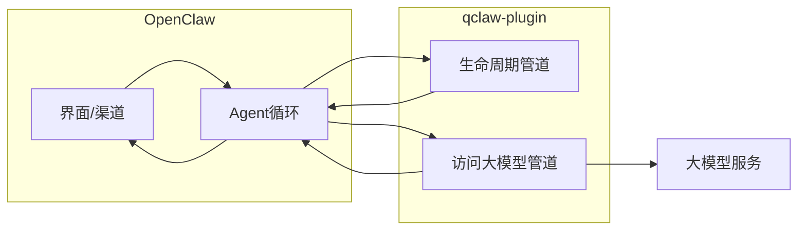
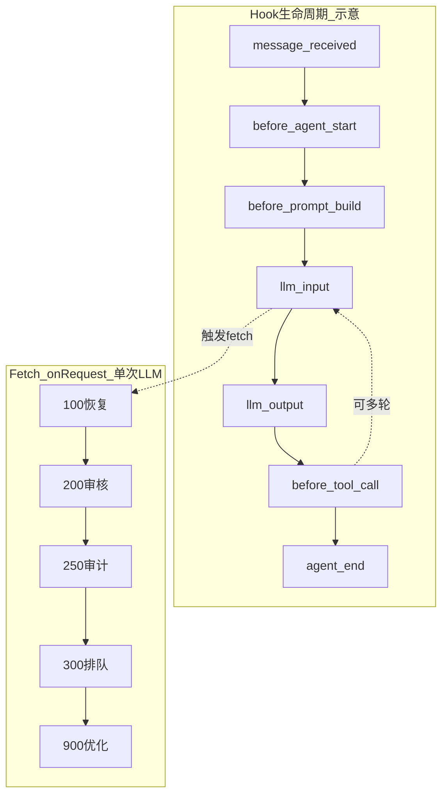
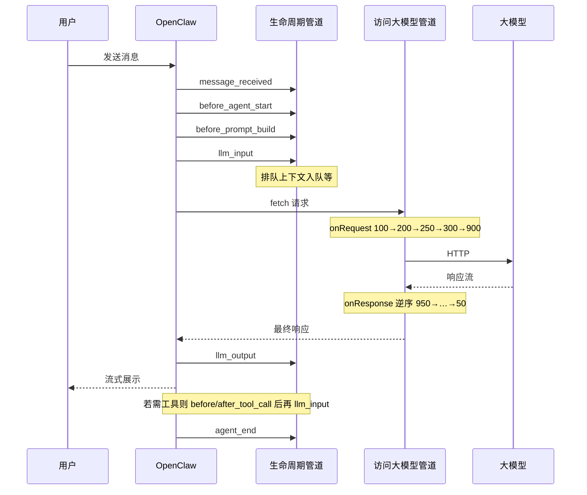

# 从发消息到看见回复：qclaw-plugin 里发生了什么

> 本文跟一条用户消息，看数据在 QClaw 核心插件 **qclaw-plugin** 里如何被处理。  
> 想查「有哪些模块、目录怎么分」请看 [01-qclaw-plugin-architecture-research.md](./01-qclaw-plugin-architecture-research.md)；想深入 Fetch 中间件链原理请看 [03-qclaw-fetch-chain-deep-dive.md](./03-qclaw-fetch-chain-deep-dive.md)；本篇只讲**动态旅程**。  
> 正文不依赖阅读源码；可选对照路径见文末脚注。

---

## 写在前面

你在 QClaw 里发一句「帮我整理桌面」，到界面上看见流式回复，中间并不只是「OpenClaw 调一次大模型」这么简单。QClaw 把大量产品能力收进一个 OpenClaw 插件 **qclaw-plugin**：对外它和普通插件一样注册进 OpenClaw；对内它用 **两条管道** 协调十几个功能模块（Package）：

1. **生命周期管道**：OpenClaw 在固定时机回调插件（代码里叫 **Hook**，如 `message_received`、`llm_input`）。
2. **访问大模型管道**：所有发往 LLM 的 HTTP 请求会经过 **Fetch 中间件链**（按优先级一层层处理后再真正上网）。

读完本篇，你应能回答：

- 用户消息进入后，大致经过哪些阶段？
- 「等模型」时请求先后过哪些关卡？
- 这些处理分别为了解决什么问题？

---

## 一张表看懂全过程

下面这张表**故意不写** priority、Hook 英文名，只对应「你作为用户」的感受。需要对照源码时，看后文 [各阶段谁在干活](#各阶段谁在干活)。

| 阶段（白话） | 你感受到什么 | qclaw-plugin 在干什么 |
|--------------|--------------|------------------------|
| 消息进入 | 消息发送成功 | 记链路、上报「收到消息」 |
| Agent 开始 | 出现「思考中」 | 建立本轮追踪、准备合规上下文 |
| 组 Prompt | 仍在思考 | 往系统提示里追加规则；崩溃恢复时打点 |
| 即将问模型 | 等待变长 | 排队取号；审计上下文就绪 |
| 访问模型 | 流式字开始出现 | 恢复（若有）→ 审核输入 → 审计 → 排队放行 → 优化 Prompt → 发 HTTP |
| 模型输出 | 字继续蹦 | 记录用量；审核输出流 |
| 调工具 | 界面出现工具步骤 | 检查 Skill 授权、AI 安全、内容合规 |
| 回合结束 | 回复完整 | 收尾上报；**后台**写记忆/摘要（不挡你当前这条回复） |

**两条管道怎么配合？**

**双轨对照（与上表互补）**：横轴为 Hook 生命周期（消息进入 → 组 Prompt → llm_input → 工具 → agent_end）；纵轴为单次 LLM 请求的 Fetch 关卡（出门 100→200→250→300→900，回家逆序）。下文 [各阶段谁在干活](#各阶段谁在干活) 与 [出门：请求一层层过](#出门请求一层层过) 分别展开两轨。

**读图注意：**

- **Hook 轴**为示意：未画出同事件多模块的 priority 细节（例如 `message_received` 上 trace **100** 先于 content **500**）；复杂任务会在 `llm_input` ↔ 工具调用之间**重复多轮**（虚线回环）。
- **Fetch 轴**只表示单次 LLM 请求的 **onRequest（出门）**；**onResponse（回家）** 为逆序（约 950 → … → 50），见下文 [回家：响应一层层过](#回家响应一层层过)。

---

## 本文讲什么、不讲什么

**讲：**

- 从 `message_received` 到 `agent_end` 的一轮对话里，qclaw-plugin 在哪些 Hook 点介入。
- 每次 `llm_input` 之后、`globalThis.fetch` 发出前/返回后，Fetch 链上各模块做什么。
- Agent 多轮「问模型 → 调工具 → 再问」时，上述过程会**重复**；下文以「一次 LLM 请求」为原子单元说明 Fetch 链。

**不讲（避免无源码依据的猜测）：**

- OpenClaw 内核如何把 Hook `emit` 出来的实现细节（本仓库未定位到触发点）；统一表述为「OpenClaw 在下列时机回调插件」。
- 界面如何把 SSE 渲染成气泡（属于客户端 / OpenClaw UI）。
- 已下线的 `tool-sandbox`（不在 `PACKAGES` 列表中，不参与运行）。

**和 01 的关系：** 01 是模块地图；本篇是跟一条消息的时间线。

---

## 插件启动时做了什么

OpenClaw 加载插件时会调用 **register(api)**（插件入口）。与「跟消息」相关的步骤是：

1. 创建 **HookProxy**（统一向 OpenClaw 注册 Hook）、**FetchChain**（统一替换 `globalThis.fetch`）、配置中心、上报器等。
2. 按顺序对 **15 个 Package** 调用 `setup(ctx)`；某个 Package 失败只打日志，**不阻断**其余模块。
3. **qmemory** 额外用 `api.on` 直接注册 `session_start` / `session_end`（这两个事件不经 HookProxy）。
4. 最后 `fetchChain.install()`，把全局 `fetch` 接到中间件链上。

**为什么值得写一句：** OpenClaw 可能对多 Agent / Gateway **多次**调用 `register()`。FetchChain 做了进程级单例：后续实例只把自己的中间件**合并**进已安装实例，避免 `fetch` 被包多层、同一请求跑 N 遍（详见 [03 §4.1](./03-qclaw-fetch-chain-deep-dive.md)）。

当前活跃 Package（**PACKAGES** 列表，共 15 个）：

`trace-span-reporter`、`error-response-handler`、`cron-delivery-guard`、`prompt-optimizer`、`pcmgr-ai-security`、`skill-interceptor`、`queue-guard`、`qmemory`、`content-plugin`、`data-sync-report`、`workspace-summary`、`skill-usage-analyzer`、`auto-memory`、`agent-browser-reporter`、`prompt-inspector`。

---

## 一条消息的旅程

### 先讲个故事

1. **你发出消息**  
   OpenClaw 收到后触发 `message_received`（消息已进入）。插件侧主要做追踪与上报，一般不在这里挡住你。

2. **Agent 准备开工**  
   `before_agent_start`：建立本轮调用的根 Span、traceId 映射等（内容安全与链路追踪都会用到）。

3. **组装「要怎么回答」的 Prompt**  
   `before_prompt_build`：例如追加 SkillHub 安装指引；qmemory 在这里记检查点；若上次进程崩溃，会在此 **arm** 恢复逻辑（真正改发往后端的 messages 在下一步 Fetch 里）。

4. **马上要调用大模型了**  
   `llm_input`：记录模型名、runId；**queue-guard** 把 session 上下文推进 FIFO 队列，供后面 Fetch 层消费（Hook 里有 sessionKey，纯 Fetch 里没有，这是后面「排队桥接」的原因）。

5. **HTTP 发出——你开始等**  
   OpenClaw 通过 `globalThis.fetch` 访问模型。Fetch 链依次：恢复注入（若有）→ 输入审核 → 注入请求 ID → AI 安全审计 → **排队轮询** → **Prompt 优化** → 真正请求网络；返回时再审核输出、翻译 HTTP 错误等（详见下一章）。

6. **模型返回一段结果**  
   `llm_output`：写入 token 用量等，供追踪收尾。

7. **若模型要调工具**  
   `before_tool_call` / `after_tool_call`：Skill 是否允许、PC 管家 AI 安全、内容拦截等；可能 `block` 直接拦住某次工具。

8. **可能重复 4–7**  
   复杂任务会多轮「问模型 ↔ 调工具」。

9. **这一轮对话结束**  
   `agent_end`：追踪 Span 最终上报（故意晚于 `llm_output`，以免用量还没写上）；**auto-memory**、**workspace-summary** 等在这里 **异步** 写文件，**不阻塞**你已看到的回复。

---

### 各阶段谁在干活

下表按 OpenClaw 事件顺序列出主路径上的模块。**同一事件多个模块时，priority 数字越小越先执行**（默认 500）。

| 阶段（白话） | 时机（Hook） | 主要模块 | priority | 数据 / 行为摘要 |
|--------------|--------------|----------|:--------:|-----------------|
| 消息进入 | `message_received` | trace-span-reporter | 100 | 缓存 messageId，建 receive span |
| | | content-plugin | 500（默认） | 上报 MessageReceived，无 block |
| Agent 开始 | `before_agent_start` | trace-span-reporter | 100 | run / agent span |
| | | content-plugin | 300 | traceId、Galileo root span |
| 组 Prompt | `before_prompt_build` | trace-span-reporter | 100 | 采集构建前信息 |
| | | content-plugin | 200 | `appendSystemContext`（SkillHub 指引等） |
| | | qmemory（×2 同 priority） | 500 | 检查点；恢复模式 arm |
| | | prompt-inspector | 900 | 仅调试开启时采集 |
| 即将问模型 | `llm_input` | trace-span-reporter | 100 | LLM span 准备 |
| | | queue-guard | 300 | `pushPendingContext` 排队上下文 |
| | | content-plugin | 300 | 审计上下文、Skill 列表等 |
| | | pcmgr-ai-security | 500 | 记录 sessionKey 供 Fetch 用 |
| 访问模型 | **Fetch onRequest** | （见下章表） | — | 改 body / 排队 / 短路 |
| 模型输出 | `llm_output` | trace-span-reporter | 100 | usage |
| | | content-plugin | 300 | 输出侧遥测 |
| 调工具前 | `before_tool_call` | trace-span-reporter | 100 | tool span |
| | | pcmgr-ai-security | 250 | AI 安全 |
| | | skill-interceptor | 280 | Skill 授权 |
| | | content-plugin | 200 | 可 `block: true` |
| 调工具后 | `after_tool_call` | 同上 + agent-browser-reporter | 900 | 浏览器类工具上报 |
| 回合结束 | `agent_end` | trace-span-reporter | **900** | 等 usage 后 finalize |
| | | content-plugin | 300 | 收尾上报 |
| | | auto-memory | 900 | 异步写 daily / MEMORY.md |
| | | workspace-summary | 850（并发） | 有 .md 产物才摘要 |

**说明：**

- `trace-span-reporter` 在 `agent_end` 用 priority **900** 是刻意晚于多数 hook，以便 `llm_output` 先写入 token（见该包内注释）。
- **auto-memory** 不在 `before_prompt_build` 往 Prompt 里塞记忆；下轮由模型自己 `read_file` 读 `MEMORY.md`（与 01 文档、包内 DESIGN 一致）。
- **prompt-inspector** 默认生产关闭，下文主路径不展开。

---

## 等模型回复时，请求经过哪些关卡

FetchChain 的洋葱模型、`shortCircuitResponse`、单例合并等机制见 [03-qclaw-fetch-chain-deep-dive.md](./03-qclaw-fetch-chain-deep-dive.md)；本节从**用户旅程**列出各关卡，不重复展开 execute 源码。

可以把一次 LLM 请求想成寄往「大模型邮局」的包裹：

- **出门（onRequest）**：先过序号小的关卡，再真正 `fetch` 上网。
- **回家（onResponse）**：顺序反过来，序号大的先处理返回体。

Fetch 链执行器按 priority 遍历：onRequest 正序；若有 `shortCircuitResponse` 则**不访问真实网络**；否则访问真实 LLM；onResponse 逆序。机制详见 [03 §三](./03-qclaw-fetch-chain-deep-dive.md)。

### 出门：请求一层层过

| priority | 模块 | 何时生效 | 做什么 |
|:--------:|------|----------|--------|
| 100 | qmemory | 崩溃恢复模式 | 向 `messages` 注入恢复说明（之后仍过内层审核） |
| 200 | content-plugin | 匹配 LLM POST | 输入审核；违规可 `shortCircuitResponse` 直接假响应 |
| 250 | trace-span-reporter | LLM 请求 | 注入 `x-agent-request-id` |
| 250 | pcmgr-ai-security | 请求体含 messages | Prompt/Skill 等 AI 安全与审计（熔断 Fail-Open） |
| 300 | queue-guard | 判定为 LLM 请求 | 轮询后端排队；取消时可短路为模拟响应；异常 **fail-open 放行** |
| 900 | prompt-optimizer | body 含 `messages` | 路径占位符、重排 system，减轻 KV Cache 失效 |

**三个容易忽略的设计：**

1. **排队桥接**  
   `llm_input`（Hook 300）里 `pushPendingContext(sessionKey, …)`，Fetch 里 `shiftPendingContext()` 取出——因为 Fetch 中间件拿不到 Hook 里的 `sessionKey`（queue-guard 设计注释）。

2. **两种「拦住」**  
   - Hook 返回 `{ block: true }`：后续 Hook handler 不再执行（如部分 `before_tool_call`）。  
   - Fetch 设置 `shortCircuitResponse`：不发起真实 LLM HTTP（如输入审核未通过、排队被用户中止）。

3. **Prompt 优化为何排在 900**  
   先过安全与排队，再改 system messages，避免未审核内容被优化器改写后漏检（`prompt-optimizer` priority 900）。

### 回家：响应一层层过

| priority（onResponse 顺序） | 模块 | 做什么 |
|----------------------------|------|--------|
| 950 最先 | prompt-inspector | 调试：抓原始流 |
| … | content-plugin | 流式输出审核（SSE Transform） |
| 50 最后 | error-response-handler | 将 LLM HTTP 错误转成外部渠道能解析的 SSE 序列 |

### 典型一次「问模型」时序

---

## 为什么要做这些处理

每个小节：**你能感知什么** → **代码里怎么做**。

### 统一调度，避免模块互相打架

**感知：** 功能多但不至于「装多个插件后顺序乱了、同一条请求被处理好几遍」。

**实现：** qclaw-plugin 核心层对每个 Hook 事件只注册一次 `api.on`，内部按 priority 调度；Fetch 全局只安装一条链。单 Package `setup` 抛错不影响其他 Package（初始化循环 try/catch，见 [01 原则四](./01-qclaw-plugin-architecture-research.md)）。

### 让回答更快、更省资源

**感知：** 高峰时可能多等一会儿排队；日常回复更稳；长对话后桌面摘要等不拖慢当前回复。

**实现：**

- **prompt-optimizer**：把用户目录等换成 `{workspace_root_dir}` 等占位符，远端策略 + 本地缓存（stale-while-revalidate），降低 system 因路径差异导致的 KV Cache miss。
- **queue-guard**：Fetch onRequest 轮询后端；接口挂了仍放行（fail-open）。
- **workspace-summary**：`agent_end` 标记 `concurrent: true`，与其他收尾并行。

### 崩了还能接着干

**感知：** 进程异常退出后，再打开可能提示恢复未完成任务。

**实现：**

- **qmemory**：`before_tool_call` / `after_tool_call` / `agent_end` 写 WAL；重启后 Fetch priority 100 注入恢复上下文到 `messages`。
- **auto-memory**：`agent_end` 异步提炼要点写入 `memory/YYYY-MM-DD.md`，合并 `MEMORY.md`；下轮模型自行读取，不撑大当轮 Prompt。

### 该拦的拦、该放的放

**感知：** 违规内容可能被替换或提示换问题；未授权 Skill 调不了；安全服务异常时尽量仍能用的体验（Fail-Open）。

**实现：**

- **content-plugin**：全生命周期 Hook + Fetch 输入/输出审核。
- **pcmgr-ai-security**：`before_tool_call` 250 + Fetch 250。
- **skill-interceptor**：`before_tool_call` 280，三种入口（use_skill / read / exec）。

### 出错也要说得明白

**感知：** 模型侧 429/5xx 时，微信等外部渠道仍可能看到结构化错误流，而不是乱码。

**实现：**

- **error-response-handler**：Fetch priority 50，onResponse 最后把 HTTP 错误包装成 Anthropic SSE 形态。
- **cron-delivery-guard**：Hook 400，修正 LLM 建定时任务时漏填的渠道参数（非普通聊天主路径）。

### 方便排查问题

**感知：** 产品/运维侧可查调用链、上报；开发者可用 prompt-inspector（需显式开启）。

**实现：**

- **trace-span-reporter**：把离散 Hook 拼成 OpenTelemetry Span；`agent_end`@900 延迟 finalize。
- **content-plugin**：自带 Galileo / OTLP 等遥测（与审核同包）。

---

## 平时很少走到的功能

| 模块 | 说明 |
|------|------|
| data-sync-report | 登录/登出驱动的后台同步 |
| skill-usage-analyzer | 本地 JSONL 统计 Skill 使用 |
| prompt-inspector | 调试：采集 Prompt/请求修改链，三层门控 |
| cron-delivery-guard | 仅 Cron 创建/投递相关 Hook |
| agent-browser-reporter | 浏览器自动化工具成败上报 |

---

## 和《架构探索》那篇怎么配合读

| 文档 | 适合回答 |
|------|----------|
| [01-qclaw-plugin-architecture-research.md](./01-qclaw-plugin-architecture-research.md) | 目录结构、Package 分工、框架设计原则 |
| **本篇** | 一条消息的时间顺序、Fetch 关卡、优化动机 |
| [03-qclaw-fetch-chain-deep-dive.md](./03-qclaw-fetch-chain-deep-dive.md) | FetchChain 设计动机、execute 模型、扩展中间件 |

**文档同步说明：** 上述 priority 与模块数量已与 [01 架构探索](./01-qclaw-plugin-architecture-research.md) 文首「阅读提示」对齐（2026-05-30）。若你发现两篇仍不一致，以**本篇附录**为准。

---

## 附录（可选）：开发者速查

> **不读附录也能理解上文主路径。** 本节供需要对照实现或本地调试的读者使用。

### A. Hook priority 速查（主路径）

| Hook | 模块 | priority |
|------|------|:--------:|
| message_received | trace-span-reporter | 100 |
| message_received | content-plugin | 500 |
| before_agent_start | trace-span-reporter | 100 |
| before_agent_start | content-plugin | 300 |
| before_prompt_build | trace-span-reporter | 100 |
| before_prompt_build | content-plugin | 200 |
| before_prompt_build | qmemory ×2 | 500 |
| llm_input | trace-span-reporter | 100 |
| llm_input | queue-guard | 300 |
| llm_input | content-plugin | 300 |
| before_tool_call | trace-span-reporter | 100 |
| before_tool_call | pcmgr-ai-security | 250 |
| before_tool_call | skill-interceptor | 280 |
| before_tool_call | content-plugin | 200 |
| agent_end | trace-span-reporter | 900 |
| agent_end | auto-memory | 900 |

### B. Fetch middleware priority（升序 = onRequest 顺序）

| priority | 模块 |
|:--------:|------|
| 50 | error-response-handler（主要 onResponse） |
| 100 | qmemory |
| 200 | content-plugin |
| 250 | trace-span-reporter、pcmgr-ai-security |
| 300 | queue-guard |
| 900 | prompt-optimizer |
| 950 | prompt-inspector |

### C. 关键文件

| 文件 | 作用 |
|------|------|
| `index.ts` | 插件入口、`PACKAGES`、register |
| `core/hook-proxy.ts` | Hook 调度、block、并发组 |
| `core/fetch-chain.ts` | Fetch 洋葱链、单例 |
| `core/types.ts` | Hook 事件名、类型 |
| `packages/*/index.ts` | 各 Package 注册点 |

### D. 本地对照日志

启动后关注控制台 `[qclaw-plugin]`，尤其是 `register() END` 一行会打印已加载中间件及 priority，例如：

`middlewares=[trace-span-reporter(250), content-plugin(200), …]`

Hook 阻断时会打 `dispatch(...) BLOCKED`（`hook-proxy.ts`）。

### E. 术语表

| 术语 | 白话 |
|------|------|
| Hook | OpenClaw 在固定时机回调插件的钩子 |
| Package | qclaw-plugin 内一个功能模块 |
| HookProxy | 统一注册、按 priority 调度 Hook |
| Fetch 中间件链 | 拦截 `globalThis.fetch` 的过滤器链 |
| priority | 数字越小越先执行（Hook onRequest 同理） |
| block | Hook 返回后不再执行同事件后续 handler |
| shortCircuitResponse | Fetch 不访问真实网络，直接返回伪造响应 |
| fail-open | 出错时放行，避免把整个助手弄挂 |
| SSE | 流式响应格式，常见于大模型 API |

---

*文档基于未混淆 qclaw-plugin 梳理；0.2.5+ 安装包内插件可能已压缩。可选源码路径：`resources/openclaw/config/extensions/qclaw-plugin/`（以你本机 QClaw 安装目录为准）。*
