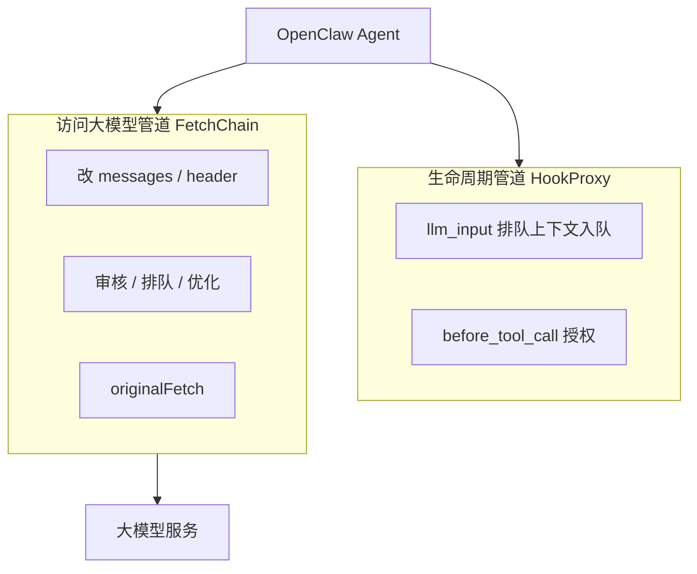
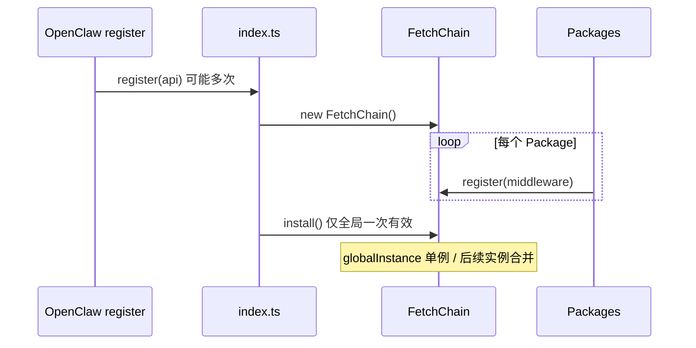
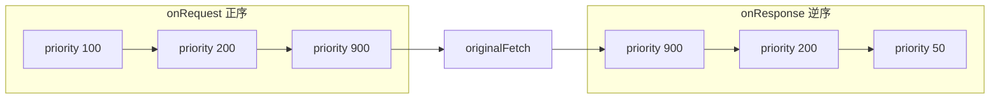
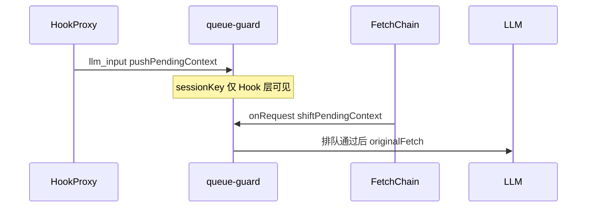

# FetchChain 深度解析：qclaw-plugin 的 LLM 请求拦截链

> OpenClaw 访问大模型只有一条路：`globalThis.fetch`。qclaw-plugin 用 **FetchChain** 把十几种「改请求、拦响应、假回复」的能力收进**一条**可预测的中间件链——本文专门讲这条链为什么存在、怎么跑、设计上有哪些取舍。  
> 想查模块地图请看 [01-qclaw-plugin-architecture-research.md](./01-qclaw-plugin-architecture-research.md)；想跟一条消息的时间线请看 [02-qclaw-plugin-data-journey.md](./02-qclaw-plugin-data-journey.md)。  
> 源码路径（未压缩版本）：`resources/openclaw/config/extensions/qclaw-plugin/core/fetch-chain.ts`。

---

## 写在前面

**qclaw-plugin** 对外是普通 OpenClaw 插件，对内是一套调度框架（见 [01](./01-qclaw-plugin-architecture-research.md)）。框架 core 层里与 Hook 并列的第二条管道，就是 **FetchChain**——它统一替换 `globalThis.fetch`，让各 Package 以中间件形式介入 LLM HTTP 请求。

**本文不讲：**

- OpenClaw 内核如何 emit Hook、UI 如何把 SSE 渲染成气泡（与 [02](./02-qclaw-plugin-data-journey.md) 一致，统一表述为「OpenClaw 在下列时机回调 / 调用 fetch」）。
- 15 个 Package 的完整分工表（见 01 §2.3、§5.4）。

**读完本文，你应能回答：**

- 为什么需要 FetchChain，而不是各 Package 各自包一层 fetch？
- FetchChain 的主要职责是什么，一次请求如何穿过链条？
- 洋葱模型、单例合并、shortCircuit、getOriginalFetch 等设计各自解决什么问题？
- 如何为 qclaw-plugin 新增一个 FetchMiddleware？

---

## 一、问题从何而来：为什么要有 FetchChain？

### 1.1 LLM 请求是唯一的 HTTP 出口

OpenClaw Agent 调用大模型时，走的是 Node/Electron 环境下的 **`globalThis.fetch`**。凡是「发出去之前改 body / header」「回来之后改 SSE 流」「网络失败时伪造响应」的逻辑，都必须挂在这条链上——Hook 管不了 request body，因为 Hook 发生在 OpenClaw 生命周期节点，例如 `llm_input` 能拿到 `sessionKey`，但拿不到即将 POST 的 `messages` 数组。

qclaw-plugin 因此把能力拆成 **两条管道**（[02](./02-qclaw-plugin-data-journey.md) 有完整旅程，这里只抽象分工）：

| 管道 | 框架组件 | 典型数据 | 典型动作 |
|------|---------|---------|---------|
| 生命周期 | HookProxy | sessionKey、toolName、runId | 审核上下文、排队入队、Span 采集 |
| 访问大模型 | FetchChain | URL、RequestInit.body、Response 流 | 改 messages、注入 header、流式审核、短路假回复 |



没有 FetchChain 时，每个需要动 LLM 请求的 Package 只能自己 `globalThis.fetch = wrapper(globalThis.fetch)`。十几个模块叠在一起，顺序等于加载顺序，无法文档化，也无法保证「只包一层」。

### 1.2 无统一链时的三类工程灾难

| 问题 | 无框架时 | FetchChain 后 |
|------|---------|--------------|
| 拦截顺序 | 各 Package 各自包裹 fetch，嵌套顺序 = 模块加载顺序 | 单层链，`priority` 显式排序 |
| 重复包裹 | OpenClaw 为多 Agent / Gateway **多次**调用 `register()`，N 次 install → 同一请求被中间件处理 N 遍 | 进程级单例，后续实例**合并中间件**，不再替换 `globalThis.fetch` |
| 自拦截 | 中间件内部再 `fetch` 拉配置/上报，会被自己的链拦住甚至递归 | `ctx.getOriginalFetch()` 绕过链 |

多次 `register()` 的根因在源码文件头写得很直白：

```1:8:resources/openclaw/config/extensions/qclaw-plugin/core/fetch-chain.ts
/**
 * core/fetch-chain.ts — Fetch 中间件链
 *
 * 单点安装 globalThis.fetch，多 package 注册中间件。
 * 执行顺序（洋葱模型）：
 *   request:  priority 100 → 150 → 200 → 250 → originalFetch
 *   response: priority 250 → 200 → 150 → 100
 */
```

OpenClaw 会为不同运行上下文（多 agent + gateway）多次调用插件的 `register()`，每次都会 `new FetchChain()`。若不做单例保护，每次 install 都在已有拦截器外再套一层，用户发一条消息，审核、排队、优化会各跑 N 遍。

### 1.3 与 HookProxy 的对称设计

FetchChain 不是孤立发明，而是与 **HookProxy** 成对出现的基础设施（见 [01 §3.2](./01-qclaw-plugin-architecture-research.md)）：

- **HookProxy**：对每个 OpenClaw 事件名只调用一次 `api.on()`，内部按 `priority` 调度各 Package 的 handler，统一管理 `block` 语义。
- **FetchChain**：对 `globalThis.fetch` 只替换一次，内部按 `priority` 做洋葱调度，统一管理 `shortCircuitResponse`。

两条管道共享同一套 **priority 产品语义**：观测(100) → 安全(200/250) → 排队(300) → 业务(900) → 调试(950)；兜底层 error-response-handler 的 priority 50 在 **onResponse 逆序时最后执行**（最外层包装 HTTP 错误）。

---

## 二、FetchChain 是什么：主要职责

FetchChain 类（`core/fetch-chain.ts`）承担三件事：

1. **安装点** — `install()` 保存原始 fetch，用拦截函数替换 `globalThis.fetch`；通过 `Object.assign(interceptor, originalFetch)` 保留 Node.js 22+ 上 fetch 的静态属性（如 `preconnect`）。
2. **注册点** — Package 在 `setup(ctx)` 里调用 `ctx.registerFetchMiddleware()`，框架不直接把 OpenClaw API 暴露给 Package。
3. **执行点** — 每次 `fetch()` 进入私有方法 `execute()`，驱动洋葱链；若无任何匹配的中间件，直调 `originalFetch`。

### 2.1 生命周期：从 register 到 install

插件入口 `index.ts` 在每次 OpenClaw 调用 `register(api)` 时：

1. `new FetchChain()`
2. 依次为 15 个 Package 创建 `QClawContext` 并执行 `setup(ctx)`（各 Package 在此注册中间件）
3. **最后**无条件 `fetchChain.install()`

```205:206:resources/openclaw/config/extensions/qclaw-plugin/index.ts
    // 安装 FetchChain（无条件安装，支持 package 延迟注册中间件）
    fetchChain.install()
```

Package 侧注册只是薄封装：

```90:92:resources/openclaw/config/extensions/qclaw-plugin/core/context.ts
    registerFetchMiddleware(middleware: FetchMiddleware): void {
      fetchChain.register(middleware)
    },
```



启动完成后，控制台 `register() END` 一行会打印已加载中间件及 priority，例如：

`middlewares=[trace-span-reporter(250), content-plugin(200), queue-guard(300), …]`

---

## 三、执行模型：一次 fetch 如何穿过链条

本章是全文技术核心。实现集中在 `FetchChain.execute()`。

### 3.1 洋葱模型四阶段

| 阶段 | 遍历方向 | 触发条件 |
|------|---------|---------|
| onRequest | priority **升序** | 中间件实现了 `onRequest` |
| originalFetch | — | onRequest 结束后**没有** `ctx.shortCircuitResponse` |
| onResponse | priority **降序** | 中间件实现了 `onResponse`（含短路后的假响应） |
| onError | priority **降序** | `originalFetch` 抛错；**首个**返回 `Response` 的 `onError` 结束链条 |



**伪代码摘要：**

```
matched = middlewares.filter(m => !m.match || m.match(input, init))
if matched.empty → return originalFetch(input, init)

ctx = { input, init, extra: {} }
for mw in matched ascending:
  ctx = await mw.onRequest(ctx)  // 异常只打日志，不中断

if ctx.shortCircuitResponse:
  response = ctx.shortCircuitResponse
else:
  try: response = await originalFetch(ctx.input, ctx.init)
  catch: 逆序 onError，有 Recovery 则 return

for mw in matched descending:
  response = await mw.onResponse({ ..., response, extra: ctx.extra })

return response
```

### 3.2 关键机制

| 机制 | 类型定义 | 典型 Package |
|------|---------|-------------|
| `match()` 过滤 | `FetchMiddleware.match?` | queue-guard 跳过 GET；content-plugin 匹配 LLM POST |
| `extra` 跨阶段共享 | `FetchRequestContext.extra` | onRequest 写入，onResponse 同一次请求内读取 |
| `shortCircuitResponse` | `FetchRequestContext` | content-plugin 输入审核 BLOCK；queue-guard 用户取消排队 |
| `onError` 恢复 | `FetchErrorContext` | 单测：network error → 中间件返回 recovered Response |
| 错误不阻断 | `execute` 内 try/catch | onRequest/onResponse 抛错只打 `[diag]` 日志，继续下一个 |

**shortCircuit 与 Hook block 的区别**（[02](./02-qclaw-plugin-data-journey.md) 从用户旅程讲过，这里从 FetchChain 视角重述）：

- Hook `{ block: true }`：同一事件后续 handler **不再执行**。
- Fetch `shortCircuitResponse`：**不发起真实 HTTP**，但仍有 `response` 对象，**继续走 onResponse 逆序**——例如 error-response-handler 仍可在最外层包装错误形态。

### 3.3 execute() 源码导读

**① 筛选匹配中间件，无匹配则快速放行**

```168:176:resources/openclaw/config/extensions/qclaw-plugin/core/fetch-chain.ts
    const matched = this.middlewares.filter(
      (m) => !m.match || m.match(input, init),
    )

    if (matched.length === 0) {
      // 没有匹配的中间件，直接调用原始 fetch
      return this.originalFetch!(input, init)
    }
```

**② onRequest 正序 + 短路检测**

```185:206:resources/openclaw/config/extensions/qclaw-plugin/core/fetch-chain.ts
    for (const mw of matched) {
      if (!mw.onRequest) continue
      // ...
        ctx = await mw.onRequest(ctx)
        if (ctx.shortCircuitResponse) {
          console.log(`${LOG_TAG} [diag] onRequest ${mw.id} SHORT_CIRCUIT url=${urlTag}`)
        }
      // catch: 只打日志，不 throw
    }
    // ...
    if (ctx.shortCircuitResponse) {
      response = ctx.shortCircuitResponse
    } else {
      response = await this.originalFetch!(ctx.input, ctx.init)
```

**③ onResponse 逆序 + observer 通知**

```240:266:resources/openclaw/config/extensions/qclaw-plugin/core/fetch-chain.ts
    for (let i = matched.length - 1; i >= 0; i--) {
      const mw = matched[i]!
      if (!mw.onResponse) continue
      // ...
        response = await mw.onResponse(responseCtx)
        const modified = response !== responseBefore
        // onMiddlewareExecutedObservers 通知 prompt-inspector 等
```

---

## 四、设计特点：FetchChain 的工程取舍

以下每条结构为：**设计特点 → 代码证据 → 为什么这样**。

### 4.1 进程级单例 + 中间件合并

第二次及以后的 `FetchChain.install()` 发现 `globalInstance` 已存在时，把当前实例的中间件 `register` 到已安装实例，**不再**替换 `globalThis.fetch`：

```71:89:resources/openclaw/config/extensions/qclaw-plugin/core/fetch-chain.ts
    if (FetchChain.globalInstance && FetchChain.globalInstance !== this) {
      const existing = FetchChain.globalInstance
      for (const mw of this.middlewares) {
        existing.register(mw)
      }
      this.installed = true
      this.originalFetch = existing.originalFetch
      // ... Skipping globalThis.fetch replacement.
      return
    }
```

单元测试 `第二个 FetchChain 实例 install 时应该合并中间件而非重复替换 globalThis.fetch` 锁定了这一行为（`__tests__/fetch-chain.test.ts`）。

### 4.2 模块级共享 middlewares 数组

```13:13:resources/openclaw/config/extensions/qclaw-plugin/core/fetch-chain.ts
const middlewares:FetchMiddleware[] = []
```

所有 `FetchChain` 实例的 `private middlewares` 都指向同一数组。这是**刻意设计**：合并语义要求「第二次 register 的中间件进入同一份列表」，而不是每个实例各维护一份。

### 4.3 priority 显式调度，与注册顺序无关

每次 `register()` 后按 `priority` 升序排序。执行顺序是架构决策，不应依赖 `PACKAGES` 数组顺序或 `setup` 完成先后。

同 priority 多个中间件（如 250 的 trace-span-reporter 与 pcmgr-ai-security）在排序稳定时以**注册顺序** tie-break；新 Package 应查 [01 §5.3 优先级规范](./01-qclaw-plugin-architecture-research.md)，尽量避免与安全/观测层抢同一数字。

### 4.4 id 去重：同 id 只保留最新

```37:49:resources/openclaw/config/extensions/qclaw-plugin/core/fetch-chain.ts
  register(middleware: FetchMiddleware): void {
    const existingIdx = this.middlewares.findIndex((m) => m.id === middleware.id)
    if (existingIdx !== -1) {
      this.middlewares[existingIdx] = middleware
      // replaced existing middleware
    } else {
      this.middlewares.push(middleware)
    }
    this.middlewares.sort((a, b) => a.priority - b.priority)
```

支持重复 setup 或热更新场景：同一 Package 再次注册中间件会覆盖旧实例，而不是链上出现两个相同 id。

### 4.5 延迟注册（late registration）

`install()` 之后仍可 `register()`，因为 `execute()` **动态读取** `middlewares` 数组。单测 `install() 后注册的中间件应该自动生效` 覆盖了这一点——便于异步 setup 或未在首轮 register 完成的模块补注册。

### 4.6 错误隔离 + fail-open 文化

中间件 `onRequest` / `onResponse` 抛错不会冒泡到 OpenClaw Agent 循环，只记 `[qclaw-plugin:fetch-chain] [diag] ... ERROR`。这与 qclaw-plugin 整体原则一致（[01 原则四](./01-qclaw-plugin-architecture-research.md)）：**误拦截（false positive）的代价远高于漏拦截**——单个中间件挂了，请求仍应尽量继续。

Package 层普遍在 catch 后 `return ctx` / `return response` 放行；queue-guard 排队接口异常时 **fail-open** 直接放行 LLM 请求。

### 4.7 可观测性与调试钩子

- **`onMiddlewareExecuted(observer)`**：每个 `onResponse` 执行后通知 observer，携带 `middlewareId`、`modified`、`action: 'transform' | 'pass'`；prompt-inspector 据此记录 Response 修改链。
- **`urlTag()`**：日志只打印 URL path 末两段（如 `v1/messages`），避免完整 URL 泄露。
- **`getMiddlewares()`**：测试与启动日志列举 `[id(priority), ...]`。

### 4.8 getOriginalFetch：防止递归与自拦截

中间件或 Package 若需再发 HTTP（拉远端配置、调审核 API、遥测上报），必须使用 **`ctx.getOriginalFetch()`**，否则会再次进入 FetchChain，造成递归或「审核请求被审核中间件拦截」。

| 场景 | 使用方 |
|------|--------|
| 拉远端配置 / 审核 API | prompt-optimizer、error-response-handler、pcmgr-ai-security |
| 审计上报 | audit-log-reporter、data-sync-report |
| 灰度探测 | skill-usage-analyzer |

`getOriginalFetch()` 在 install 前调用时返回当前 `globalThis.fetch`；install 后返回保存的原始引用。

---

## 五、实战：7 个 Package 的 FetchMiddleware 如何协作

[02「等模型回复时」](./02-qclaw-plugin-data-journey.md#等模型回复时请求经过哪些关卡) 从用户视角列过关卡表；本节从 **FetchChain 机制** 对照同一张表，并展开三个典型案例。当前活跃 **7 个 Package** 注册了 FetchMiddleware（error-response-handler 几乎只做 onResponse）。

### 5.1 总表

| priority | Package | onRequest | onResponse |
|:--------:|---------|-----------|------------|
| 50 | error-response-handler | — | **最后**：HTTP 4xx/5xx → Anthropic SSE 形态 |
| 100 | qmemory | 崩溃恢复时向 `messages` 注入恢复说明 | — |
| 200 | content-plugin | 输入审核；违规设 `shortCircuitResponse` | 流式输出审核（SSE Transform） |
| 250 | trace-span-reporter | 注入 `x-agent-request-id` | — |
| 250 | pcmgr-ai-security | Prompt/Skill AI 审计（Fail-Open） | — |
| 300 | queue-guard | 轮询排队；abort 时 `shortCircuitResponse` | — |
| 900 | prompt-optimizer | 路径占位符、重排 system messages | — |
| 950 | prompt-inspector | — | **最先**：调试环境下抓 raw 响应 |

onRequest 走 priority 升序；onResponse 走降序，故 950 先于 200，50 包在最外层。

### 5.2 案例 A：content-plugin 输入拦截（shortCircuit）

输入审核未通过时，不调用真实 LLM，在 onRequest 里构造 SSE 假响应并写入 `shortCircuitResponse`：

```509:521:resources/openclaw/config/extensions/qclaw-plugin/packages/content-plugin/src/interceptor.ts
              // 设置短路响应，FetchChain 将跳过 originalFetch
              ctx.shortCircuitResponse = new Response(encoder.encode(sseBody), {
                status: 200, statusText: "OK",
                headers: {
                  "Content-Type": "text/event-stream",
                  "Cache-Control": "no-cache",
                  "Connection": "keep-alive",
                },
              });
              return ctx;
```

FetchChain 检测到 `shortCircuitResponse` 后跳过 `originalFetch`，但仍进入 onResponse 逆序——content-plugin 可在输出侧继续处理，error-response-handler 在 HTTP 错误场景仍可在最外层兜底（本例 status 200，通常不触发）。

### 5.3 案例 B：queue-guard 跨层桥接

Fetch 中间件拿不到 Hook 上下文里的 `sessionKey`，queue-guard 在 **`llm_input` Hook（priority 300）** 里 `pushPendingContext(sessionKey, …)` 入 FIFO，在 **Fetch onRequest（priority 300）** 里 `shiftPendingContext()` 取出配对。

- 排队通过：正常 `return reqCtx`，链条继续 `originalFetch`。
- 用户 abort：设置 `shortCircuitResponse` 为模拟 LLM 响应，避免向用户抛 HTTP 错误。
- 排队接口异常：**fail-open**，`return reqCtx` 放行。

这是典型的 **Hook → 内存队列 → Fetch** 桥接模式（详见第六章）。

### 5.4 案例 C：prompt-optimizer 为何排 900

priority 900 使 onRequest **排在安全（200/250）与排队（300）之后**：先完成输入审核与 AI 审计，再改 system messages，避免未审核内容被优化器改写后漏检。

Package 内部拉远端优化策略时使用 `ctx.getOriginalFetch()`，注释明确写明「绕过 FetchChain 避免递归」。`processRequestBody` 异常时降级为放行原始 body，不阻断链条，同样遵循 fail-open。

---

## 六、FetchChain 与 Hook 的协作模式

扩展 Package 时，常需要在两条管道间传递上下文。当前代码里可归纳两种模式：

### 6.1 上下文桥接（Hook 写 → Fetch 读）

| 模块 | Hook 侧 | Fetch 侧 |
|------|---------|---------|
| queue-guard | `llm_input`：`pushPendingContext` | onRequest：`shiftPendingContext`、轮询排队 |
| pcmgr-ai-security | `llm_input`：记录 sessionKey 等 | onRequest：读 session 维度审计上下文 |



### 6.2 职责拆分（Hook 决策 → Fetch 执行）

**qmemory**：Hook 阶段（`before_prompt_build` / tool 相关 Hook）写 WAL、arm 恢复模式；真正改发往后端的 `messages` 在 Fetch **priority 100** 的 onRequest 里注入恢复说明。Hook 负责「要不要恢复」，Fetch 负责「怎么改 HTTP body」。

设计 implication：若你的功能既需要 session 生命周期又需要改 LLM 请求体，应显式拆成 Hook 段 + Fetch 段，而不是在 Fetch 里猜测 session 状态。

---

## 七、扩展指南：如何新增 FetchMiddleware

在 Package 的 `setup(ctx)` 中：

```typescript
ctx.registerFetchMiddleware({
  id: 'my-feature',              // 全局唯一；重复注册覆盖旧实例
  priority: 500,                   // 对照 01 §5.3 优先级规范
  match: (input, init) => {
    const method = (init?.method || 'GET').toUpperCase()
    return method === 'POST' && /* 窄化到 LLM 请求 */
  },
  onRequest: async (ctx) => {
    // 改 ctx.input / ctx.init；或 ctx.extra 存数据
    // 需要拦截且不发网络：ctx.shortCircuitResponse = new Response(...)
    return ctx
  },
  onResponse: async ({ response, extra }) => response,
  onError: async ({ error, extra }) => undefined,  // 可选：返回 Response 恢复
})
```

**上线前检查清单：**

- 内部 HTTP 是否用了 `ctx.getOriginalFetch()`？（拉配置、上报、调第三方 API）
- `match` 是否排除了自身服务 URL？（参考 content-plugin、pcmgr-ai-security 单测里的「跳过审核接口自身请求」）
- onRequest/onResponse 异常是否 fail-open（return 原 ctx/response）？
- 拦截用户可见回复时，优先 `shortCircuitResponse` 而非 throw？
- priority 是否与 content-plugin(200)、queue-guard(300) 等冲突或顺序颠倒？

将 Package 加入 `index.ts` 的 `PACKAGES` 数组即可参与注册；无需直接碰 `globalThis.fetch`。

---

## 八、测试与调试

### 8.1 单元测试（`__tests__/fetch-chain.test.ts`）

| 场景 | 断言要点 |
|------|---------|
| install / uninstall | 替换与恢复 `globalThis.fetch` |
| 重复 install | 同一实例忽略；第二实例合并中间件 |
| 洋葱顺序 | onRequest 100→200；onResponse 200→100 |
| match | `match: () => false` 的中间件不执行 |
| 无中间件 / 无匹配 | 直调 originalFetch |
| 延迟注册 | install 后 register 仍生效 |
| onRequest 异常 | 后续中间件仍执行 |
| onError | originalFetch 抛错时中间件可返回 recovered Response |

Package 单测通常 mock `ctx.registerFetchMiddleware` 收集中间件，直接调用 `onRequest`/`onResponse` 测业务逻辑，无需启动 OpenClaw。

### 8.2 本地调试

1. 启动后搜 **`[qclaw-plugin] register() END`**，确认 `middlewares=[...]` 列表与预期 priority 一致。
2. 搜 **`[qclaw-plugin:fetch-chain] [diag]`**：`SHORT_CIRCUIT`、`onRequest ERROR`、`onResponse ERROR`、`originalFetch ERROR`。
3. 开发环境开启 **prompt-inspector**（环境变量 + ConfigCenter + 窗口状态三层门控），订阅 `onMiddlewareExecuted` 查看 Response 修改链。
4. Hook 阻断与 Fetch 短路是不同机制：前者看 HookProxy 的 `dispatch(...) BLOCKED` 日志。

---

## 九、总结

| 问题 | 答案 |
|------|------|
| **为什么要有 FetchChain？** | 多 Package 共享唯一 `globalThis.fetch` 出口；OpenClaw 多次 `register()` 不能多层嵌套；需要显式 priority、避免自拦截、与 HookProxy 对称的统一调度。 |
| **主要用途是什么？** | 在 LLM HTTP 发出前/返回后串联审核、排队、Prompt 优化、链路追踪、错误翻译等能力；支持短路假响应与 onError 恢复。 |
| **设计特点是什么？** | 洋葱模型（onRequest 升序 / onResponse 降序）；进程级单例与中间件合并；模块级共享列表；id 去重与延迟注册；中间件错误隔离与 fail-open；`getOriginalFetch` 逃生舱；`onMiddlewareExecuted` 可观测。 |

**与系列衔接：**

- 读完本文后，建议回读 [02 §等模型回复时](./02-qclaw-plugin-data-journey.md#等模型回复时请求经过哪些关卡)，把表中每一行对应到本文 `execute()` 的某一环。
- 模块全景与 priority 规范见 [01](./01-qclaw-plugin-architecture-research.md)。

---

## 附录 A：FetchMiddleware 接口速查

```typescript
export interface FetchRequestContext {
  input: RequestInfo | URL
  init: RequestInit | undefined
  extra: Record<string, unknown>
  shortCircuitResponse?: Response   // 设置后跳过 originalFetch
}

export interface FetchResponseContext {
  input: RequestInfo | URL
  init: RequestInit | undefined
  response: Response
  extra: Record<string, unknown>
}

export interface FetchMiddleware {
  id: string
  priority: number
  match?: (input: RequestInfo | URL, init?: RequestInit) => boolean
  onRequest?: (ctx: FetchRequestContext) => Promise<FetchRequestContext>
  onResponse?: (ctx: FetchResponseContext) => Promise<Response>
  onError?: (ctx: FetchErrorContext) => Promise<Response | void>
}
```

（摘自 `core/types.ts`。）

---

## 附录 B：关键文件索引

| 文件 | 作用 |
|------|------|
| `core/fetch-chain.ts` | FetchChain 实现：install、execute、单例合并 |
| `core/types.ts` | FetchMiddleware 类型契约 |
| `core/context.ts` | `registerFetchMiddleware`、`getOriginalFetch` |
| `index.ts` | 创建 FetchChain、Package setup 后 `install()` |
| `__tests__/fetch-chain.test.ts` | 链行为单元测试 |
| `packages/*/index.ts` 或 `*/interceptor.ts` | 各 Package 中间件注册与实现 |

---

## 附录 C：术语表

| 术语 | 说明 |
|------|------|
| FetchChain | 替换 `globalThis.fetch` 的中间件链执行器 |
| FetchMiddleware | 实现 onRequest/onResponse/onError 的可插拔单元 |
| priority | 数字越小，onRequest 越先执行；onResponse 越后执行 |
| 洋葱模型 | 请求阶段正序、响应阶段逆序的中间件模式 |
| shortCircuitResponse | onRequest 设假 Response，跳过真实 HTTP |
| match | 可选 URL/方法过滤器；false 则跳过该中间件 |
| extra | 同一次 fetch 内 onRequest 与 onResponse 共享的键值 bag |
| getOriginalFetch | 绕过链的原始 fetch，防递归与自拦截 |
| fail-open | 出错或异常时放行请求，避免整助手不可用 |
| originalFetch | FetchChain 保存的、未被替换的 fetch 引用 |

---

*文档基于 QClaw 安装目录下未混淆的 qclaw-plugin 源码整理；若本地版本已压缩，请以同版本安装包内路径为准。*
