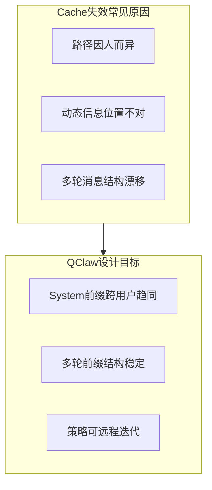
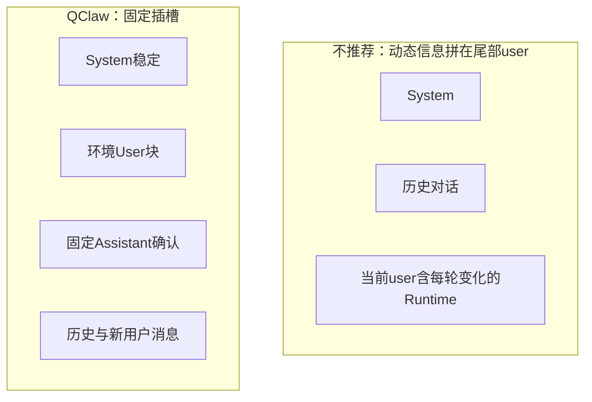

# QClaw Prompt Cache 优化：长 Agent 的前缀治理

> **问题：** Agent 的 System Prompt 又长又「因人而异」，多轮对话里前缀不断漂移，Prompt Cache 很难稳定命中。  
> **做法：** QClaw 在**审核通过之后、请求发出之前**对 Prompt 做结构重组——Section 重排、Volatile 外移、路径占位符、远端可调策略。  
> **效果与借鉴：** 提高前缀一致性，可用 `cacheRead` 等字段验证；「前缀治理」适用于任何长 System + 多轮 Agent。  
> 正文只讲**设计思路与原理**（基于可读插件版本梳理），不展开实现细节。想了解重组在请求管道中的位置，文末有系列导航。

---

## 写在前面

**读完本文，你应能回答：**

- Prompt Cache 在 Agent 场景里到底省什么、为什么天然难命中？
- QClaw 用了哪几招提高前缀稳定性？每招解决什么问题？
- 优化后预期带来什么效果、边界在哪里？
- 自己做长 Prompt / 多轮 Agent 时，有哪些可借鉴的模式？

**本文不讲：** 插件内部的函数名、文件路径、调试手段，以及各厂商 Prompt Cache 的官方定价。

---

## 术语速查

| 术语 | 含义 |
|------|------|
| **Prompt Cache** | 模型服务商对请求**固定前缀**的缓存能力；账单与 usage 里常见 `cacheRead`（命中读取）、`cacheWrite`（写入缓存） |
| **KV Cache** | 推理侧对 attention 等状态的复用，常与 Prompt Cache 一起讨论；**观测上以后者返回的 cache 字段为准** |
| **Stable prefix** | 跨用户、跨轮次尽量不变的部分：规则、Skill 说明、占位符化的路径等 |
| **Volatile 内容** | 每轮或每人都会变的部分：当前时间、Runtime 环境、本机真实路径等 |
| **Prompt 重组模块** | QClaw 产品内的 **prompt-optimizer** 能力：在 HTTP 发出前改写即将发给模型的 Prompt 结构 |
| **远端策略** | 重组规则（Section 顺序、外移名单等）从云端下发；本地有副本兜底——这是**策略热更新**，不是 LLM 的 Prompt Cache 本身 |

---

## 一、为什么要做 Prompt Cache 优化

### 1.1 Prompt Cache 在 Agent 里省什么

大模型处理输入时，要对整段上下文做 prefill（预填充）。当 System Prompt 达到几千甚至上万 token 时，**每一轮**若都全量 prefill，成本和首 token 延迟（TTFT）都会明显上升。

主流模型服务商提供的 Prompt Cache，核心逻辑是：**若本次请求的前缀 token 序列与某次历史请求一致**，则复用已缓存的 KV 状态，只对**前缀之后的新增部分**做完整计算。反映在账单与监控上，往往是 `cacheRead` 增多、等效 input 成本下降、长 System 场景下 TTFT 缩短。

对 Agent 产品而言，典型负载是：

```text
长 System Prompt  +  多轮「问模型 → 调工具 → 再问模型」
```

首轮通常承担「写入缓存」的成本（`cacheWrite`）；从第二轮起，若前缀不变，理论上应看到 `cacheRead` 上升。问题就在于——OpenClaw 类 Agent 的 Prompt **默认并不满足「前缀长期不变」**。

| 对比维度 | 每轮全量 prefill | 前缀命中 Prompt Cache |
|----------|------------------|------------------------|
| 长 System 的计算量 | 每轮重复 | 首轮之后可跳过大部分 Stable 段 |
| 多轮 Agent TTFT | 随轮次线性承压 | Stable 越长、收益越明显 |
| 可观测信号 | `cacheRead` 低 | 同会话后续轮 `cacheRead` 升高 |

### 1.2 为什么 OpenClaw 类 Agent 天然难命中

QClaw 基于 OpenClaw，System Prompt 通常由多块文档与规则拼接而成：Skill 列表、AGENTS.md、工具说明、工作区路径等，按 `## 标题` 分成多个 Section。再叠加多轮工具调用，每轮都会重新组装 messages 发给模型。

在这种结构下，有三类常见的 **Cache 杀手**：

**① 用户差异——路径写进 System**

Skill 说明、工作区文档里经常出现本机绝对路径。用户 A 与用户 B 的路径字面量不同，即使读的是同一份逻辑文档，System 的前缀字节级不一致，**跨用户无法共享 Cache**。

**② 时间差异——动态块位置不对**

当前日期、Runtime 环境、会话上下文等每轮都会变。若它们留在 System 中部/尾部，或**追加在最后一条 user 消息里**，则每多一轮对话，messages 的**整条前缀**都可能与上一轮不同，第二轮起 Cache 即失效。

**③ 结构差异——Section 顺序不固定**

上游框架、插件版本或 Hook 追加顺序变化，会导致「同样的内容、不同的排列」。模型按 token 序列匹配前缀，顺序一变即视为新前缀。



### 1.3 QClaw 的设计目标

在上述约束下，QClaw 的 Prompt Cache 优化**不是**替模型实现缓存 API，而是**提高自然前缀命中率**。目标可以归纳为三条：

1. **尽量拉长 Stable prefix**——静态规则、Skill 说明、占位符化路径占据 System 主体，且顺序固定。
2. **Volatile 内容进固定插槽**——动态块移出 System 的稳定区，且多轮对话不重复堆叠。
3. **策略可云端迭代**——Section 编排、外移名单、覆盖文案可远程调整，无需客户端发版即可 A/B。

同时有两条产品级约束：**先审后发**（不能为了 Cache 绕过内容安全），以及 **Fail-open**（优化失败时必须原样请求模型，不能挡用户）。

---

## 二、总览：QClaw 在链路里做了什么

### 2.1 插入时机：先审后发，再重组

用户消息经 Agent 循环后，会以 HTTP 请求形式访问大模型。QClaw 在「访问大模型」这条管道上挂载了多层中间能力：在内容审核（约 **200**）、AI 审计（约 **250**）、排队放行（约 **300**）**全部完成之后**，由 Prompt 重组模块（约 **900**）才改写 request body（先审后发）。完整关卡表见 [02 §出门](./02-qclaw-plugin-data-journey.md#出门请求一层层过)。

这样设计的原因很直接：若先改 Prompt 再审核，可能出现「改写后的内容未经过相同审核策略」的漏洞；若重组逻辑异常，则**降级为不改动**，保证主路径可用。

```mermaid
sequenceDiagram
  participant Agent as Agent循环
  participant Gate as 审核与排队
  participant Opt as Prompt重组
  participant LLM as 大模型

  Agent->>Gate: 即将发出的请求
  Gate->>Opt: 审核通过后的Prompt
  Opt->>Opt: 重排/外移/占位符
  Opt->>LLM: 重组后的请求
  LLM-->>Agent: 回复与cacheRead统计
```

### 2.2 四板斧总览

| 手段 | 解决什么问题 | 直觉类比 |
|------|--------------|----------|
| **Section 重排** | 静态块顺序不固定，Stable 区域不稳定 | 把「员工手册」按固定目录装订 |
| **Volatile 外移** | 动态块污染 System 或拼在尾部 user | 把「今日值班表」贴在工作台固定位置，不夹进手册里 |
| **路径占位符** | 用户路径导致 System 无法跨人共享 | 手册里写 `{仓库地址}`，附一页「地址对照表」 |
| **远端策略** | 线上需快速试错 Section 编排 | 装订规则云下发，客户端只执行 |

后文第三至五章分别展开前三个设计；第六章合并讲远端策略与工程保障。

### 2.3 单次请求内的重组顺序

四板斧在**每一次**发往模型的请求上按固定顺序执行，便于理解各步如何叠加：

1. **解析 Section**——从即将发出的 System（及必要时从 user 消息）中，按 `## 标题` 切出各块。
2. **路径占位符化**——在 System 稳定块中把绝对路径换成语义占位符，并生成「路径变量映射表」（映射表不放进 System，见第五章）。
3. **重排 System**——按远端策略指定的顺序，只拼接允许参与优化的 Section，得到稳定的 System 前缀。
4. **外移到环境插槽**——将 volatile Section 与映射表写入 System 之后的固定 user+assistant 对；多轮时先去重再插入。

因此：**先让 System「长得一样」，再把「会变的内容」挪到固定槽位**——与四板斧表中的直觉一一对应。

---

## 三、设计一：Section 重排——把 System 变成「标准目录」

**本章 takeaway：** 固定 Section 顺序，拉长跨用户、跨轮次可复用的 Stable 前缀。

### 3.1 思路

OpenClaw 的 System Prompt 本身按 `## 标题` 分块。QClaw 的做法是：从即将发出的 System 文本中识别这些块，再按**云端配置的顺序**重新拼接，只纳入策略允许参与优化的 Section。

未列入策略白名单的 `##` 块**不会被抽出重排或外移**，仍按上游原有方式留在请求中（通常归入相邻块或保持原位置），避免误删业务内容。

效果是：Skill 规则、工具说明等**静态块**始终出现在相同位置，System 的前缀在长对话、多用户之间更可预测。

### 3.2 优化前后示意

以下为**结构示意**（非真实 Prompt，仅说明排列变化）：

```text
【优化前】System 内部块顺序随上游拼装变化，且夹杂动态块：

  ## Skills
  …（Skill 列表）…
  ## Runtime
  OS: Windows 11；当前时间: 2026-05-30 14:00
  ## Tooling
  …（工具规则）…
  ## AGENTS.md
  …（含 C:\Users\alice\.qclaw\workspace\…）…

【优化后】System 只保留「稳定块」，且顺序固定：

  ## Skills
  …
  ## Tooling
  …
  ## AGENTS.md
  …（路径已占位符化，见第五章）…

  （Runtime 等动态块不在 System 内，见第四章）
```

### 3.3 与模型 Cache API 的衔接

部分模型（如 Anthropic）支持在 System 字段上附加 cache 相关标记。QClaw 重组 System 文本时，会**保留已有标记、只替换文字内容**，避免「优化反而打掉 Provider 侧已配置的 Cache 能力」。这是工程上容易忽略、但对生产很重要的一点。

---

## 四、设计二：Volatile 外移——多轮对话的「固定插槽」

**本章 takeaway：** 每轮会变的内容不进 System 尾部，放进固定 user+assistant 插槽，避免多轮前缀漂移。

本章是全文核心。

### 4.1 常见误区：拼在最后一条 user

一种直观但有害的做法是：每轮把 Runtime、环境信息**追加到当前 user 消息末尾**。短期看模型「能读到最新环境」，长期看却破坏了 Cache：

- 第一轮 messages 前缀是 `[System][User₁]`；
- 第二轮变成 `[System][User₁][Assistant₁][User₂'（含新 Runtime）]`；

从第二轮起，**前缀与第一轮不再一致**，Stable 的 System 即使不变，也无法在多轮之间延续 Cache 收益。更糟的是，若 Runtime 曾写在 System 尾部，则 System 本身每轮都在变。

### 4.2 QClaw 的做法：System 之后的固定插槽

QClaw 采用 **固定插槽** 方案：

1. 在 **System 之后、历史对话之前**，插入一对消息：
   - **User 消息**：承载 Runtime、当前时间、Inbound 等 volatile Section 的合集（内容每轮可更新）；
   - **Assistant 消息**：一句**固定**的简短确认，表示「已读取环境信息」。
2. **多轮去重**：下一轮请求前，先识别并移除上一轮插入的那一对，再插入更新后的内容，避免重复堆叠导致 token 膨胀。

示意结构：

```text
[System — 稳定，多轮不变]

[User — 环境插槽：Runtime / 时间 / …（每轮更新）]
[Assistant — 固定确认句（多轮相同）]

[历史 user / assistant / tool 消息…]
[本轮新 user 消息]
```

### 4.3 为什么这样有利于 Cache

需要区分「**哪一段**前缀能命中」，避免误以为整条 messages 每轮都字节级相同：

- **System 全文**在多轮之间保持不变 → 这是最主要的 Cache 收益来源：长 System 在后续轮次可反复出现较高的 `cacheRead`（具体比例取决于模型与 Provider）。
- **环境 User 插槽**每轮会更新（新 Runtime、新时间等）→ 该段及之后的对话历史通常需重新 prefill，**不应期望**「从 System 末尾到最新消息」全部命中。
- **Assistant 确认句**固定 → 插槽的「结构形状」稳定；相对「把 Runtime 拼在最后一条 user」而言，不会破坏**更早轮次**在 messages 里的位置，从而保住 System 大段前缀的连续性。
- **去重**保证 volatile 块不会随轮次线性叠加，避免 token 膨胀和更深层的前缀漂移。

相对尾部 user 方案，固定插槽的核心价值是：**锁住最长的 Stable 段（System），把变化收敛到固定位置**，而不是让历史消息中间的内容每轮被改写。



### 4.4 设计权衡

| 取舍 | 说明 |
|------|------|
| 多 2 条 message | 换前缀稳定；长 Agent 任务里通常划算 |
| 固定确认句 | 必须稳定且可识别，否则无法可靠去重 |
| 动态块从 System 抽出 | 模型仍能在插槽里读到环境，只是位置从前部稳定区挪到插槽 |

---

## 五、设计三：路径占位符——跨用户的 System 归一化

**本章 takeaway：** System 里写语义占位符，真实路径放映射表，不进入 Stable 段。

### 5.1 问题

Skill 与工作区文档中大量出现本机绝对路径。两位用户的内容逻辑相同，但 `C:\Users\alice\...` 与 `C:\Users\bob\...` 导致 System **字节级不同**，Prompt Cache 无法跨用户复用。

### 5.2 做法：语义占位符 + 映射表

QClaw 在重组时自动检测 System 中的绝对路径，替换为**语义占位符**。**Path Variable Mappings**（路径变量映射表）不留在已占位符化的 System 里，而是与 Runtime 等 volatile 内容一起，写入**环境插槽**（第四章的 user 消息）：列出每个占位符对应的本机真实路径，供模型在需要读文件、列目录时还原。

极简例子：

```text
System 内原文：
  请从 C:\Users\alice\.qclaw\workspace\skills\foo\SKILL.md 读取说明

System 优化后：
  请从 {qclaw_skill_dir}\foo\SKILL.md 读取说明

环境插槽中的映射表：
  {qclaw_skill_dir} = C:\Users\alice\.qclaw\workspace\skills
  {workspace_root_dir} = C:\Users\alice\.qclaw\workspace
```

映射表本身保留真实路径，且**不再对映射表做二次占位符替换**——否则会出现「地图上的地址又被改成占位符」的自引用问题。

### 5.3 常见占位符语义

| 占位符示例 | 语义 |
|------------|------|
| `{workspace_root_dir}` | 当前 Agent 工作区根目录 |
| `{qclaw_skill_dir}` | 用户 Skill 目录 |
| `{bundled_skill_dir}` | 内置 Skill 目录 |
| `{workspace_root_dir:agent-xxx}` | 多 Agent 实例的变体工作区 |

检测规则覆盖 Windows、Unix 以及 `~` 形式路径；同一语义目录在不同机器上归一为同一占位符，System 模板跨用户趋同。

### 5.4 与 Cache 的关系

- **跨用户**：System 主体高度相似，利于共享 Cache 前缀（仍取决于 Provider 策略与租户隔离方式）。
- **跨轮次**：真实路径集中在插槽与映射表，System 不再因「路径字面量」而抖动。

---

## 六、远端策略与工程保障

**本章 takeaway：** 编排规则可云端热更新；重组失败则 fail-open，不挡主路径。

### 6.1 远端策略：热更新而不阻塞对话

Section 顺序、外移名单、是否启用路径替换、对部分 Section 的覆盖文案等，由云端策略下发。客户端本地保留策略副本；拉取失败时使用上一份副本，**绝不会**因为等待策略而卡住用户发消息。

策略本地缓存大约**每半小时**在后台刷新一次；冷启动时若无副本，才可能短暂同步拉取。这与 LLM Prompt Cache 无关，但支撑产品侧持续迭代「怎么拼 Prompt 最利于 Cache」。

策略中与 Prompt 结构相关的主要配置项（概念级）：

| 配置项 | 作用 |
|--------|------|
| 总开关 | 关闭则整段重组跳过 |
| 有序 Section 列表 | 指定 System 内块的拼接顺序 |
| 外移 Section 列表 | 指定哪些块进入环境插槽 |
| 确认句文案 | 固定 Assistant 插槽的文本 |
| Section 覆盖 / 自定义块 | 远程微调或新增某块内容 |
| 路径替换开关 | 是否启用占位符化 |

### 6.2 Fail-open：优化是增强项，不是硬依赖

| 情况 | 行为 |
|------|------|
| 策略缺失或总开关关闭 | 不重组，原 Prompt 发出 |
| 重组过程出错 | 捕获异常，原 Prompt 发出 |
| 云端暂时不可用 | 使用本地策略副本；全无则跳过 |

这与「先审后发」一起构成：**Cache 优化不能牺牲可用性与安全**。

### 6.3 如何验证效果

**第一层：任何 Agent 都适用的 Cache 信号**

| 信号 | 说明 |
|------|------|
| `cacheRead` | 从 Provider 缓存读取的 input token 数；同会话多轮对话中，若 System 稳定，后续轮次往往升高 |
| `cacheWrite` | 写入缓存的 token 数；常见首轮或前缀变化后出现 |

**第二层：判断 QClaw 重组是否生效（产品遥测）**

| 关注点 | 含义 |
|--------|------|
| System 体量是否变短 | 重组前后 System token 对比；路径占位、volatile 外移都会缩短 System |
| System 缩短比例 | 相对缩短幅度；变短是伴生现象，**不等于**必然 cache hit |
| 路径替换次数 | 是否发生占位符化；大于 0 说明跨用户归一化逻辑已执行 |

上述第二层字段在 QClaw 链路追踪中亦有对应上报（如 `openclaw.tokens.cache_read`）。开发环境可用 Prompt Inspector 对比重组前后 Prompt 结构——属调试能力，非本文重点。

**验证思路建议：**

1. 同一 session 多轮对话，对比首轮与第 N 轮的 `cacheRead`（重点看 System 稳定后是否上升）。
2. 确认路径占位与 System 缩短是否发生，再与 Cache 字段对照。
3. 关闭重组总开关做 A/B，对比同场景下的 `cacheRead` / `cacheWrite`（需自行实验，无统一基准百分比）。

---

## 七、达到了什么效果

### 7.1 机制层预期（定性）

| 场景 | 优化前 | 优化后（预期） |
|------|--------|----------------|
| 同会话第 2+ 轮 | 前缀随 Runtime 或尾部 user 变化 | System 段稳定、更易 `cacheRead`；环境插槽及之后仍需重算 |
| 不同用户、同版本客户端 | System 路径字面量不同 | 占位符化后前缀高度相似 |
| 首轮请求 | 多为建立缓存 | 可能出现 `cacheWrite` |
| 后续轮 / 相邻请求 | 反复全量 prefill | `cacheRead` 占比上升（若模型支持且前缀一致） |

System token 数下降（路径变短、动态块移出）是**伴生指标**，不等于必然命中 Cache——**是否命中以 `cacheRead` 为准**。

### 7.2 效果边界（诚实说明）

1. **QClaw 提高的是前缀一致性**，不替代模型侧的 Prompt Cache 实现；是否命中仍取决于 Provider、模型版本与租户策略。
2. **云端 Section 名单**需与当前 OpenClaw 版本的块命名对齐；否则重排可能漏块或顺序不符预期。
3. **固定插槽**占用额外 message 槽位与少量 token，极短对话或单轮问答收益有限。
4. 本文**不提供**命中率或成本节省的具体百分比；若需量化，请用上文监控字段在自有环境实测。

---

## 八、对读者的借鉴意义

本章面向正在做 Agent 平台、长 System Prompt、多轮工具循环的工程师——**不绑定 QClaw**，只提炼模式。

### 8.1 可复用的设计模式

| 模式 | 一句话 | 适用场景 |
|------|--------|----------|
| **前缀治理** | 显式划分 Stable / Volatile | System 超过数千 token |
| **固定插槽外移** | 动态块不进 System 末尾、不拼 last user | 多轮 Agent、工具循环 |
| **语义占位符 + 映射表** | 模板共享，实例路径另附 | 多租户、多工作区、Skill 路径 |
| **网关层重组** | 在 HTTP 发出前统一改 Prompt | 不便改上游框架时 |
| **Fail-open 优化** | 失败则原样放行 | 生产增强型能力 |
| **远端策略** | 编排规则热更新 | 需线上 A/B 与快速迭代 |

### 8.2 不建议照搬的情况

- **Prompt 很短或单轮问答**——重组收益有限，复杂度不划算。
- **安全策略要求「发什么审什么」且无法固定审核边界**——需先理清审核与改写的顺序。
- **模型不支持 Prompt Cache**——前缀治理仍可能改善结构，但无 `cacheRead` 直接收益。

### 8.3 自检清单

在设计和 Review Prompt 管线时，可以自问：

- [ ] System 里是否含有用户级绝对路径？
- [ ] Runtime / 时间是否每轮追加在最后一条 user？
- [ ] 多轮之后，messages 前缀是否与第一轮做过逐段对比？
- [ ] 优化逻辑失败时，是否会阻断用户请求？
- [ ] 是否监控 `cacheRead` / `cacheWrite`？

---

## 小结

QClaw 的 Prompt Cache 优化，本质是一套 **长 Agent 的前缀治理**：用 Section 重排锁定静态规则，用固定插槽外移动态信息，用路径占位符实现跨用户模板化，用远端策略支撑持续迭代；全程 **先审后发、Fail-open**，不把 Cache 当成硬依赖。

对读者而言，值得带走的不是某几个配置项名称，而是**把 Prompt 当成可工程化的数据结构**——Stable 与 Volatile 分离、多轮前缀有意识地设计、用可观测字段验证——这在任何 Prompt Cache 时代的长上下文 Agent 里都将长期有效。

---

## 系列导航

| 文档 | 关系 |
|------|------|
| [02 从发消息到看见回复](./02-qclaw-plugin-data-journey.md) | 重组模块在「访问大模型」管道中的位置 |
| [03 FetchChain 深度解析](./03-qclaw-fetch-chain-deep-dive.md) | 为何「先审后发」、中间件链如何协作 |
| [01 架构探索](./01-qclaw-plugin-architecture-research.md) | qclaw-plugin 整体模块地图 |
