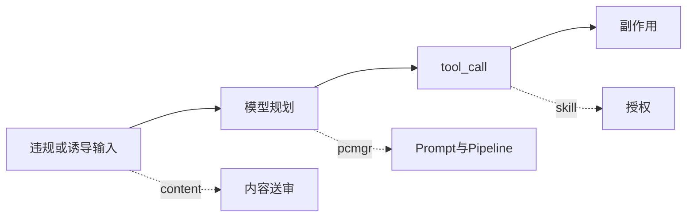
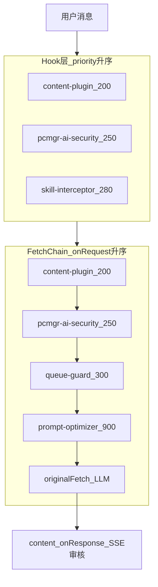
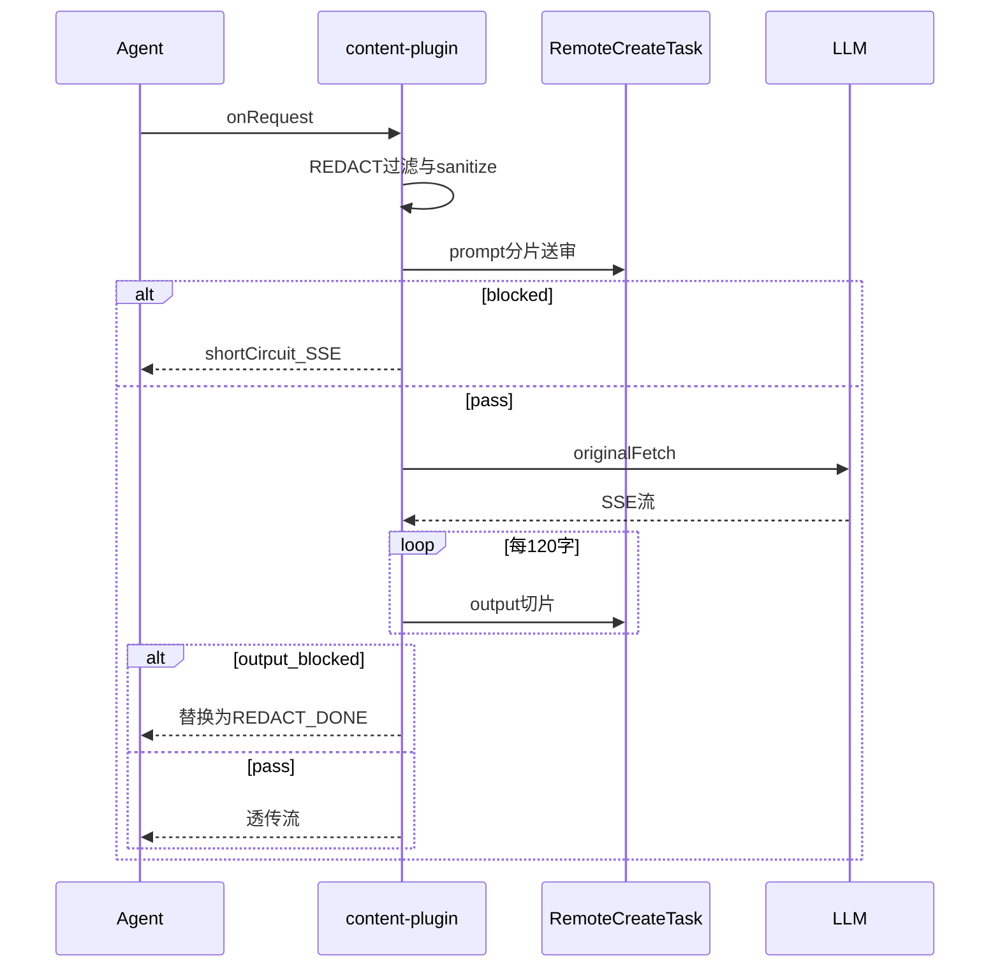
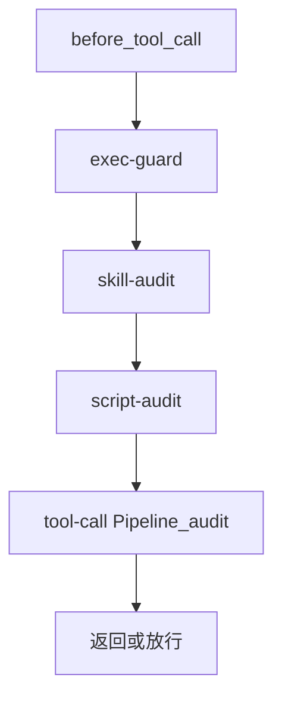
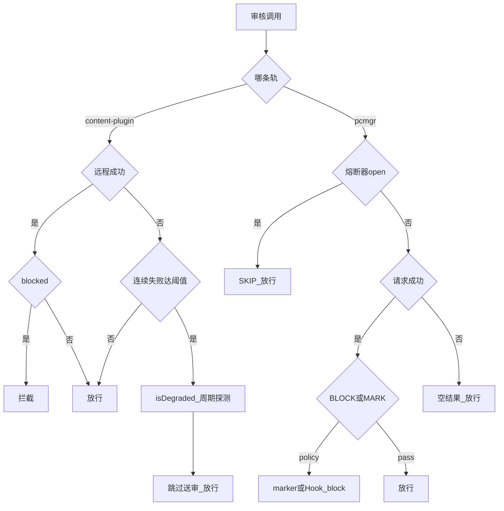

# QClaw 内容安全与合规防护设计

> **问题：** 桌面 Agent 不仅能「说话」，还能调工具、读文件、执行命令、连 OAuth Skill——仅靠模型自带安全不够。  
> **做法：** QClaw 在插件网关叠加三类能力：**内容违规拦截**（content-plugin）、**AI 行为审计**（pcmgr-ai-security）、**Skill 授权**（skill-interceptor），配合审计留痕与 Fail-Open。  
> **边界与借鉴：** 本文只写可观察的产品与工程机制，不构成法律意见，也不宣称拦截率；文末给出验证字段与 Agent 平台 checklist。  
> 正文为设计解读（基于可读版 qclaw-plugin 梳理），不引导读者翻仓库。机制细节见系列 [02](./02-qclaw-plugin-data-journey.md)、[03](./03-qclaw-fetch-chain-deep-dive.md)。

---

## 写在前面

**读完本文，你应能回答：**

- 为什么 QClaw 这类 AI 工具必须做安全防护，且要放在网关层？
- 用户输入、模型输入/输出、工具调用分别如何被治理？与「本地敏感词库」有何不同？
- 合规风险在产品上如何通过拦截、话术、审计、授权与 Fail-Open 来规避（工程视角）？
- 效果如何验证、边界在哪里？对自建 Agent 平台有何借鉴？

**本文不讲：** 大段源码、法律合规结论、拦截率 benchmark、Prompt Cache 重组细节（见 [04](./04-qclaw-prompt-cache-optimization.md)）。

**声明：** 下文描述的是 QClaw 产品中可观察的设计与机制，**不构成法律意见**，也不替代贵司合规评审。

---

## 术语速查

| 术语 | 含义 |
|------|------|
| **Content Security** | 对用户/模型/工具文本走远程 CreateTask 审核，用 `ResultCode` 与可配置 **blockLevel** 判定是否拦截 |
| **AI Audit** | 电脑管家 **LLMShield** 对 Prompt、Skill、脚本、工具 Pipeline 做行为审计，`DecisionType` 为 BLOCK 或 MARK |
| **Authorization** | Skill 是否已授权、已开启、当前渠道是否允许操作；**不是**内容违规词库 |
| **Fail-Open** | 审核服务不可用或熔断时**放行**主路径，避免安全故障拖垮可用性 |
| **shortCircuit** | Fetch 中间件在 `onRequest` 注入假 SSE 响应，**不发起真实 LLM HTTP**（见 [03](./03-qclaw-fetch-chain-deep-dive.md)） |
| **REDACT** | 用 `<!--REDACT-->…<!--/REDACT-->` 包裹的统一拒答话术；也用于裁剪历史中的违规轮次 |
| **blockLevel** | 默认 200；除 `ResultCode === BLOCK` 外，`ResultTypeLevel > blockLevel` 也会判为拦截 |
| **SessionType** | 送审相位：输入 `QUESTION`、流式片段 `ANSWER`、收尾 `ANSWER_END` |
| **QAID** | 单轮问答 ID，贯穿送审、HTTP 头与 Trace |
| **query_scene** | 区分用户主动对话与记忆压缩、定时任务等；部分审计仅针对 `USER_QUERY` |
| **sanitize** | 历史 user 消息若命中「拦截指纹」，替换为 `[该消息已被移除]`，避免脏上下文再次进模型 |
| **security-marker** | pcmgr 将审计结论写入后续请求的 user 内容：BLOCK 为替换，MARK 为追加 |
| **exec-guard** | 拦截不受信目录下的可执行文件；用改写 `command` 的方式让 Agent 仍能向用户解释原因 |

---

## 零、三类能力：不要混为一谈

QClaw 的安全不是「一个敏感词插件」，而是三条正交的防线：

| 维度 | Content Security | AI Audit | Authorization |
|------|------------------|----------|-----------------|
| **包** | content-plugin | pcmgr-ai-security | skill-interceptor |
| **管什么** | 文本/流式内容是否违规 | Prompt 与工具行为是否高风险 | Skill 是否允许在本渠道使用 |
| **后端** | 远程 CreateTask（内容安全） | LLMShield（moderate / pipeline 等） | 本地凭据 + 4227/4230/4164 等授权接口 |
| **典型挂载** | Fetch 200 + 多 Hook | Fetch 250 + `before_tool_call` 250 | `before_tool_call` 280 |
| **拦截形态** | shortCircuit 假 SSE、流式截断、Hook block | 注入 marker 或 Hook `block:true` | 授权卡片 / 渠道文案 / Hook block |
| **失败策略** | 连续失败后 **降级放行** + 周期探测恢复 | **熔断器打开** 时 SKIP 审核 | 授权接口失败时按检查逻辑降级 |

后文按此三分法展开；同一轮 `before_tool_call` 上三者会**依次**执行（200 → 250 → 280），详见 [02 附录](./02-qclaw-plugin-data-journey.md)。

---

## 一、为什么 AI Agent 需要安全防护，以及为何放在网关层

### 1.1 为什么 QClaw 这类 AI 工具必须做安全防护

传统聊天产品的风险主要集中在「模型生成什么」。QClaw 基于 OpenClaw，属于 **Agent**：除了对话，还会 **调用工具、读取工作区与 Skill 文件、执行 shell、通过 OAuth 访问邮件/网盘等**。在这种形态下：

1. **从对话到行动**  
   违规或诱导性输入不必等到「有害回复」才产生后果——一次 `tool_call` 就可能触发本机执行、外发数据或调用未授权 Skill。模型响应头的 `content_filter` 通常只覆盖生成文本，**管不到工具参数与工具回执**。

2. **攻击面沿行为链放大**  
   用户输入、多轮历史、工具结果、Skill 说明都可能被投毒（Prompt Injection）。Agent 会把上下文带入下一轮，因此需要在 **进模型前、出模型后、调工具前、调工具后** 多点设闸——这正是 content-plugin 同时注册 Fetch 与 Hook 的原因。

3. **多通道与多身份**  
   PC 主端、企微/飞书等外部渠道、不同 Skill 的授权状态并存。产品需要 **统一的拒答体验**（REDACT 话术）与 **差异化的授权策略**（skill-interceptor 渠道矩阵）。

4. **产品与运营需要可解释、可回溯**  
   面向桌面与 C 端场景，不能只对用户说「模型拒了」。QClaw 为每轮绑定 `qaid`、`sessionId`，并向 Galileo / 审计系统上报 `content_security_block`、`PROMPT_SECURITY_CHECK` 等可检索字段，便于排障与内控。

5. **策略应与模型解耦**  
   换模型、多模型路由时，内容策略应留在产品侧（`blockLevel`、远程开关、LLMShield scene），而不是绑定某一家的内置策略。

**模型内置安全 vs Agent 网关安全（能力对照）**

| 链路环节 | 模型内置安全（典型） | 典型盲区 | QClaw 补位 |
|----------|----------------------|----------|------------|
| 用户输入 | 部分厂商审核 user 消息 | 工具参数、拼接后的 thinking | content Fetch 输入 + pcmgr Prompt 审计 |
| 模型输出 | `content_filter` 等 finish_reason | 已发出的一段流式正文 | content SSE Transform 切片送审 |
| 工具入参 | 一般不审 | 诱导执行、敏感命令 | content `before_tool_call` + pcmgr Pipeline |
| 工具回执 | 一般不审 | 恶意回灌进历史 | content `after_tool_call` + sanitize |
| 本地 exec | 无 | 下载目录下的 `.exe` 等 | pcmgr **exec-guard** |
| 第三方 Skill | 无 | 未授权 OAuth / 读 Skill 目录 | **skill-interceptor** |



### 1.1.1 与纯云端 Chat API 的差异：本地 exec、桌面数据

QClaw 不是「把网页版 Chat 嵌进客户端」。**本地运行时 + 用户数据面** 让安全控制点必须多于纯云端对话 API：

| 维度 | 纯云端 Chat API（典型） | QClaw / OpenClaw 类桌面 Agent | 安全设计回应 |
|------|-------------------------|-------------------------------|--------------|
| **执行面** | 无用户机 shell；能力在厂商沙箱 | `exec` / `bash` 可执行本机命令 | exec-guard、script-audit、tool-call Pipeline |
| **数据面** | 上下文多在请求体内 | Prompt 可含 `[file:…]`、`[image:…]`；工具可读 JSONL、Skill 目录 | 输入/输出送审、历史 sanitize、skill-interceptor 读文件拦截 |
| **身份与密钥** | 多为单一 API Key | OAuth Skill、mcporter token、设备指纹等 | 授权矩阵、审计头 `X-Device-Fingerprint`、凭据查询走 **getOriginalFetch** 避免被 Fetch 链误审 |

云端产品的常见假设是：风险主要是「说什么」，且**默认触达不到用户文件系统**。桌面 Agent 在同一套 LLM 能力上包了 **本地 I/O**——模型无法感知「这条命令将运行 Downloads 里刚下的安装包」或「这次 read 指向 Skill 目录外的敏感路径」。发往模型的 HTTP 里即便只有路径与计划摘要，**真正危险的动作发生在 Hook 层的 tool_call**，必须在客户端网关再设闸。

可观察例子：用户拖拽文件后，消息会出现本地路径标记；若只依赖远端模型安全，仍可能在后续工具链中触发执行。企微/飞书等渠道的 `sessionKey` 与 PC 主端不同，则需要渠道策略与统一 REDACT 并存。

因此，QClaw **在插件网关叠加 content / pcmgr / skill 三层**，而不是把合规全部委托给模型厂商。

### 1.2 为什么用网关层（而不只依赖模型自带安全）

在 §1.1 成立的前提下，QClaw 选择 **FetchChain + Hook**（架构见 [01](./01-qclaw-plugin-architecture-research.md)、[03](./03-qclaw-fetch-chain-deep-dive.md)）：

1. **全链路可见**  
   只有 Fetch 能在 **HTTP 发往 LLM 的前后** 统一改写 body、设置 **shortCircuitResponse**、用 `TransformStream` 包装 SSE。content-plugin 的 priority 为 **200**，负责输入 shortCircuit 与输出流式审核。

2. **工具侧不可绕过**  
   模型「同意」调工具时，Hook 仍执行：content 200 审工具文本、pcmgr 250 做 exec-guard / skill / script / Pipeline、skill-interceptor 280 做授权。

3. **双轨互补**  
   内容违规（CreateTask + blockLevel）与行为审计（LLMShield + marker）分工不同，第 3 章专表说明。

4. **与 Prompt 优化正交**  
   [04](./04-qclaw-prompt-cache-optimization.md) 强调 **先审后发、Fail-open**：prompt-optimizer（Fetch **900**）排在 content 200、pcmgr 250、queue-guard 300 **之后**，避免重组后的 Prompt 绕过审核。

5. **可用性权衡**  
   审核故障时采用 Fail-Open（第 5 章展开）——产品选择「安全服务异常时仍尽量可用」，而非静默硬拦所有请求。



Hook / Fetch 的完整优先级表见 [02](./02-qclaw-plugin-data-journey.md)，本文不重复抄写。上图 Hook 层为 **工具调用主路径**（`before_tool_call` 上 content 200 → pcmgr 250 → skill 280）；`before_agent_start`、`llm_input` 等阶段 content 多为 300，见 02 附录。

---

## 二、内容违规拦截：content-plugin

content-plugin 的职责是 **Content Security**：通过远程 **CreateTask** 审核文本，而不是维护本地敏感词表。拦截与改写发生在插件网关，读者无需读源码即可理解下列链路。

### 2.1 挂载点与远程审核

- **FetchMiddleware**（priority 200）：`onRequest` 做输入审核；`onResponse` 对 LLM 的 JSON / SSE 做输出审核。`match` 会跳过对审核服务自身 URL 的请求，避免环回。
- **Hook**：覆盖 Agent 多阶段；与安全强相关的是 `before_tool_call` / `after_tool_call`（priority 200）。
- **判定逻辑**：远程返回 `ResultCode === BLOCK`，或 `ResultTypeLevel > blockLevel`（默认 **200**），则 `blocked: true`。标签可解析自 `ResultFirstLabel` JSON。

服务异常时的策略见第 5 章：短暂超时重试；连续失败进入 **isDegraded**，在探测恢复前 **跳过送审并放行**（Fail-Open）。

### 2.2 输入路径：先审后发，可 shortCircuit

在 LLM 请求的 `onRequest` 阶段，插件会：

1. **清理历史**  
   - `filterRedactedMessages`：去掉带 `<!--REDACT-->` 标记的整段 user 轮次。  
   - `sanitizeMessages`：若历史 user 文本命中内存中的 **拦截指纹**（最多保留 50 条、24h TTL），替换为 `[该消息已被移除]`，避免违规内容再次进入 Prompt。

2. **送审最后一条 user 消息**  
   - 按约 **4000** 字符分片，并行调用 `checkContentSecurity(scene=prompt)`。  
   - 记忆压缩类请求（特定 prompt 前缀或 `auto-memory-extract-` 的 QAID）**跳过输入送审**，避免误伤后台任务。

3. **输入被拦截**  
   - 不调用真实 LLM，设置 **shortCircuitResponse**：返回形如流式接口的 SSE，body 内为统一 **REDACT** 拒答。  
   - 上报 `content_security_block` Trace（区分 input/output）。

对用户而言，体验类似「模型立刻给了一句安全提示并结束」；对链路而言，**没有 outbound LLM HTTP**（与 [03](./03-qclaw-fetch-chain-deep-dive.md) 中 shortCircuit 语义一致）。

**BLOCK 时用户可见结构（极简示意，全文仅此一段结构描述）**

```text
assistant delta 内容 ≈
  <!--REDACT-->
  抱歉，这个问题我暂时无法解答，让我们换个话题吧~
  （若干条能力引导：搜索 / 创作 / 提醒 / 系统操作等）
  <!--/REDACT-->
```

日志里可通过 `openclaw.block_type`、`audit_input` / `OUTPUT_BLOCKED` 等字段区分输入拦截与输出截断。

### 2.3 输出路径：流式切片送审

对 `text/event-stream` 响应，插件用 **TransformStream** 解析 SSE，累积 assistant 文本，每满约 **120** 字符送审 `scene=output`（`SessionType.ANSWER`）。若命中拦截：

- 停止向用户继续推送模型原文；  
- 注入与输入拦截相同的 REDACT 话术 chunk，并发送 `[DONE]`；  
- 将违规片段记入指纹库，供后续 `sanitize` 使用。

收尾时根据 `finish_reason` 区分 **中间轮**（`tool_calls` → `ANSWER`）与 **最终轮**（`ANSWER_END`），避免工具调用轮误用收尾会话类型。

此外，模型若返回 `content_filter` / `sensitive` / `error` 等 finish_reason，插件会与送审结果一并处理，必要时同样替换为 REDACT 流。

### 2.4 工具调用：before / after

| 阶段 | 行为 |
|------|------|
| **before_tool_call** | 将工具名、参数（可拼接 JSONL 中匹配的 thinking）分片送审；拦截则 `block: true`，`blockReason` 为「请换个问题提问。」 |
| **after_tool_call** | 对工具结果按 output 规则分片送审；拦截则改写 `event.result` 为 `Intercepted` JSON，避免脏结果进入历史 |

同一轮还可与 pcmgr、skill-interceptor 叠加，见第 3、4 章。

### 2.5 上下文标识与可观测性

送审与 LLM 请求会关联 **sessionId**、**qaid**（每轮/每 turn 稳定）、**traceparent** 及 `X-Conversation-ID` / `X-Query-Scene` 等头，便于与 Galileo、`reportLog` 中的 `logtype`（如 `LlmRequest`、`LlmResponseSseBlocked`）交叉查询。

耗时 ≥ 约 400ms 的审核会打 `security.check.*` Span；单次审核超过约 2s 时，诊断日志会出现 `AUDIT_SLOW` 提示——属于性能观测，**不是**拦截率指标。



---

## 三、AI 行为审计：pcmgr-ai-security

pcmgr-ai-security 实现 **AI Audit**，后端为电脑管家 **LLMShield**（moderate、moderate/skill、moderate/script、pipeline 等）。它与 content-plugin **不是重复建设**，而是管「行为与策略」：Prompt 注入标记、Skill/脚本风险、工具 Pipeline、本地 exec 纵深防御。

### 3.1 双轨审核对照

| 维度 | content-plugin | pcmgr-ai-security |
|------|----------------|-------------------|
| **管什么** | 内容是否违规（文本/流式） | Prompt 与工具行为是否高风险 |
| **后端** | CreateTask 内容安全 | LLMShield |
| **典型拦截** | shortCircuit、截断 SSE | 注入 security-marker；Hook `block:true` |
| **失败时** | 降级跳过送审（探测恢复） | 熔断 SKIP moderate |
| **典型场景** | 违法违规话术、输出流式命中 | 可疑 Prompt、危险 Skill、脚本、Pipeline |

**叠加示例**

1. **用户输入明确违规** → content 输入送审 **BLOCK** → **shortCircuit**，LLM 不会被调用。  
2. **内容未达 content 阈值，但 LLMShield 认为 Prompt 高风险** → pcmgr 在 Fetch 250 对最后 user 消息注入 **security-marker**（BLOCK 替换全文，MARK 追加确认语），请求**仍会**发往模型，由 marker 约束模型行为。  
3. **模型发起 tool_call** → content 审工具文本 → pcmgr 依次 exec-guard / skill-audit / script-audit /（可选）Pipeline → skill-interceptor 审授权。

### 3.2 Fetch：Prompt 审计（priority 250）

在 content 200 之后、发往 LLM 之前：

- 仅当 `enablePromptAudit` 且 **query_scene === USER_QUERY** 时送审；记忆压缩、定时任务等场景 **SKIP**（与「用 prompt 前缀伪造内部请求」的绕过方式划清界限——场景由 sessionKey / header 判定）。  
- 送审前剥离 OpenClaw 元数据与 UI 隐藏 prompt。  
- 若决策为 **BLOCK** 或 **MARK**：生成 `securityReason`，写入 **messageCache**，并对当前 user 内容做 **injectSecurityMarker**（BLOCK 替换，MARK 追加）。  
- 对 BLOCK/ALLOW 可 **reportAuditLog**（`PROMPT_SECURITY_CHECK`）；MARK 在 optpath 中带 `[MARK]` 标记。

**与 content 的关键差异**：pcmgr Prompt 审计 **不使用 shortCircuit**，不阻止 HTTP 发出；content 输入 BLOCK 则 **不发 LLM**。

### 3.3 before_tool_call：顺序与职责

在同一 Hook 上，pcmgr（250）在 skill-interceptor（280）**之前**执行，顺序大致为：



1. **exec-guard**  
   针对 `exec` / `bash` 等，若命令指向 Downloads、Desktop、Temp 等**不受信目录**下的 `.exe`、`.ps1` 等，**不**使用 `block:true`（避免 Agent 以 stop_error 结束、用户看不到解释），而是把 `command` 替换为 `echo` / `Write-Output` 输出拦截原因，并记 `EXEC_SCRIPT_CHECK` 审计。

2. **skill-audit / script-audit**  
   调用 LLMShield 对应端点；BLOCK 或 MARK 时返回 `block:true` 与 **appendSystemContext**（强制模型不得重试绕过）。

3. **tool-call Pipeline 审核（可选）**  
   见 §3.4。

### 3.4 AgentDR 信封与 Pipeline 审核

当开启 **toolCallAudit** 时，pcmgr 在工具真正执行前调用 `auditPipeline`：

- **信封（envelope）**：由 `buildToolCallEnvelope` 组装，包含工具名、参数（exec 类取 `command` 字符串，其它工具为 `toolName + JSON`）、**会话历史片段**（从 state 目录 JSONL 提取）、当前工作目录、OS 类型等上下文，供后端做 **Pipeline 级** 策略判断。  
- **决策**：响应中 `DecisionType` 为 BLOCK 或 MARK 时，返回 `block:true` 与面向用户的 `blockReason`（MARK 强调需用户确认）。  
- **超时**：默认约 **3000ms**；与 moderate 共用 **globalCircuitBreaker**——熔断打开时 **SKIP**，等同 Fail-Open 放行。  
- **错误**：请求失败记录失败次数，不阻断工具（与 skill/script 审计的错误处理一致）。

Pipeline 审的是「这一次工具调用在会话上下文中是否合理」，与 content 对**文本片段**的合规送审互补。

### 3.5 熔断 Fail-Open（pcmgr）

`globalCircuitBreaker`：连续失败达到阈值（默认 **3** 次）后打开熔断，冷却约 **2 分钟**内所有 moderate / pipeline **SKIP**，日志可见 `Circuit-breaker OPEN`。冷却结束自动恢复，无需单独探测请求。

这与 content-plugin 的 `isDegraded` + 周期性 **hello 探测** 是两套实现，第 5 章用决策树对比。

---

## 四、Skill 授权与渠道策略：skill-interceptor

skill-interceptor 实现 **Authorization**：解决的是「用户有没有权利用这个 Skill」，而不是「这句话违不违规」。

### 4.1 三种拦截入口

| 入口 | 识别方式 | 典型场景 |
|------|----------|----------|
| **use_skill** | 工具名 + command/name | LLM 显式调用某 Skill |
| **read / read_file / with** | 路径解析出 Skill 名 | 读取 Skill 目录下文件 |
| **exec / bash / execute_command** | mcporter 命令或 Skill 入口脚本 | 通过 shell 间接调用 Skill |

仅对配置中 **blockedSkills**（默认可视为「需管控的全量 Skill」）执行检查；其它 Skill 放行。

### 4.2 授权检查与渠道矩阵

检查模式包括：wecom-cli 本地 `bot.enc`、public-mail（4227）、multi-bind 邮箱（4230）、credential-hosted（4164）、默认 mcporter 配置等。授权查询使用 **getOriginalFetch()**，避免授权 HTTP 被 content / pcmgr 的 Fetch 中间件再次送审造成环回。

**决策矩阵（摘要）**

| 来源 | 已授权且已开启 | 未授权 / 未开启 |
|------|----------------|-----------------|
| **PC 端** | 放行 | 弹授权或开启卡片（Hook block） |
| **非 PC + 授权码类 Skill** | 放行 | 放行（用户可在任意端完成授权码配置） |
| **非 PC + OAuth 类** | 放行 | 文字提示「请在 PC 端 QClaw 连接应用」 |

配置项 **logOnly** 为 true 时只记日志不阻断，用于灰度。

priority **280** 保证在 pcmgr 行为审计之后、真正执行工具之前完成授权判断。

---

## 五、合规风险的产品化规避（工程视角）

本节只描述**可观察的产品与工程机制**，不提供法律结论，也不讨论具体法规条款。

### 5.1 拦截层：把风险止于行动之前

| 机制 | 作用 |
|------|------|
| content 输入 **shortCircuit** | 违规输入不触达 LLM |
| content 输出 **流式截断** | 已生成内容中途替换为 REDACT |
| content / pcmgr **Hook block** | 工具不执行或 exec 被替换为说明命令 |
| exec-guard | 降低「上下文投毒 → 运行下载目录木马」类风险 |
| skill-interceptor | 未授权 Skill 不读、不调、不执行 |

多层叠加时，**先内容、再行为、再授权**，避免单点遗漏。

### 5.2 话术层：为何不是一句话打天下

| 场景 | 用户可见倾向 | 原因 |
|------|--------------|------|
| content 对话 BLOCK | REDACT 统一拒答 + 能力引导 | 产品统一口径、利于运营 |
| content 工具 block | 「请换个问题提问。」 | 短句降低工具重试诱惑 |
| pcmgr Hook block | 带 `[SYSTEM SECURITY]` 的明确拒绝 | 要求模型直接向用户解释，禁止绕过 |
| pcmgr MARK | 需用户确认的提示 | 保留人工判断空间 |
| skill 未授权 | 授权卡片或「请到 PC 端连接」 | 渠道能力不同，需可操作的下一步 |

话术差异来自 **产品、渠道与 Agent 可解释性**，不是实现疏漏。

### 5.3 审计留痕：事后能查

**content-plugin 侧（示例字段）**

- 日志 phase：`audit_input_end`、`OUTPUT_BLOCKED`、`session_write_redact_*` 等。  
- Trace：`content_security_block`、`security.check.blocked`、`openclaw.qaid`。  
- 业务日志：`reportLog` 的 `logtype`（如 `LlmResponseSseBlocked`、`BeforeToolCall`）。

**pcmgr-ai-security 侧**

- `reportAuditLog`：**ActionType** 8 Prompt、9 Skill、10 脚本、11 工具 Pipeline；**result** ALLOW/BLOCK。  
- 本地 moderate 全量 REQ/RESP 日志（含 requestId）。  
- 审计上报使用 **nativeFetch**，避免上报请求被 Fetch 链拦截。

关联键：`qaid`、`sessionId`、`traceparent`、`query_scene`、`requestId`——排障时应组合查询，而非只看单一日志行。

### 5.4 Fail-Open：可用性与风险的显式权衡

QClaw 在审核不可用时不选择「全局硬拦」，而是 **Fail-Open**（放行主路径），两套实现并行存在：



这是产品层选择：**安全服务故障不应等同「所有用户被封禁」**。代价是降级期间依赖模型与其它层的防护，故需用 `degraded:true`、`ENTERED_DEGRADED`、`Circuit-breaker OPEN` 等信号做运维告警，而不是用拦截率 KPI 掩盖可用性窗口。

---

## 六、效果验证、边界与借鉴

### 6.1 如何验证（机制推导，无拦截率）

本文**不宣称**拦截率或合规认证结论。验证应围绕 **可观测字段** 与 **场景复现**：

| 目标 | 建议做法 |
|------|----------|
| 输入 BLOCK | 触发 content 输入拦截 → 无真实 LLM 请求；UI 为 REDACT SSE；日志含 shortCircuit / `content_security_block` input |
| 输出 BLOCK | 流式回复中途变为 REDACT → 搜 `OUTPUT_BLOCKED`、`LlmResponseSseBlocked` |
| 工具 BLOCK | `before_tool_call` block 或 after 结果变 Intercepted |
| content 降级 | 模拟 CreateTask 连续失败 → `ENTERED_DEGRADED`、`degraded_skip` |
| pcmgr 熔断 | 模拟 moderate 5xx → `Circuit-breaker OPEN`，随后 SKIP |
| 双轨叠加 | 同一轮分别观察 content 与 pcmgr 日志，确认顺序与决策 |

遥测检索示例：`degraded:true`、`errorType: probe_failed|timeout`、`openclaw.block_type`、`security.check.blocked`。

### 6.2 已知边界

- **多模态图片/文件送审**：实现中存在 COS 上传 + 多模态 riskControl 链路，但 Fetch 拦截器内相关分支当前以 **`if (false && …)` 默认关闭**，不应在产品中假设「附件已全量送审」。  
- **EXTERNAL_BLOCK_PATTERNS**：预留的话术模式匹配列表当前为空，不构成额外拦截。  
- **记忆压缩 / 非 USER_QUERY**：部分输入或 pcmgr Prompt 审计会跳过。  
- **流式审核延迟**：输出按 120 字切片异步送审，极端情况下可能出现 **短窗口** 的未替换正文（诊断有 `AUDIT_SLOW`）；这是机制边界，不是承诺 SLA。  
- **sanitize**：基于指纹 `includes` 匹配，不能理解语义变体。  
- **skill-interceptor logOnly**：只记不拦。  
- **Fail-Open 窗口**：降级或熔断期间，远程内容/行为策略暂时失效，需依赖监控与恢复探测。

### 6.3 对 Agent 平台开发者的借鉴

1. **把「内容」「行为」「授权」拆成三条线**，避免一个团队、一套 API 包打天下。  
2. **网关层统一审核** LLM HTTP 与 Hook 工具，模型厂商安全只能作为一层，不能替代 tool/I/O。  
3. **shortCircuit** 适合「绝不能调用模型」的输入违规；**marker 注入** 适合「仍要调用但需约束行为」的 Prompt 风险。  
4. **Fail-Open 要显式化**，并用 `degraded` / 熔断日志驱动告警，而非静默失败。  
5. **审计字段与业务 ID 绑定**（会话、轮次、requestId），方便安全与客服共查。  
6. **桌面 Agent 必须单列 exec / 路径 / 凭据** 控制点，云端 Chat 经验不能直接套用。  
7. **授权查询绕过 Fetch 链**（getOriginalFetch），避免环回与误审。

---

## 七、总结与系列导航

**三条 takeaway**

1. QClaw 的安全是 **Agent 形态下的必选项**：行动链、本地 I/O 与多通道让「只信模型」不够。  
2. 实现上分为 **content 违规拦截、pcmgr 行为审计、skill 授权**，在 Fetch / Hook 网关按优先级串联。  
3. 合规相关产品化靠 **拦截 + 统一/分场景话术 + 审计留痕 + Fail-Open**；效果用机制与遥测验证，而非虚构拦截率。

| 文档 | 与本篇关系 |
|------|------------|
| [01 架构探索](./01-qclaw-plugin-architecture-research.md) | 三包职责与 priority 规范 |
| [02 数据旅程](./02-qclaw-plugin-data-journey.md) | 一条消息的 Hook/Fetch 关卡表 |
| [03 FetchChain](./03-qclaw-fetch-chain-deep-dive.md) | shortCircuit、onResponse 逆序 |
| [04 Prompt Cache](./04-qclaw-prompt-cache-optimization.md) | 先审后发；optimizer 排在安全之后 |

**建议阅读顺序：** 01 → 02 → 03 → **05**；04 可与 05 并行。若你正在做自家 Agent 的安全架构，可先读本章 §1 与 §6.3，再按需回看 02/03 中的链路表。

---

*基于 QClaw 安装目录内可读版 qclaw-plugin（content-plugin、pcmgr-ai-security、skill-interceptor 等）梳理，版本随产品迭代可能变化。*
