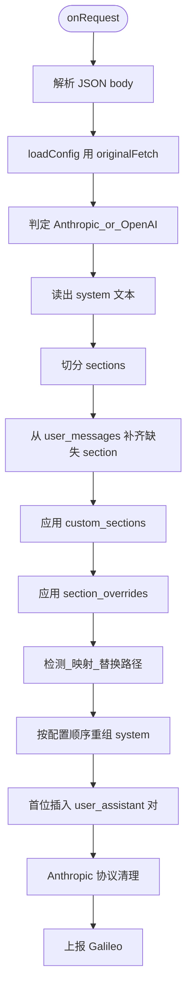
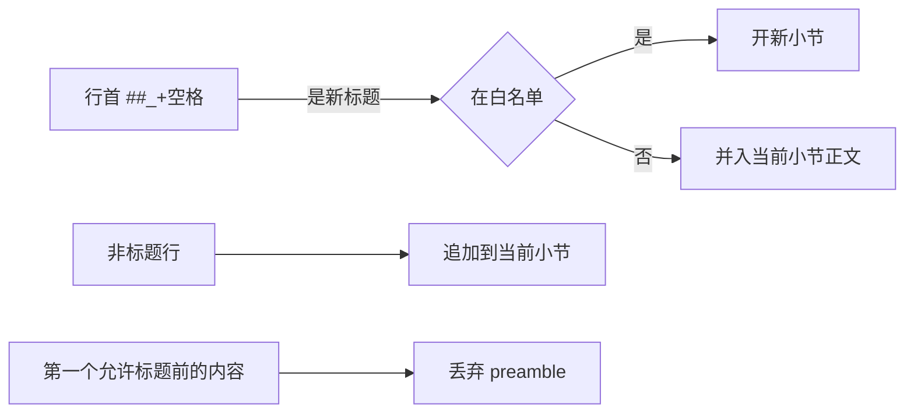
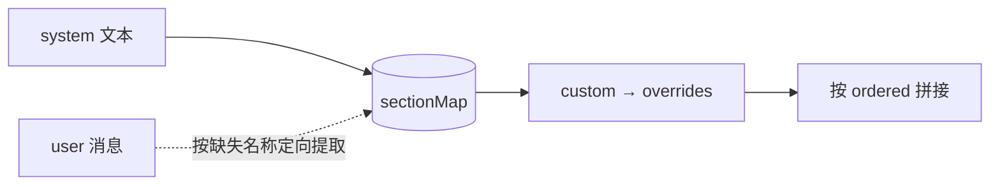
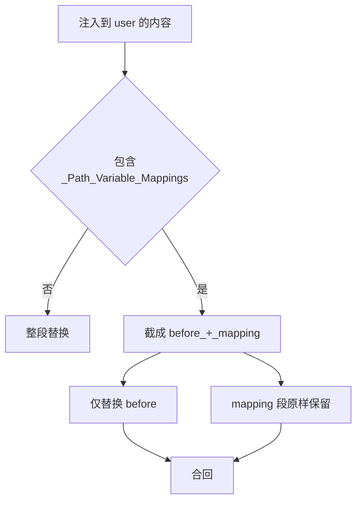
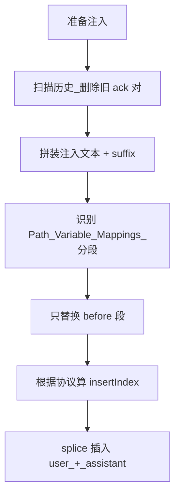
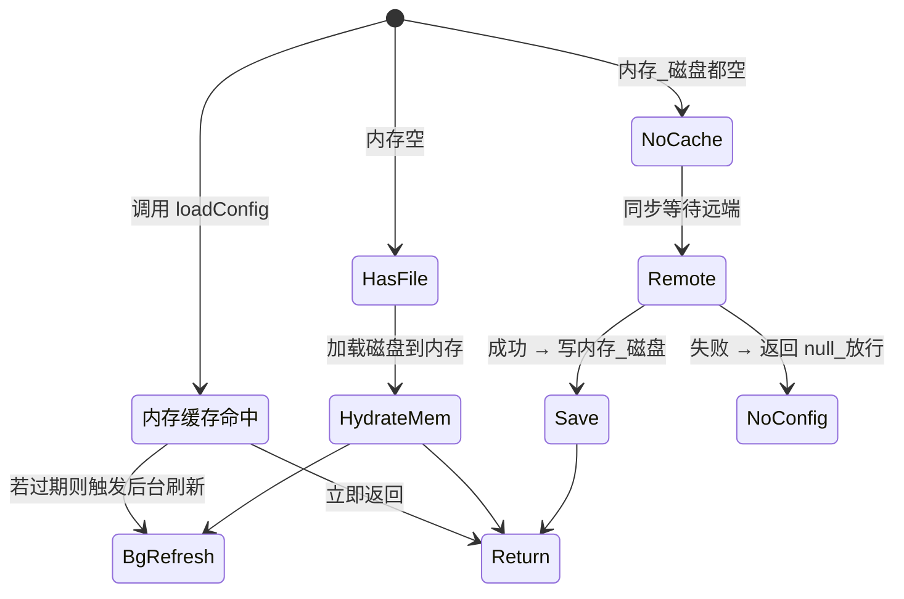

# QClaw Prompt Cache 优化策略深度剖析

> 读完本文你会知道：在多轮 Agent 场景下，为什么仅有的几行机器路径、几次模块顺序抖动，就能让百分位级别的成本翻倍；以及在不动模型、不改服务商的前提下，应用层能做哪些事把 KV cache 命中率拉回来。

关联阅读：[Prompt 管线总览](./QClaw-Prompt处理管线：从用户输入到LLM的完整旅程.md)、[审核链路分层纵深防御](./QClaw-审核链路分层纵深防御深度剖析.md)。

---

## 1. 从一个 Bug 看清问题

### 1.1 Prompt Cache 是什么，为什么它「脆」

大模型解码时，已经处理过的 token 会被服务端以 KV 形式存下来。下次请求若 prompt 的开头若干 token 完全一致，这段前缀就不必再过一遍 Attention，按 cache read 计费——Anthropic 当前的官方价位大约是普通输入价的 1/10。

这种缓存的关键特性，是它只看「从开头起多长的前缀逐字节相同」。一旦某个位置出现哪怕一个字符差异，从该位置往后的整段前缀都失效。换句话说，**位置敏感、内容敏感、空格敏感**——非常脆。

### 1.2 Agent 场景：缓存为什么经常没命中

把这个特性放进真实 Agent 场景，你会看到几种典型的「自损」：

| 现象 | 触发原因 |
|------|---------|
| 换台电脑就全部 miss | system prompt 里嵌着 `/Users/alice/...`、`C:\Users\bob\...` 这类机器相关串 |
| 跨小版本部分 miss | 多个插件往 system 追加自己的小节，拼接顺序不稳定 |
| 同一会话每轮都 miss | 当前时间、Runtime、入站上下文塞在 system 顶部，每轮都变 |

QClaw 的应对策略，落在三件事上：**把内容按小节重排到稳定顺序**、**把机器相关串替换成占位符**、**把易变内容从 system 前缀挪到 user/assistant 消息对里**。

下面我们顺着这三件事拆开看。

---

## 2. 优化器在管线里的位置

### 2.1 为什么 priority=900：安全先于优化

QClaw 的 Fetch 中间件用洋葱模型组织：`onRequest` 按 priority 升序进入，`onResponse` 按降序出栈。安全审核（content-plugin 在 200、pcmgr-ai-security 在 250）放外层，优化器放在 900——接近出口。

这个排序不是随手设置的。它解决两个潜在冲突：

- 如果优化器先跑，会改写 prompt 的物理形态（路径变占位符、小节顺序重排），后面的安全审核拿到的就不是用户原始意图，可能造成误判或漏判。
- 安全审核可能 short-circuit 整个请求（详见审核篇）。优化器跑在 short-circuit 之后没有意义，跑在之前是浪费。

因此：让安全决策先做出，再让最贴近网络出口的中间件把请求 body 改成「LLM 友好」的形态。

### 2.2 主流程的形状

优化器只在请求体里看到 `messages` 数组才动手。整个处理被收敛到一个纯函数里，方便单元测试：



一个关键设计是：`loadConfig` 必须使用 `ctx.getOriginalFetch()` 而不是当前的 `fetch`。原因是当前的 `fetch` 已经被 FetchChain 包裹，再去拉远端配置会触发递归。这是个不显眼但很重要的反例：在中间件里发起网络请求，永远要拿原始 fetch。

### 2.3 协议分叉

Anthropic 和 OpenAI 在 system prompt 的承载方式上不同：

- Anthropic 把 system 放在请求体顶层（可以是字符串或 text block 数组），messages 里不应该出现 `role=system`。
- OpenAI 把 system 当作 messages 数组里的第一条消息。

优化器用一个简单判定收敛差异：URL 含 `anthropic`，**或者**请求体有顶层 `system` 且 messages 里没有 `role=system`。后一条判定是为了识别那种走 OpenAI 兼容协议、但实际上是 Anthropic 形态的请求。读写时分两支处理，处理完后再统一收尾保证 Anthropic 协议合规。

源码锚点：`packages/prompt-optimizer/index.ts` 的 `processRequestBody`、`registerFetchMiddleware`。

---

## 3. 手法一：把内容按小节稳定下来

### 3.1 用什么作分隔符：成本与可读性的折衷

要做小节重排，第一步要切分。可选方案大致有三类：

1. 在 system prompt 里嵌入框架自定义的 marker，比如 `<<<SECTION:foo>>>`——可靠，但污染模型可见上下文，也让 prompt 不便于人工阅读。
2. 完全靠 NLP/规则识别小节——脆弱，且需要框架先训练。
3. 借用 Markdown 已有的二级标题 `## `——零侵入，但需要规避用户内容里出现 `##` 的「假阳性」。

QClaw 选了 3，再用白名单兜底。代码逻辑非常朴素：扫每一行，行首是 `## ` 时把后面当成小节标题；如果当前配置里给了白名单，那么只有白名单内的标题才被认作新小节开头，其余 `## ` 行被当作普通文本归到上一节里。

这是一个典型的「自由格式 + 配置约束」组合：默认行为足以应付大部分 prompt，遇到特殊文档习惯也能通过控制面收敛。



### 3.2 路径标题的双向 basename 别名

有一种小节标题本身就是路径，比如 `## /Users/alice/.qclaw/workspace/HEARTBEAT.md`。如果配置文件里硬写完整路径，换台机器就失效。

优化器做了一个对称的别名机制：

- 提取阶段：识别出路径形式的标题时，额外用其 basename（`HEARTBEAT.md`）作为别名写入 sectionMap。
- 命中阶段：白名单 `isSectionAllowed` 比较时，「标题是路径」和「白名单项是路径」两种方向都会取 basename 做匹配。

效果是：控制面里写 `HEARTBEAT.md` 就能命中各种平台、各个用户目录下的 HEARTBEAT.md。代价是 basename 冲突时后者覆盖前者，但实际场景里这种冲突极少出现。

源码锚点：`extractSections`、`isSectionAllowed`。

### 3.3 三层覆盖链

切分出 sectionMap 后，到模型可见前还会经过三轮：

```
extractSections (从 system 提)
    ↓
applyCustomSections (新增任意 section，不受白名单限制)
    ↓
applySectionOverrides (改/删已知 section，受白名单限制；优先级最高)
    ↓
buildContent (按 ordered_system_prompt 顺序拼接)
```

两个 apply 行为略有不同：

- `custom_sections` 用来「注入框架想插入的内容」，所以不受白名单限制——你可以加一个全新的 `## Cache Hint` 小节。
- `section_overrides` 用来「微调既有内容」，所以受白名单限制——值为空字符串等价于删除该小节。

最终拼接时，配置里点名但 sectionMap 里没有的小节会被静默跳过。这是个有意的选择：让模型 prompt 的稳定性优于配置的严格性。如果某个客户端版本没有 `## Heartbeat`，远端配置照样可以发，老版本不会因此报错。

### 3.4 从 user 消息里捞回缺失的 section

实际跑起来你会发现：`## Runtime`、`## Inbound Context` 这类小节经常不在 system prompt 里，而是被上游 OpenClaw 当成独立的 user message 注入到 messages 数组里。

如果只看 system，sectionMap 就缺这几块，重排出来的内容就漏。处理办法是回头扫一遍 messages 数组：对每个 `role=user` 的文本运行同样的 `extractSections`，只找当前缺失的几个名字，找到就补上、提早退出。



源码锚点：`processRequestBody` 里 `if (hasUserConfig) { const missingSections = ... }` 的回扫块。

---

## 4. 手法二：把机器相关串变成占位符

### 4.1 为什么不能只在编译期写死

Skill 目录、扩展目录、工作区根目录这些路径，会因为：

- 安装位置（`/Applications` vs 自定义目录）
- 操作系统（Unix 风 `/` vs Windows 风 `\`）
- 用户名（每个用户都不一样）
- workspace 实例（多开时形如 `workspace-agent-5cb34fee`）

而在每台机器上呈现完全不同的字面值。这就是经典的「环境绑定串」问题——同样的语义，前缀字节不同。

通用解法是引入占位符：把 `/Users/alice/.qclaw/workspace/skills` 这样的串替换成 `{workspace_skill_dir}`，模型看到占位符时去附带的映射表里查真值再访问磁盘。

### 4.2 路径检测：先抓所有可能，再用 tail 收敛

实现里把检测和归类分开做。检测阶段用三组正则覆盖三类形态：

| 形态 | 例子 | 备注 |
|------|------|------|
| Unix 绝对路径 | `/Applications/QClaw/skills` | 至少两段，避免误抓 `/usr` 之类太短的 |
| `~/...` | `~/.qclaw/workspace/skills` | 兼容 Windows 反斜杠形式 |
| Windows 绝对 | `C:\Users\bob\.qclaw` | 大小写盘符均可 |

有一个细节值得注意：Unix 正则会跟 `~/` 正则在 `~/.qclaw` 这种串上「打架」——如果不处理，Unix 正则会从 `~` 后的 `/` 开始抓出一段 `/.qclaw/...`，造成同一个路径被同时收到两种形态里。处理办法是在 Unix 正则循环里检查匹配位置前一个字符是不是 `~`，是就跳过。

```js
if (m.index > 0 && text[m.index - 1] === '~') continue
```

很小的一行，但它体现了「使用宽松正则 + 上下文兜底」这种工程做法的典型场景。

### 4.3 归类：tail 命中 + 优先级 + 变体

抓到的原始路径只是字符串，要变成有意义的占位符还得归类。归类规则用一张表表达：

```js
{ tail: '/.qclaw/workspace/skills', placeholder: '{qclaw_skill_dir}', priority: 11 }
```

`tail` 是「在归一化路径上要查找的尾段」。匹配方式有两种：

- 精确匹配：tail 后面紧跟 `/` 或字符串结束。比如 `/Users/alice/.qclaw/workspace/skills` 精准对上 `{qclaw_skill_dir}`。
- 扩展变体：tail 后面紧跟非 `/` 字符，比如 `/Users/alice/.qclaw/workspace-agent-5cb34fee/skills` 中 tail 是 `/workspace/skills`，但实际是 `workspace-agent-xxx`。此时把 `agent-5cb34fee` 提出来作为标签，生成 `{workspace_root_dir:agent-5cb34fee}` 这种带后缀的占位符。

优先级（priority）的作用是消歧。同一条原始路径可能同时匹配多个 tail（比如 `/.openclaw/workspace/skills` 和 `/.qclaw/workspace/skills` 都含 `/skills`）。模式按 priority 降序排，原始路径按长度降序排，让最具体的语义先消耗最长的字符串。这是「贪婪匹配 + 优先消费」的经典策略。

### 4.4 替换与映射段：避免自引用

替换阶段对每个绝对路径做两件事：

```js
result = result.split(absolutePath).join(placeholder)
// 还要兼容反斜杠版本
result = result.split(flipped).join(placeholder)
```

为了让模型知道这些占位符指什么，优化器还会构造一个 `## Path Variable Mappings` 小节，把映射关系连同一句自然语言指令一起喂进去——告诉模型「遇到占位符请先查表替换成真实路径再去访问磁盘」。

这里有一个反直觉的细节：**映射段本身不能参与替换**。否则会变成 `{workspace_skill_dir} = {workspace_skill_dir}`，模型彻底失去线索。所以注入用户消息的时候，要先把内容按 `## Path Variable Mappings` 分成前后两半，只对前半做替换，后半原样保留。



源码锚点：`detectPathReplacements`、`applyPathReplacements`、`buildPathMappingSection`。统计实际替换次数的 `countReplacementsInText` 是为 telemetry 服务的，不影响替换正确性。

---

## 5. 手法三：把易变内容挪出 system 前缀

### 5.1 为什么不能拼到最后一条 user 消息

到这里有个直觉问题：既然 `## Runtime`、`## Current Date & Time` 这类小节内容会变，为什么不直接把它们留在每轮新建的 user 消息里？

考虑一下缓存视角下三种做法：

| 做法 | 前缀稳定性 |
|------|----------|
| 易变内容留在 system | system 前缀每轮都变，最坏情况下 0% 命中 |
| 拼接到最后一条 user 后面 | 最后一条 user 本身也在变，注入段在序列里的「位置」也在变 |
| 独立 user + assistant 对，固定插在最前 | 注入段在每轮里的位置是固定的，前缀结构稳定 |

第三种是 QClaw 选的方案。多轮对话里，第一条 `role=user` 永远是注入内容，第二条 `role=assistant` 永远是一个固定的英文 ack，之后才是真正的用户对话。这一对就像一段「锚」，让后续的对话历史在序列里的位置可预测。

### 5.2 ack 的设计与去重

ack 必须固定到逐字节相同，否则锚的稳定性就崩了。默认值是：

```
Understood. I've noted your environment details and preferences.
I'll reference them throughout our conversation.
```

允许通过 `inject_user_query_ack` 改写，但用 `||` 而非 `??` 做 fallback——因为部分模型拒收空字符串 assistant content，需要把 `""` 当作「请用默认」。

多轮对话有一个隐性陷阱：上游会把上一轮 LLM 收到的完整 messages（含上一轮注入的 user/assistant 对）作为历史保留下来。如果不去重，每轮对话都会叠加一对，几轮过后 prompt 会被自我复制成笑话。

去重策略很直白：从尾向头扫，找到 content 等于 ack 的 assistant，且前一条是 user，就 splice 这两条出去。这种「按内容指纹去重」是因为 messages 数组里没有更可靠的元数据可以认领「这是我上一轮注入的」。

### 5.3 插入位置的协议适配

插入到哪？

- Anthropic：messages 里没有 system，从下标 0 直接插。
- OpenAI：跳过开头连续的 system 消息，在第一条非 system 之前插。

代码细节略，但有一点值得注意——注入内容里如果带有 `## Path Variable Mappings` 段，要走 §4.4 的「映射段免替换」逻辑。



源码锚点：`processRequestBody` 末段「按 inject_user_query + suffix 作为独立的 user+assistant 消息对插入」。

---

## 6. Anthropic 协议的「保留字段」处理

Anthropic 协议比较特别：`system` 字段允许是字符串，也允许是 text block 数组，且 block 上可以挂 `cache_control` 这类 metadata。

这意味着优化器写回 system 时必须考虑两件事：

1. 如果原始 system 是数组（说明上游在 block 上挂了 cache_control），写回时必须保留数组形态、保留第一个 text block 的 metadata，只替换 text 字段。否则会丢失服务商侧的显式 cache 标记。
2. 如果 messages 里混入了 `role=system`（不规范但偶有发生），最终阶段要扫一遍把它们合并到顶层 system 字段，再从 messages 里 filter 掉。这样既保证协议合规，也避免数据丢失。

代码里这两段非常短，但它体现了「保留上游已经做对的事」这种克制：优化器不假定自己是唯一关心 cache 的人。

源码锚点：`processRequestBody` 中 `originalSystemIsArray` 处理分支、文件末尾「Anthropic 协议最终保障」块。

---

## 7. 配置加载：把抖动控制在「永远不阻塞用户」

### 7.1 为什么用 SWR + 单飞 + 退避

远端配置必须能在线热更新，但它带来一个新问题：用户每一次请求都得等远端响应？如果远端慢一点、卡一下，整个请求链就跟着卡。

应对方案是把配置加载做成 stale-while-revalidate（SWR）—— HTTP 缓存里很经典的模式：

| 状态 | 行为 |
|------|------|
| 内存有配置且未过期 | 零延迟返回，不发请求 |
| 内存有配置但过期 | 零延迟返回旧配置，**后台**异步刷新 |
| 内存无、磁盘有 | 加载磁盘到内存（标记为已过期），返回旧配置 + 后台刷新 |
| 内存无、磁盘无（首次冷启动） | **同步**等待远端，唯一一条会阻塞的路径 |

参数：内存 TTL 30 分钟，单次拉取超时 1.5 秒，连续 5 次失败进入 5 分钟退避，期间不再发起远端请求——遵循「让远端坏了的影响有界」的原则。



注意还有一个「单飞」机制：用一个模块级 `inflightPromise` 防止并发请求同时发起多次远端拉取——内存里同一时刻只可能有一个 in-flight 请求，其他并发请求复用结果。

### 7.2 失败时的安全姿势

失败有不同后果：

- 远端拉失败但内存或磁盘有缓存：把 `lastConfigSource` 标为 `cache`，在 telemetry 里反映真实路径，业务正常进行。
- 远端拉失败且无任何缓存：返回 null，优化器整个走 skip 分支，不做任何 prompt 改写——这是非常重要的「优化器自身有故障不能伤业务」的兜底。
- 配置开关 `switch=false`：跟无配置等价，直接放行。

把「能跑」放在「跑得好」之前，是热路径配置加载的核心姿势。

源码锚点：`loadConfig`、`triggerBackgroundRefresh`、`fetchConfigFromRemote`，相关常量 `CACHE_TTL_MS / FETCH_TIMEOUT_MS / MAX_CONSECUTIVE_FAILURES / BACKOFF_DURATION_MS`。

---

## 8. 看得见的效果：可观测性

光改没用，得能量化。优化器把每次执行都上报到伽利略（Galileo）：

| 事件 | 何时上报 | 关键字段 |
|------|---------|---------|
| `prompt_optimizer_request` | 成功改写 | 优化前后 token 估算、缩减比、路径替换次数、命中的 section 数 |
| `prompt_optimizer_skip` | 配置缺失或 switch=false | skip_reason、config_source |
| `prompt_optimizer_error` | processRequestBody 抛错 | error_message、配置来源 |

Token 估算用最朴素的 `ceil(length/4)`——和 lossless-claw 等其他模块对齐，不是为了精度，是为了趋势可比。

`session_id / trace_id / user_id` 这些公共字段来自 `reqCtx.extra._contentPlugin`，由 content-plugin 中间件在更外层挂载。这意味着 telemetry 字段是跨模块共享上下文，不是各自重新计算——这种「上游挂载、下游消费」的设计在 OpenClaw 链路里很常见。

源码锚点：`reportGalileoLog`、`estimateTokens`、`processRequestBody` 末尾的 telemetry 块。

---

## 9. 这些模式哪些值得借用

回过头看，整篇下来用到的设计模式有这么几个，每个都不绑定 LLM 场景：

| 模式 | 解决什么问题 | 别处可以怎么用 |
|------|----------|--------------|
| 廉价分隔符 + 白名单 | 零侵入解析 + 防止误识别 | 解析任何半结构化文本（日志、Markdown 配置等） |
| 环境绑定串 → 占位符 + 映射 | 跨机器缓存命中、跨平台兼容 | 任何「同语义不同字节」的配置串 |
| 锚定 user/assistant 对 | 把易变内容挪出稳定前缀 | 任何需要稳定前缀的序列协议（不止是 prompt） |
| SWR + 单飞 + 超时 + 退避 | 热路径配置不阻塞 | 任何不能让用户等的远端配置加载 |
| 协议分叉用判定函数收敛 | 一套代码兼容两种协议 | 任何「主流派 + 兼容派」共存的接口适配 |

不可忽视的局限也得说清楚：

- 收益强依赖服务商是否对前缀重复计费/加速。Anthropic 提供，OpenAI 不直接提供（虽然它们的内部架构也会复用 KV，但不直接体现在计费上）。无 cache 计费时收益只剩「prompt 更短 → 输入 token 更少」。
- 路径占位依赖已知 tail 清单。如果业务里出现没列出的路径形态，就会被原样发出去——这是「优先级靠前的模式覆盖率决定收益」的结构。
- `## ` 作为分隔符与用户文档习惯潜在冲突，需要白名单治理或改用更冷门的分隔策略。

---

## 源码锚点

均在 `resources/openclaw/config/extensions/qclaw-plugin/packages/prompt-optimizer/index.ts`：

| 文章对应 | 函数/区域 |
|---------|---------|
| 主流程 | `processRequestBody` |
| 协议判定 | `processRequestBody` 顶部 `isAnthropic` 判定 |
| 小节切分 | `extractSections`、`isSectionAllowed` |
| 覆盖链 | `applyCustomSections`、`applySectionOverrides`、`buildContent` |
| 路径检测 | `detectPathReplacements` |
| 路径替换 | `applyPathReplacements` |
| 映射段构造 | `buildPathMappingSection` |
| 配置加载 | `loadConfig`、`triggerBackgroundRefresh`、`fetchConfigFromRemote` |
| 持久化 | `writeConfigCache`、`readConfigCache` |
| 上报 | `reportGalileoLog`、`estimateTokens` |
| 中间件注册 | `promptOptimizer.setup` 中 `registerFetchMiddleware` |
