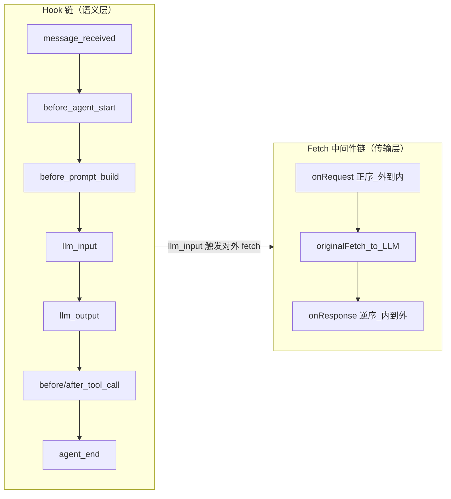
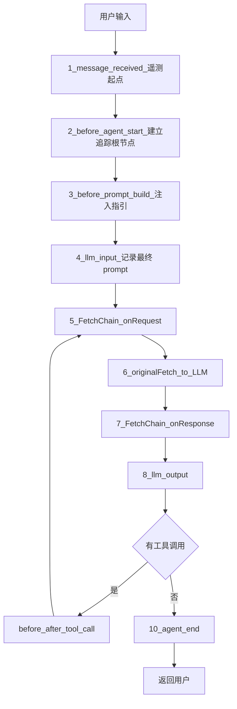
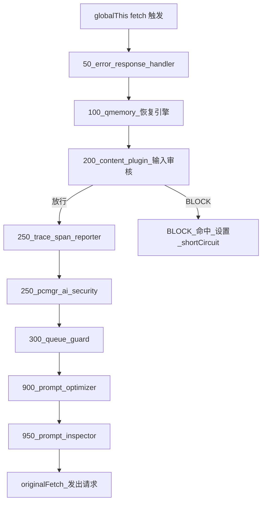
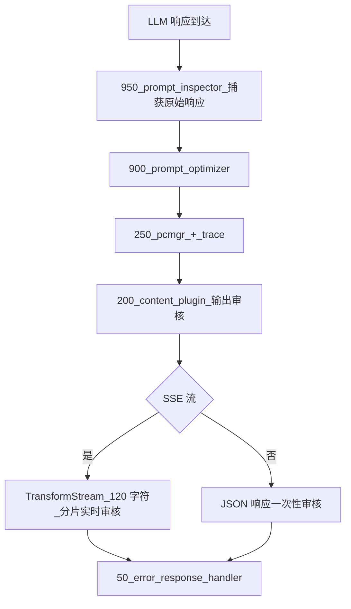
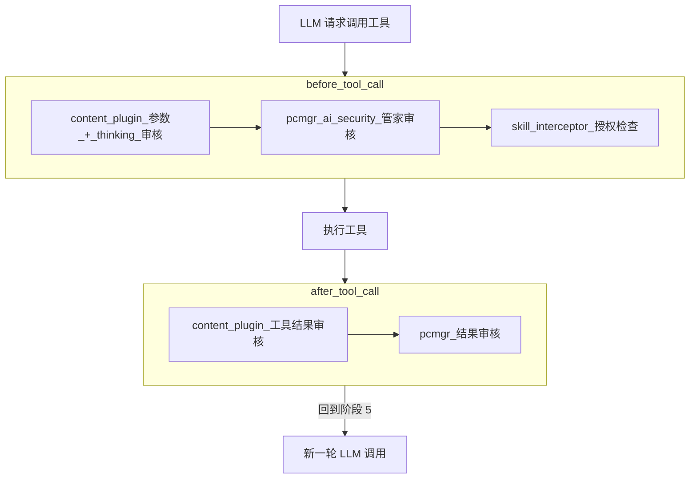

# QClaw Prompt 处理管线：从用户输入到 LLM 的完整旅程

> 读完本文你会知道：QClaw 是怎么把「用户的一句话」变成「发给 LLM 的请求」、又把「LLM 的流式响应」变回「用户看到的内容」的——这条管线为何用两条独立链路串起来、为何要 10 个阶段而不是 2 个、以及每个阶段是为了挡住怎样的问题而存在。

关联深入阅读：[Prompt Cache 优化](./QClaw-PromptCache优化策略深度剖析.md)、[审核链路分层纵深防御](./QClaw-审核链路分层纵深防御深度剖析.md)。

---

## Part 1：架构总览

### 1.1 为什么不能把用户输入直接转发给 LLM

最朴素的实现是：拿到用户消息、塞进 messages 数组、调用 LLM API、把响应流回前端。如果你只在 demo 里跑跑当然没问题，但放到生产环境，会同时撞上几堵墙：

| 你会看到 | 原因 |
|---------|------|
| LLM 账单几天翻一倍 | system prompt 里有绝对路径、时间戳，每轮 KV cache 都失效 |
| 偶发的违规输出流到用户 | 没有审核，模型偶尔会被诱导生成不合规内容 |
| 改坏一段 prompt 找不到是谁干的 | 多个模块层层改写 prompt，没有审计链就只能猜 |
| LLM 接口慢一下，对话全卡住 | 没有熔断和降级，依赖链一断就整体不可用 |
| 工具调用绕开安全策略 | 用户的 prompt 干净，但 LLM 让工具读了一个恶意文件 |

QClaw 的 qclaw-plugin 用一套插件化架构同时解决这些问题。它的核心结构是两条独立的拦截链。

### 1.2 为什么是两条链：语义层 vs 传输层

很多 Agent 框架用单一拦截器解决所有问题，结果是「同一段代码既要懂业务、又要懂协议」，复用性差、测试也难写。QClaw 选了分层方案：

- **Hook 链**：跟着 OpenClaw 的生命周期事件走。比如「用户消息到达」、「准备构造 prompt」、「准备调 LLM」、「LLM 返回了」、「要调工具了」——每个节点都有一个事件。在这些事件上，业务模块声明「我要做什么」，比如「在 system prompt 里追加一段 Skill 指引」。
- **Fetch 链**：跟着 HTTP 请求走。无论是哪个生命周期触发的请求，只要走 `globalThis.fetch`，就会经过这条链。改的是 HTTP body、headers、响应体——纯粹的传输层操作。

简单说：Hook 链负责「**事件触发时该改什么语义**」，Fetch 链负责「**HTTP 请求出去之前/响应回来之后该改什么字节**」。



两条链通过同一个 `priority` 模型协作：数字越小越外层、越早执行。这套机制让模块之间的执行顺序不靠隐式约定，而是靠声明。

### 1.3 HookProxy 的核心机制：从事件订阅到可控编排

HookProxy 解决一个很具体的问题：OpenClaw 的事件机制是 `api.on(event, handler)` 这种回调订阅模式，但 qclaw-plugin 里有十几个 package 都想监听同一个事件。如果每个 package 各自调一次 `api.on`，OpenClaw 内部就会有十几个并列的 handler，执行顺序不可控、相互影响不可见。

HookProxy 的做法是：**每个事件只向 OpenClaw 注册一次 `api.on`，内部自己维护 handler 列表**。从外部看是十几个独立监听，从内部看是一个统一调度器，能控制顺序、传递修改、并发分组。它额外支持的几种语义：

| 能力 | 含义 |
|------|-----|
| 按 priority 升序执行 | 默认 500，数字越小越早 |
| `block` 语义 | handler 返回 `{ block: true }`，后续 handler 不再执行 |
| `params` 改写 | handler 返回 `{ params: newParams }`，后续 handler 拿到改写后的版本 |
| `appendSystemContext` 合并 | 多个 handler 各自追加的 system context 被自动聚合 |
| `concurrent` 并行组 | 相邻的 concurrent handler 并发执行，减少等待 |
| `onHandlerExecuted` 观察者 | 让 prompt-inspector 这类只读模块旁路记录每一步改动 |
| 异常隔离 | 单个 handler 报错不影响其他 handler |

`concurrent` 并行组是一个值得专门提的设计：把彼此独立的 handler 标记为可并行，相邻的并行 handler 自动分组共同 `Promise.all`。这避免了「上报遥测的 handler 等审核 handler、审核 handler 等优化 handler」这种没必要的串行链。

### 1.4 FetchChain 的洋葱模型：理解为什么 onResponse 是逆序

FetchChain 把 `globalThis.fetch` 整体替换成一个中间件链。所有 HTTP 请求都经过这条链——不管发起者是 LLM 调用、内部接口还是后台轮询。

它的执行模型是「洋葱」：

```
onRequest:   priority 50 → 100 → 200 → 250 → 900 → 950 → originalFetch
onResponse:  priority 950 → 900 → 250 → 200 → 100 → 50
```

为什么逆序？因为「外层包内层」的语义最自然：外层中间件先看到请求、最后看到响应，就像剥洋葱时从外往里、从里往外。这种对称让 prompt-inspector 这种「记录最终请求 + 原始响应」的模块只需要注册一次就拿到完整的输入输出对：

- onRequest 阶段它最后执行——此时请求已被所有中间件改写过，看到的是真正发给 LLM 的字节。
- onResponse 阶段它最先执行——此时 LLM 响应刚到，还没被任何中间件审核或包装。

除了洋葱模型本身，FetchChain 还做了两件不显眼但很必要的事：

- **进程级单例保护**：OpenClaw 在多 agent 或 gateway 模式下可能多次调用插件的 `register()`，每次都新建一个 FetchChain 实例。如果不做保护，会出现 `globalThis.fetch` 被嵌套替换多次，每个请求被中间件重复处理 N 遍。`FetchChain.globalInstance` 静态字段确保只有第一个实例替换 fetch，后续实例把自己的中间件合并进去。
- **`match` 过滤**：中间件可以声明「不处理哪类请求」。比如内容审核服务自己的请求要被它自己拦截就死循环了——`match` 让它跳过自己的 endpoint。
- **延迟注册**：`install()` 后仍可注册中间件，因为执行链是动态读取数组而非快照。

### 1.5 当前中间件优先级总览

下表的 priority 不是随手设的，每个数字反映一个排序意图：

| Priority | 模块 | 做什么 | 为什么是这个值 |
|---------|------|-------|--------------|
| 50 | error-response-handler | HTTP 错误码 → SSE 友好响应 | 最外层——错误响应要在所有改写之前转换，让其他中间件能像处理正常响应一样处理错误 |
| 100 | qmemory | crash 恢复时替换 user message | 替换后要继续走安全审核，所以放在审核之前 |
| 200 | content-plugin | 内容安全审核（输入/输出） | 在所有可能改写 prompt 的模块之前先审核——审核看到的必须是用户原文 |
| 250 | trace-span-reporter | 注入 trace headers | 在大部分中间件之前注入，让链路追踪覆盖完整管线 |
| 250 | pcmgr-ai-security | 管家 AI 安全审核 | 与第一道审核处置语义不同（注入而非短路），独立熔断 |
| 300 | queue-guard | 模型排队守卫 | 审核之后再决定是否排队，避免不合规请求占队列 |
| 900 | prompt-optimizer | section 重排 + 路径替换 + 消息对注入 | 最内层——所有改写都在审核之后，且最接近网络出口 |
| 950 | prompt-inspector | 调试观察：记录最终请求与原始响应 | 比 optimizer 还内一步，捕捉「即将发出」的最终形态 |

源码锚点：`packages/*/index.ts` 各自的 `registerFetchMiddleware`、`core/hook-proxy.ts`、`core/fetch-chain.ts`。

---

## Part 2：Prompt 处理的完整生命周期

下面沿着「用户输入 → LLM → 返回用户」的时间线，逐阶段拆解每一步在做什么、解决什么问题。



### 阶段 1：message_received —— 留下最早的存证

用户在 UI 提交消息后立即触发。这是整条链路的最早入口。

这一步不改 prompt 内容，只做两件事：原始消息加密上报、起一个 trace 起点。"加密上报" 看起来像额外负担，但它的价值在排查时才体现：当一周后用户报告「上次问 X 没回」，运维要能根据 sessionKey 和时间定位到这条消息，看到「确实进来了，且当时是 Y 状态」。

参与方：content-plugin（记录加密日志）、trace-span-reporter（priority=100，开始采集遥测）。

### 阶段 2：before_agent_start —— 建立分布式追踪根节点

这一步建立 OpenTelemetry 的 `invoke_agent` root span，把 sessionKey、agentName、userId 这类上下文挂上去。

为什么需要这个根节点？因为接下来一次用户请求会触发：N 次 LLM 调用 + M 次工具调用 + K 次审核接口调用，每个都是独立 span。如果没有根节点把它们串起来，trace 后台就只能看到一堆孤立调用。根节点的存在让整条调用树呈现为一个有起止时间的整体。

参与方：content-plugin（priority=300）。

### 阶段 3：before_prompt_build —— 内容级 prompt 改写的核心

这是 prompt **内容层面**改写最密集的阶段。HookProxy 按 priority 升序串行（或分组并发）调用所有 handler：

| Priority | Package | 做什么 |
|---------|--------|-------|
| 100 | trace-span-reporter | 建立 trace 上下文 |
| 200 | content-plugin | `appendSystemContext` 注入 SkillHub 安装指引 |
| 280 | skill-interceptor | Skill 授权检查（部分预检） |
| 500 | qmemory | checkpoint 记录 + crash 恢复模式 arm |
| 900 | prompt-inspector | 旁路采集 PromptBuildEvent |

`appendSystemContext` 是个值得讲的设计。如果让每个 package 直接改 system prompt 字符串，会出现冲突——后改的覆盖先改的、谁先谁后取决于隐式注册顺序。HookProxy 让 package 只声明「我要追加什么」，由 proxy 自动聚合：

```
{ appendSystemContext: ['## My Section', '## Another'] }
```

每个 package 只关心自己加什么，不需要知道其他 package 加了什么——这是个简单但有效的解耦。

### 阶段 4：llm_input —— 最终 prompt 形态的回填点

到这一步 OpenClaw 已经组装好完整的 messages 数组，准备发起 LLM 调用。两个模块在此各做一件事：

- content-plugin（priority=300）：解析 system prompt 里的可用 Skills、创建 `chat` span、记录加密 prompt
- prompt-inspector（priority=950）：采集 `LlmCallEvent`，**回填** `finalSystemPrompt`

「回填」是个值得展开的概念。在阶段 3 里 prompt-inspector 已经创建过一个 `PromptBuildEvent`，但当时 system prompt 还在组装中，`event.systemPrompt` 拿到的不是最终形态。到 llm_input 这个时间点，组装才完成。inspector 在这里把最终形态写回之前那个事件——这样调试视图能看到「构建前 → 构建后」的完整对比。

如果不做回填，调试时拿到的「构建中」快照会和真实发出的版本不一致，排查问题时反而误导。

### 阶段 5：FetchChain onRequest —— 整条管线最密集的改写

阶段 4 触发对 LLM API 的 `globalThis.fetch` 调用，FetchChain 接管。中间件按 priority 升序逐层执行 onRequest：



下面按 priority 逐层说明。

**[50] error-response-handler**：这一层不改请求，只改响应——它在 onResponse 阶段把 HTTP 错误码转换成 SSE 友好的响应格式，让用户看到可读的错误提示而非 raw error。放在最外层是因为「错误转换」要在所有内层中间件之前完成，让它们都能像处理正常响应一样处理错误。

**[100] qmemory 恢复引擎**：当 OpenClaw 上次 crash 后重启，扫描未完成的 WAL（Write-Ahead Log）任务。如果用户表达了「继续」的意图，引擎会直接把最后一条 user message 替换成一段恢复指令，比如：

```
[TASK RECOVERY] 上次执行中断，用户没有看到任何结果。
用户请求恢复中断的任务。请重新执行以下被中断的任务：
任务：{原始任务描述}
```

为什么放在 priority=100 而不是更内层？因为替换后的内容仍要经过 content-plugin、pcmgr 的安全审核——恢复指令也不能绕过审核。如果放在最内层，相当于给了「恢复模式可以发任意 prompt」的绕过通道。

**[200] content-plugin 输入安全审核**：提取真正的用户消息（过滤掉 tool_result 回传），按 4000 字符分片并行送审。第一片要先 `stripPromptMetadata` 去除框架注入的标记，避免误判。命中 BLOCK 时设置 `shortCircuitResponse`，构造一段假的 SSE 流直接返回，跳过 LLM 调用。智能跳过 Memory Compaction 等内部请求。详见 [审核链路分层纵深防御](./QClaw-审核链路分层纵深防御深度剖析.md)。

**[250] pcmgr-ai-security 管家审核**：独立第二道审核，使用不同的后端服务。与 content-plugin 的最大区别是**不短路**——BLOCK 时整段替换 user 文本为安全话术，MARK 时在原文后追加风险标记，仍发给 LLM。两种处置语义共存的设计动机详见 [审核链路分层纵深防御](./QClaw-审核链路分层纵深防御深度剖析.md)。

**[250] trace-span-reporter**：注入 `x-agent-request-id` 等链路追踪 headers，让 LLM 服务商侧的日志能与本地 trace 对齐。

**[300] queue-guard 模型排队守卫**：在高并发或限速场景下决定是否延迟该请求。不改 prompt 内容，只影响发出时机。放在审核之后避免不合规请求占用排队额度。

**[900] prompt-optimizer**：管线里最关键的优化器。做三件事：

- 按远端配置的固定顺序重组 `## ` 小节，稳定 token 前缀
- 把绝对路径替换为语义化占位符（如 `{qclaw_skill_dir}`）
- 把易变 section 从 system prompt 移到 user/assistant 消息对里，避免污染前缀

为什么放在 priority=900（最内层）？理由是「安全审核必须看到用户原文」。如果优化器先跑，审核看到的就是被路径替换、被重排过的版本——一段被改写的 prompt 既不利于审核策略命中，也让审核日志失去了「这是用户真实说了什么」的语义。把优化放在最内层，保证审核拿到的是用户原文，优化只改变最终发给 LLM 的字节。详见 [Prompt Cache 优化](./QClaw-PromptCache优化策略深度剖析.md)。

**[950] prompt-inspector**：作为最内层 onRequest，它记录经过所有改写之后即将发给 LLM 的最终请求。配合 onResponse 阶段的最外执行（priority 反过来最先），形成完整的「最终请求 → 原始响应」对——这是出问题时最关键的证据。

### 阶段 6：originalFetch —— 真正发出去

经过所有 onRequest 中间件后的请求送到 LLM API。

如果上游中间件设置了 `shortCircuitResponse`（典型场景：content-plugin BLOCK），FetchChain 跳过 originalFetch，直接用 shortCircuitResponse 进入 onResponse 阶段。这意味着 LLM 服务商根本没看到这个请求——成本和合规风险都不暴露。

协议适配的细节在阶段 5 的 prompt-optimizer 里完成：通过 URL 是否含 `anthropic` 或请求体是否有顶层 `system` 字段判定协议类型，Anthropic 把 system 放顶层、OpenAI 放 messages 里，读写逻辑分两支处理后再统一保证 Anthropic 协议合规。

### 阶段 7：FetchChain onResponse —— 输出审核的实时窗口

LLM 响应回来后按 priority 降序逐层执行 onResponse：



输出审核（content-plugin）是这一阶段的重头戏，因为流式输出意味着不能等全文再审：

- 用 `TransformStream` 包装上游 reader，边接收边切片送审，每累积 120 字符送一次。
- 命中触发源不只一种：审核接口返回 BLOCK、LLM 自截（`finish_reason: content_filter / sensitive / error`）、正则匹配已知拒绝话术——都视为输出违规。
- 命中后向下游写入替换 chunk（含 `<!--REDACT-->` 标记）+ `[DONE]`，并取消上游 reader。

prompt-inspector 的位置体现了洋葱模型的优势：注册 priority=950，在 onRequest 阶段最后执行（看到最终请求），在 onResponse 阶段最先执行（看到原始响应）——一次注册拿到完整 IO 对。

### 阶段 8：llm_output —— 收尾本轮 LLM 调用

- content-plugin（priority=300）：结束 `chat` span，上报 token 用量 metrics
- prompt-inspector（priority=950）：采集 LlmResponseEvent，记录 Response 修改链审计日志

简单收尾，但 token 用量上报是计费和容量规划的依据，不能省。

### 阶段 9：工具调用拦截 —— 如果 LLM 想调工具

如果 LLM 在响应里要求调用工具，进入工具调用审核流程：



一个易被忽略的攻击面：参数本身干净，但 LLM 在调用前的 thinking 阶段「想」了不合规内容。content-plugin 的应对是从持久化会话存储里捞出当前 toolCallId 对应的 thinking 文本，**前置拼接到送审字符串**——让审核看到完整的「意图 + 参数」。

skill-interceptor 拦三类操作（详见 [审核链路](./QClaw-审核链路分层纵深防御深度剖析.md)）：

- `use_skill`：LLM 直接调用 skill
- `read` / `read_file` / `with`：LLM 想读 skill 目录下的文件
- `exec` / `bash` / `execute_command`：LLM 想跑 mcporter 或 skill 入口脚本

拦三类是因为只挡一类，LLM 会自然选择另一类绕开。处置矩阵随请求来源（PC vs 外部渠道）和授权状态（OAuth / 授权码 / wecom-cli）变化。

工具执行完后，结果作为新的 message 回到阶段 5，发起下一轮 LLM 调用，直到 LLM 不再请求工具——这就是为什么阶段 9 在流程图里指回阶段 5。

### 阶段 10：agent_end —— 收尾整条会话

| Priority | Package | 做什么 |
|---------|--------|-------|
| 500 | qmemory | 标记任务完成 + 清理 WAL |
| 850 | workspace-summary | 触发工作区摘要（concurrent 并行组） |
| 900 | prompt-inspector | 标记 run 结束 |
| 900 | auto-memory | 从 messages 增量提取记忆 |
| 900 | trace-span-reporter | 结束 root span |

注意三个 priority=900 的 handler——它们可以被声明为 concurrent，由 HookProxy 自动 `Promise.all` 并发执行。否则记忆提取要等工作区摘要、追踪结束要等记忆提取，串成一条没必要的串行链。

至此，一条用户消息完成了从输入到 LLM 再到返回用户的完整旅程。

---

## Part 3：Prompt Cache 优化专题（延伸阅读）

Anthropic 和 OpenAI 对**相同 token 前缀**可复用 KV 计算结果——按 cache read 计费，比正常输入低一个量级。但前缀的脆性来自三类常见问题：绝对路径每台机器都不同、section 拼装顺序漂移、动态内容塞进 system 头。

prompt-optimizer 通过 section 固定顺序重组、绝对路径占位符 + 映射表、前置 user-assistant 消息对三种手法应对。配置加载采用 stale-while-revalidate + 单飞 + 退避，确保配置抖动不阻塞用户请求。完整剖析见 [QClaw Prompt Cache 优化策略深度剖析](./QClaw-PromptCache优化策略深度剖析.md)。

---

## Part 4：审核链路纵深防御专题（延伸阅读）

四层独立闸门组合纵深防御：content-plugin（Fetch 中间件，输入 short-circuit、SSE 输出分片实时审核、REDACT 历史清理）、pcmgr-ai-security（注入式处置、MessageCache、场景跳过）、skill-interceptor（业务授权钩子）、以及 before/after_tool_call（thinking 前缀送审、工具结果审核）。

两套独立熔断器分别采用主动探测 + 指数退避和被动 cooldown 自动恢复——单组件故障不让整体失效。完整剖析见 [QClaw 审核链路分层纵深防御深度剖析](./QClaw-审核链路分层纵深防御深度剖析.md)。

---

## 结语：可以复用的设计原则

回顾这条管线，可以提炼出几条不绑定 LLM 场景的设计原则：

### 双链分离

把「语义层逻辑」和「传输层逻辑」拆成两条独立的链。事件驱动的模块（追加 system context、记录 trace）走 Hook 链，HTTP 改写的模块（审核、压缩、路径替换）走 Fetch 链。两条链通过同一个 priority 模型协作，但语义层的人不需要懂 HTTP，传输层的人不需要懂事件。

这种分离让团队能在不同抽象层并行工作，也让单元测试可以分别 mock 两条链。

### 洋葱模型 + 显式 priority

让中间件之间的顺序靠声明而不是注册时序。模块之间不需要知道彼此存在，只需要选一个 priority 数字——数字小的更外层、更早执行 onRequest、更晚执行 onResponse。

priority 不是随手设置：50（错误转换）、200（审核）、900（优化）、950（调试观察）每个值背后都对应一个排序意图。新模块加入时只需选一个反映自己定位的 priority，就能自然排好。

### 审核在外，优化在内

这是 priority 排序里最重要的一条具体决策。优化器（priority=900）在最内层，让审核（priority=200/250）看到的始终是用户原文。把这个原则倒过来——优化先于审核——会立刻撞上「审核策略命中率下降」和「审核日志失去原文语义」两个具体问题。

### 安全降级优于阻断

所有外部依赖（审核、配置中心）都有熔断/降级路径。内容审核熔了走「降级放行」、配置中心挂了走「旧缓存」、远端没有任何缓存走「跳过优化」。核心原则：**宁可用旧数据、宁可跳过优化、宁可漏过审核，也不阻塞用户请求**。

这是个有取舍的决定——它假定「服务可用性的代价比偶发漏审的风险更高」。在另一种业务里（比如 KYC、医疗）可能要反过来。重要的是把这种取舍写出来、放进熔断器参数里，而不是埋在代码里。

### 可观测性内建

prompt-inspector 从第一天就在管线里，通过 HookProxy/FetchChain 的 observer 机制旁路观察每一步。不是在出问题后加日志，而是设计时就让每一步变更可追溯。

这一点对于 10 个阶段、7+ 个中间件层层改写的管线是不可或缺的——少了它，出问题后你需要先猜「是哪一层改坏了」，再去那一层加日志、再重现一次。有了它，第一次出问题就有完整的修改链证据。

---

## 源码锚点

均在 `resources/openclaw/config/extensions/qclaw-plugin/`：

| 概念 | 路径 |
|------|------|
| 插件主入口 | `index.ts` |
| HookProxy | `core/hook-proxy.ts` |
| FetchChain | `core/fetch-chain.ts` |
| 各 package 注册逻辑 | `packages/*/index.ts` |
| Hook 事件定义 | `core/types.ts` |
| 共享消息工具 | `packages/shared/message-utils.ts` |
