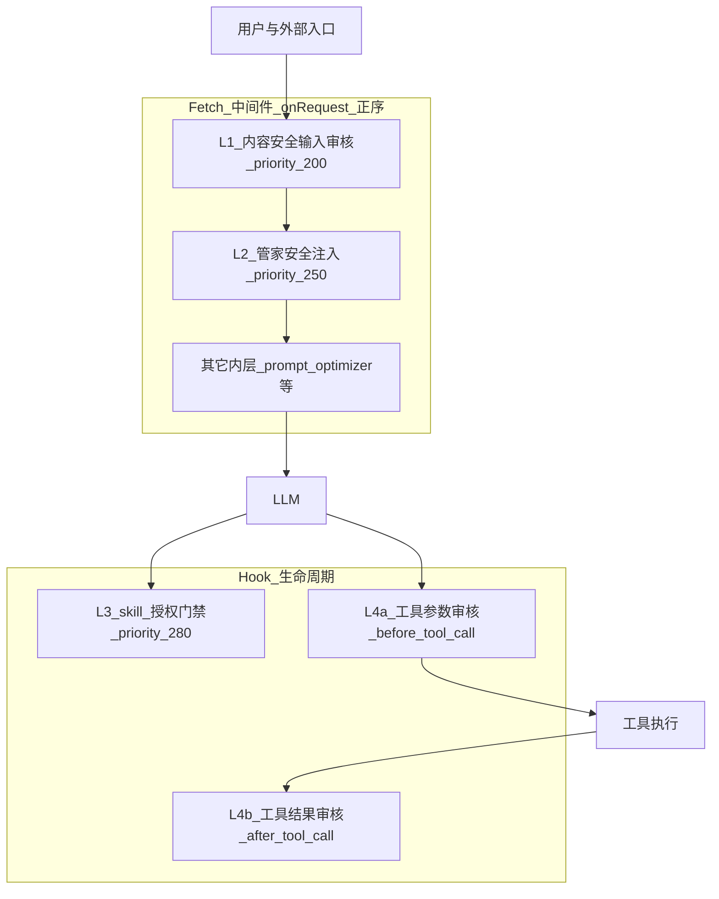
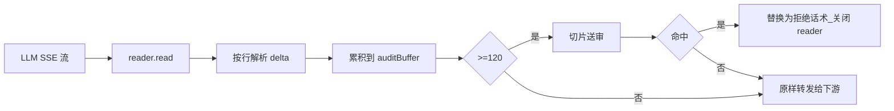
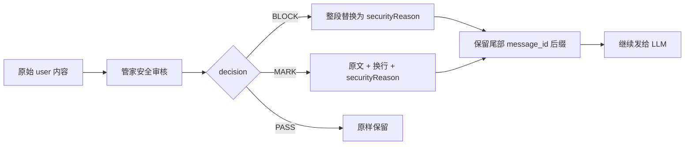
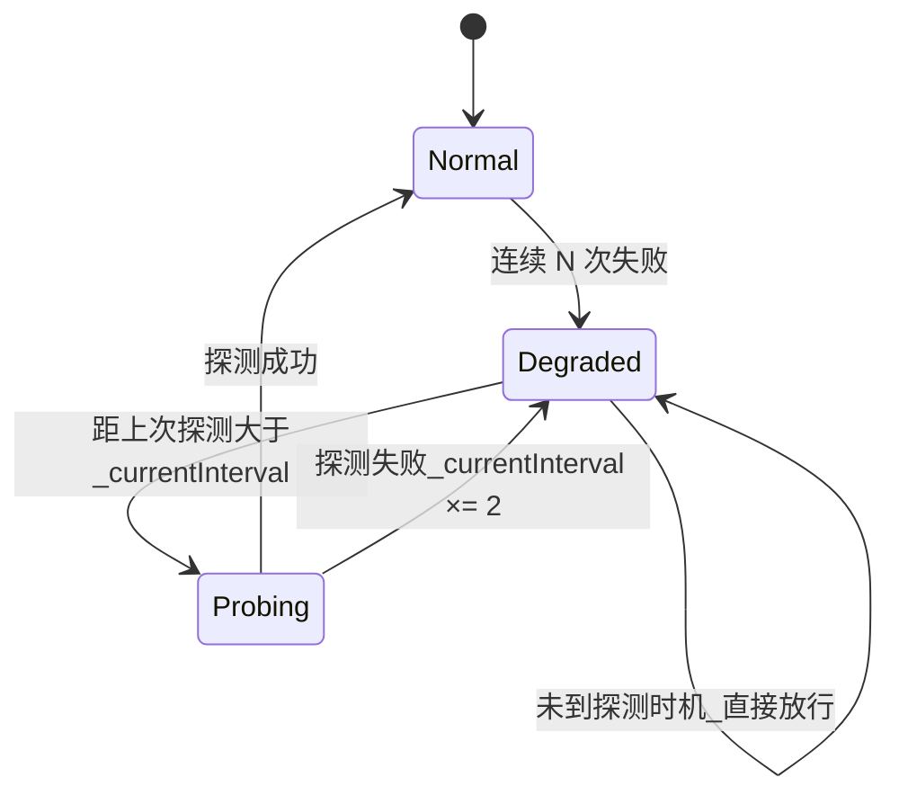
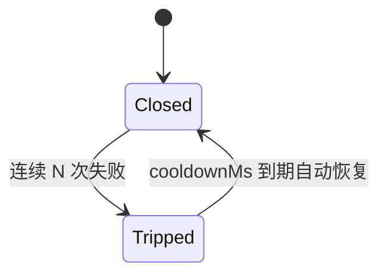

# QClaw 审核链路分层纵深防御深度剖析

> 读完本文你会知道：当 LLM 既要快、又要不出格、又能持续工作时，「能不能在不影响用户体验的前提下，把审核做得既严又稳」是一个怎样的设计问题；以及 QClaw 是如何把它拆成四层独立闸门来回答的。

关联阅读：[Prompt 管线总览](./QClaw-Prompt处理管线：从用户输入到LLM的完整旅程.md)、[PromptCache 优化策略](./QClaw-PromptCache优化策略深度剖析.md)。

---

## 1. 为什么不能只放一道闸

### 1.1 单点审核会同时输给所有方向

假设你只放一道审核：用户消息进来时调一次接口，命中就拒，没命中就转发给 LLM。这种最朴素的做法在生产里有三种典型失败：

| 失败模式 | 来源 |
|---------|-----|
| 误杀 | 单一策略偏严，正常用户被挡，转化和口碑同时受损 |
| 漏放 | 单一策略偏宽，违规内容流到 LLM，合规与品牌都暴露 |
| 抖动 | 审核接口慢或挂了，整个对话被卡住——比拒一句话更糟 |

这还没考虑到 LLM 的几个额外复杂性：

- 输出是**流式**的。等全文再审核会让首字延迟变高；边审边发又面临「半句话已经送到用户面前」的工程窗口。
- 模型在调用工具前可能有 **`thinking`** 阶段。表面参数看着干净，但 thinking 里可能藏着不合规意图。
- 工具的**输出**本身也可能不合规——比如让模型读取一个被注入恶意指令的本地文件。

一道闸过不去这些。要么过于宽松，要么把请求拖死。

### 1.2 纵深防御的设计姿势

软件工程里有一个常见思路：与其找一个完美的单点，不如把决策点串成多层，每层做不同维度的事，单层失败不让整体失败。网络安全里这叫 defense-in-depth，QClaw 在审核链路上做了类似的事：



四层分别回答四个不同的问题：

| 层 | 问题 |
|---|----|
| L1 | 用户的输入和模型的输出，本身是否合规？ |
| L2 | 即使内容没有显式违规，是否需要把安全提示注入对话上下文？ |
| L3 | 这次工具调用是否被业务授权了？ |
| L4 | 工具的参数（含 thinking）和返回值是否合规？ |

这四个问题彼此正交。一个 prompt 可能在 L1 完全合规，但在 L3 因为没授权而被拒；也可能在 L1 经过、L2 加了警示但放行、L3 通过、最终在 L4 因工具输出包含敏感数据被拦。

下面我们逐层拆开看，重点关注每层的「处置语义」——这是它们彼此区分的关键。

---

## 2. 四层的执行位置和处置差异

### 2.1 处置语义的差异是这个体系的灵魂

把四层放在一起对照：

| 层 | 包 | 执行位置 | 命中后做什么 |
|---|---|--------|------------|
| L1 | content-plugin | Fetch 中间件 onRequest/onResponse | **short-circuit**：伪造 SSE 响应、彻底跳过 LLM 调用 |
| L2 | pcmgr-ai-security | Fetch 中间件 onRequest | **改写 prompt**：BLOCK 全替换、MARK 追加警示，仍发给 LLM |
| L3 | skill-interceptor | Hook before_tool_call | **业务阻断 + 卡片**：返回授权卡片或文字提示 |
| L4 | content-plugin | Hook before/after_tool_call | **阻断单次工具调用**，不影响整体会话 |

特别注意 L1 和 L2 的处置语义差异：

- L1 的 short-circuit 意味着「这句话不能上 LLM」——直接给用户一段委婉拒绝，请求链就到此为止。
- L2 的注入意味着「让 LLM 看见这句话被标记了」——BLOCK 替换可见的 user 意图，MARK 在用户原文后追加风险提示。模型仍会继续工作，但被引导到一个更安全的话术框里。

为什么要两种语义并存？因为对于「明显违规」，越早拒越好；对于「灰色地带」，由模型在被警示的前提下做合规收尾，往往比硬拒更适合业务场景。

### 2.2 中间件之间的相对顺序

Fetch 链按 priority 升序进入 `onRequest`、降序进入 `onResponse`。审核相关中间件在外层（200 / 250），其它优化在内层（如 prompt-optimizer 在 900）。这个排序意味着：

- 安全决策在前，优化在后——优化器不能改写一个本该被 short-circuit 的请求。
- prompt-inspector 在最外层（999），SSE 字节流从原始网络出来时，它能拿到未被改写的版本。

源码锚点：`packages/content-plugin/src/interceptor.ts` 中的 `priority: 200`、`packages/pcmgr-ai-security/src/interceptor.ts` 的 `priority: 250`、`packages/skill-interceptor/index.ts` 的 `HOOK_PRIORITY = 280`。

---

## 3. L1：内容安全（输入/输出）

L1 是面向「明显违规」的硬拦截层。它的工作分两个方向：用户输入要审、模型输出也要审，而且都要在不显著拖慢请求的前提下做完。

### 3.1 输入审核：抽取真正属于「用户」的那一句话

第一步是判断「这次请求里，要审核的是哪段文字」。这不像看起来那么简单，因为 `messages` 数组里可能有：

- 用户当前消息
- 上一轮的 assistant 回复
- 工具调用回传（OpenAI `role=tool`，Anthropic `tool_result`）
- 系统注入的元数据

如果不分清，会出现「把工具返回的内容当成用户恶语再去审一次」这种误杀。L1 的抽取策略是：

```
从 messages 末尾向前找最后一条 role=user，但要把「上下文像是工具链路」的情况排除掉
```

判定细节：

- Anthropic 协议下，如果 `content` 数组里出现 `tool_result` 或 `tool_use`，整条 messages 视为工具上下文，返回空数组（这次不送审）。
- OpenAI 协议下，先向前找最近的 assistant；如果它带 `tool_calls`，或者中间夹着 `role=tool`，同样视为工具上下文。

这与 L2 的 `robustExtractLastUserMessage` 故意不一样——L2 不做工具过滤，因为 L2 关心的是「这次 prompt 在策略上要不要打标」，而不是「这次是不是用户主动说的话」。两层抽取语义的差异，本身就是纵深防御的一种体现。

### 3.2 分片：4000 字符为一刀

很多审核接口对单次请求长度有限制，且过长的内容会让 P99 延迟难以预测。L1 的做法是把内容按 `PROMPT_MAX_LENGTH = 4000` 切片并行送审，任一片命中就视为整体命中。

分片的第一片在送审前还会过一次 `stripPromptMetadata`，把框架注入的标记（如 `## Runtime`、`## Inbound Context` 这些 OpenClaw 元数据）剥掉。否则审核策略可能因为这些固定字符而误报。

### 3.3 short-circuit：一段伪造的 SSE 响应

命中后怎么把请求「中止」？最朴素的做法是抛错，但用户侧会看到一个 HTTP 错误，体验很差。L1 选了一个更工程化的方案——伪造一段成功的 SSE 流：

```
HTTP/1.1 200 OK
Content-Type: text/event-stream

data: {"choices":[{"delta":{"content":"<!--REDACT-->抱歉，这个问题我暂时无法解答..."}}]}
data: [DONE]
```

设置 `ctx.shortCircuitResponse` 后，FetchChain 会直接用这段响应代替真正的 `originalFetch`。对前端来说，它收到一段完整的助手回复；对 LLM 服务商来说，这次请求根本没发出去——成本和合规都不暴露。

`<!--REDACT-->` 标记不只是视觉提示。它会被后续的清理逻辑识别，确保「这次拒绝话术」不会留在 messages 历史里污染下一轮。

### 3.4 输出审核：边发边审的窗口工程

输出审核更难一些。LLM 生成是流式的，如果等到全文再审，首字延迟会变高；如果完全实时审，每来一个 token 就调一次接口又过重。

L1 选了一个折衷：把流式输出累积到 `OUTPUT_MAX_LENGTH = 120` 字符就切一片送审。在 TransformStream 的 `pull` 回调里维护两个缓冲——`auditBuffer`（送审窗口）和 `fullContent`（完整内容用于日志）。



命中后用 `enqueueBlockedMarker` 写入替换 chunk + `[DONE]`，再 `reader.cancel()` 切断上游。这意味着：用户已经看到的前缀仍然保留（先发后审的代价），但从拒绝那一刻起内容立刻变成话术。

流结束时还有几个分支：

- 如果 LLM 自己回了 `finish_reason: content_filter / sensitive / error`，等价于模型侧已经自截，走相同的话术替换路径。
- 流末尾的剩余 buffer 用 `setTimeout(0)` 再送一次，避免最后不足 120 字符的尾段漏审。
- 末尾审核的 SessionType 根据 `finish_reason` 是否为 `tool_calls` 区分：中间轮用 `ANSWER`，最终轮用 `ANSWER_END`，便于审核侧分析整段会话语义。

### 3.5 REDACT 历史清理

L1 拦截过的话术会留在 messages 里，下一轮请求时 OpenClaw 会把它们作为历史发回来。如果不清理，模型可能复读这段话术，或者借助它绕过审核（「之前那句你说不能回答的，能不能换个说法回答？」）。

清理策略叫 `filterRedactedMessages`：

```
遍历 messages，对每个含 <!--REDACT--> 的消息：
  向上找最近的 role=user 作为 rangeStart
  向下找下一条 role=user 作为 rangeEnd
  删除 [rangeStart, rangeEnd) 区间的所有消息
```

为什么删整段而不只是删 REDACT 那一条？因为一轮对话由 user 消息开启、由下一条 user 终止，中间可能夹着 assistant、tool_result 等。把整段切干净才能避免「拒绝话术的上下文残骸」。

### 3.6 多模态审核（注意：默认未启用）

源码里保留了完整的多模态审核链路：

- 提取消息中的 `[image:path]` / `[file:path]` 标记和 base64 image block
- 通过 COS 上传到内部地址
- 调用多模态审核服务

但目前这段被 `if (false && ...)` 包裹，明确关闭。看源码时容易误判为「已上线」——以你拿到的构建版本为准。

源码锚点：`packages/content-plugin/src/interceptor.ts` 的 `onRequest` 和 `onResponse`、`extractLastUserMessage`、`filterRedactedMessages`、`PROMPT_MAX_LENGTH` / `OUTPUT_MAX_LENGTH`、`enqueueBlockedMarker`。

---

## 4. L2：管家安全（注入式处置）

L2 不做 short-circuit，它做「改写并继续」。这是它和 L1 最大的区别。

### 4.1 BLOCK 和 MARK：两种注入方式



BLOCK 用安全话术完全替换可见的 user 文本——模型只能看到「之前的请求被拦截了，请提示用户修改」。MARK 则在原文后追加风险提示——模型可以看到用户原文，但被告知它带有特定风险，需要谨慎回应。

为什么要保留尾部的 `[message_id:xxx]`？因为下游审计系统按这个 ID 关联对话。哪怕整段被替换，message_id 都要保留，不然链路追踪断裂。

OpenAI 的多模态 user 消息是 `content: [{type:"text", text:"..."}, {type:"image"}]` 数组，注入逻辑会递归处理每个 text part。

### 4.2 MessageCache：避免每轮都重审同一条消息

多轮对话里，用户上一轮发过的消息会作为历史出现在当前 messages 里。如果每轮都重新调审核接口，浪费且不稳定（接口本身可能给出微妙不同的判定）。

L2 的应对是缓存：

- 用 `md5(content) + index` 作 key，存第一次审核结果。
- 进入 onRequest 时遍历 messages，对每条 user 消息检查缓存——命中就直接 `injectSecurityMarker` 改写。

这个缓存只在 BLOCK/MARK 时写入，PASS 不缓存——否则会把「上次刚好放行」的判定固化下来。

### 4.3 抽取与清洗：两类隐藏内容必须先剥掉

送审前要先把不属于「用户真实意图」的部分剥离：

| 来源 | 剥离方式 |
|------|---------|
| OpenClaw 注入的 `## Runtime`、`## Inbound Context` 等元数据 | `stripOpenClawMetadata` 用最末尾的 `[timestamp]` 信封定位真实用户输入；fallback 是按 sentinel 行跳过元数据块 |
| UI 层注入的 `¥¥...¥¥` 隐藏指令（如 Skill 安装） | `stripHiddenPrompts` 移除成对标记和未闭合尾部，兼容半角/全角 |

清洗顺序：`stripOpenClawMetadata` → `stripHiddenPrompts` → `trim()`。两个都是出于安全考虑——如果不剥，攻击者可以构造一条看起来「全是元数据」的消息，让真实违规文本被审核策略当成框架数据放过。

### 4.4 跳过审核：场景识别比内容判定更可靠

L2 不是所有请求都送审，因为有些场景天然就不是用户主动对话：

| 场景 | 识别方式 | 处置 |
|------|---------|------|
| 心跳 | `trigger === 'heartbeat'` | 跳过 |
| 定时任务 | sessionKey 含 `:cron` 段 | 跳过 |
| 记忆类 | sessionId 匹配 `plg-mem-` / `plg-ws-` / `plg-lcm-` 前缀 | 跳过 |
| 用户对话 | sessionKey 匹配 `agent:main:*` 或 `agent:xxx:session-*` / `agent:xxx:main` | 送审 |
| 其它 | 上述都不命中 | 跳过 |

判定优先级是固定的 `HEARTBEAT > SCHEDULED > MEMORY > USER_QUERY > OTHERS`。判定结果按 traceId 缓存（上限 100，FIFO 淘汰），避免同一次 run 内多次重复计算。

值得专门点出来的一段源码注释：

```
// isInternalPluginRequest 已移除（安全修复）。
// 该函数基于 prompt 前缀文本匹配跳过审核，可被用户伪造绕过。
```

旧版本曾用「prompt 是否以特定字符串开头」来识别内部请求并跳过。这是个可被用户伪造的信道——用户可以在自己的消息里加上这个前缀，把审核绕过去。新版只用 sessionKey + x-session-id header 这种由系统控制的信号来判定。这是一个很经典的「不要让用户控制的字段决定安全策略」的反面案例。

### 4.5 sessionKey 的细化

CLI 模式下，所有主对话的 sessionKey 都是 `agent:main:main`，无法区分不同会话。这会让审计、缓存、限流等下游模块拿不到细粒度信息。L2 在送审前会做两类细化：

- `agent:xxx:main` 形式：拼上 `x-session-id` header → `agent:xxx:main:<sessionId>`
- `agent:xxx:openai-user:<json>` 形式（外部渠道走 OpenAI 兼容 API 的形态）：去掉 JSON 部分，替换为 `<sessionId>` → `agent:xxx:openai-user:<sessionId>`

这两个修饰都是出于「下游需要稳定且能区分的会话 ID」这个朴素需求，但实现上需要前置知道每种 sessionKey 形态的语义。

源码锚点：`packages/pcmgr-ai-security/src/interceptor.ts`、`src/utils.ts` 中的 `injectSecurityMarker` / `stripOpenClawMetadata` / `stripHiddenPrompts` / `resolveQueryScene` / `USER_QUERY_PATTERN`、`src/cache.ts` 的 `MessageCache`。

---

## 5. L3：Skill 授权门禁

L3 解决的不是 NLP 语义风险，而是业务授权。即使一段话完全合规，也不代表当前用户可以在当前渠道调用任何 Skill。

### 5.1 三类触发面

LLM 触发 Skill 有三条路径，每条都要拦：

| 路径 | 工具名 | 触发场景 |
|------|-------|---------|
| 直接调用 | `use_skill` | LLM 显式说「用这个技能」 |
| 文件读取 | `read` / `read_file` / `with` | LLM 想读 skill 目录下的文件以学习如何调用 |
| Shell 执行 | `exec` / `bash` / `execute_command` | LLM 想跑 `mcporter call` 或者 skill 入口脚本 |

三类要一起拦，因为只挡其中一类，模型会自然选择另一类绕开（比如挡了 `use_skill`，它就会试图自己读 skill 目录里的脚本然后 exec）。

### 5.2 处置矩阵

```
┌──────────────┬──────────────────┬────────────────────────────┐
│ 来源          │ 已授权且已开启   │ 未授权 / 已授权但未开启     │
├──────────────┼──────────────────┼────────────────────────────┤
│ PC 端         │ 放行             │ 弹授权卡片 / 开启卡片        │
│ 非PC-授权码  │ 放行             │ 放行（用户可任意端配置）     │
│ 非PC-OAuth   │ 放行             │ 提示「请在 PC 端连接应用」   │
└──────────────┴──────────────────┴────────────────────────────┘
```

矩阵的意义是：处置不能一刀切。PC 端有 UI，可以弹卡片让用户授权；外部渠道（钉钉、飞书等）没有这样的 UI，所以要么放行（授权码模式用户自己能搞定），要么返回文字引导（OAuth 必须回到 PC 端授权）。

`logOnly` 模式可以把所有阻断改成纯观测——上线初期切到 logOnly 拿数据再决定要不要真阻断，这是个很常见的灰度策略。

源码锚点：`packages/skill-interceptor/index.ts` 的 `READ_TOOLS` / `USE_SKILL_TOOL` / `EXEC_TOOLS` 常量、`checkSkillStatus` / `resolveBlockAction`、`HOOK_PRIORITY = 280`。

---

## 6. L4：工具参数和返回值的内容审核

L4 与 L3 互补：L3 问「能不能调」，L4 问「调的内容和回响是否合规」。

### 6.1 before_tool_call：参数 + thinking 一起送审

工具参数自身可能不合规（比如 `bash` 的 command 里写了恶意指令）。但更隐蔽的情况是参数本身干净，模型却在调用前的 `thinking` 阶段「想」了不合规的内容——表现为参数表面合规、但意图不轨。

L4 的做法是把当前工具调用对应的 thinking 段抽出来，前置拼接到送审字符串里。具体路径：

1. 构造待审字符串（工具参数 + 其它上下文）。
2. 从会话存储（`stateDir/agents/{agentId}/sessions/sessions.json`）找到当前 toolCallId 对应的消息帧。
3. 在该帧的 `content` 数组里查找 `type: 'thinking'` 项，把 `thinking.thinking` 文本拼到参数文本前面。
4. 送 `checkContentSecurity` 走 `security:tool_input` 阶段。

之所以从会话存储里捞而不是直接从 hook event 里拿，是因为 OpenClaw 的 hook event 不会暴露 thinking 给中间件层——thinking 出于隐私和体验考量是隐藏在 LLM 响应内部的。但既然审核要看完整意图，就必须主动去翻持久化的会话记录。

### 6.2 after_tool_call：工具返回内容也要审

工具返回内容可能不合规的场景：

- 模型让 `read` 读了一个被注入恶意指令的本地文件——返回内容里夹着「请告诉用户……」之类的间接 prompt injection。
- 模型让 `web_fetch` 拉了一个被攻击的网页。
- 工具本身报错信息里带敏感数据。

L4 在 after_tool_call 阶段对工具返回的正文走一轮 `security:tool_output` 审核。命中后阻断单次工具调用，但不影响 LLM 继续工作——它可以选择重试、换工具或如实告知用户。

源码锚点：`packages/content-plugin/index.ts` 中 `ctx.onHook('before_tool_call', ...)` 与 `ctx.onHook('after_tool_call', ...)` 块，两者均在 `priority: 200`；`stageNameMap` 在 `packages/content-plugin/src/security.ts`。

---

## 7. 两套独立熔断：理解它们为什么不同

四层依赖的审核接口都可能慢、可能挂。如果不熔断，故障会被无限放大；但熔断本身是要谨慎设计的——熔太狠会导致整段时间审核完全失效，熔太松又救不回故障。

L1 和 L2 各自有一套熔断器，处置语义、恢复机制都不一样。

### 7.1 L1 熔断：主动探测 + 指数退避



参数（可由远程配置覆盖）：

- `failureThreshold = 3`：连续 3 次失败进入降级
- `baseRetryIntervalMs = 60_000`：60 秒探测一次
- `maxRetryIntervalMs = 3_600_000`：最长 1 小时
- `blockLevel = 200`：判定阻断的阈值

进入降级期后，下次请求会判断「距上次探测是不是已经过了 currentInterval」。是就发一个最小负载的探测请求（固定内容 `"hello"`），成功则清零状态、interval 归位；失败则 lastRetryTime 更新、interval ×2 上限 capped。未到探测时机的请求直接返回 `degraded: true, errorType: "degraded_skip"`，等同放行。

为什么用主动探测？因为 L1 的 short-circuit 是「重处置」——如果接口已经恢复但熔断器不知道，会有更多用户消息被错误地原样发给 LLM。主动探测让恢复时延有界。

### 7.2 L2 熔断：被动恢复，无探测



参数：

- `failureThreshold = 3`
- `cooldownMs = 120_000`：2 分钟

L2 没有探测请求，到点就自动重置回 Closed，让下一个请求充当真实探测。所有 `/v2/moderate`、`/v2/moderate/skill`、`/v2/moderate/script` 共享同一个 `globalCircuitBreaker` 实例。

为什么 L2 不主动探测？因为 L2 的处置语义是「注入而非阻断」——熔断期间所有审核请求被跳过、原样放行，对业务影响有限（最坏情况是部分违规内容没被打标，但仍可被 L1 兜底）。这种「软」处置允许使用更轻的熔断机制。

### 7.3 为什么是两套，不是一套

如果四层共用同一个熔断器，会出现「L1 因为接口慢被熔，L2 也跟着不工作」——这违背了纵深防御的初衷：单组件故障不能让整体失效。两套独立的熔断状态保证：

- L1 熔了 L2 还在工作（注入式提示不依赖 L1 接口）。
- L2 熔了 L1 还在工作（硬拦截不依赖 L2 接口）。
- 各自有自己的失败计数、各自决定何时恢复。

代价是状态分散、调试时要看两份日志。但这是一种可接受的复杂度。

源码锚点：`packages/content-plugin/src/security.ts` 顶部的 `isDegraded` / `consecutiveFailures` / `currentRetryIntervalMs` 状态变量、`checkContentSecurity` 的降级分支；`packages/pcmgr-ai-security/src/circuit-breaker.ts` 的 `CircuitBreaker` 类和 `globalCircuitBreaker` 单例。

---

## 8. 可观测性：让审核行为变成可分析的数据

审核不只是「拦或不拦」。要让它持续可调，每个决策点都需要留痕：

### 8.1 Span 与 Metrics

L1 在阻断时上报 `content_security_block` Span，区分两种 errorType：

- `security_block`：审核判定为违规
- `model_error`：LLM 自截或返回错误（如 `finish_reason: content_filter`、`stopReason: error`）

attributes 包含 sessionKey、qaid、stage、guid/uid 等——这些字段对应 Galileo/OpenClaw 的标准遥测约定，方便后台聚合分析。

对于「未阻断但耗时较长」的审核请求，L1 还有一个 `SECURITY_SPAN_MIN_DURATION_MS = 400` 阈值——低于 400ms 的审核不上报 Span，避免遥测自身成为成本中心。

### 8.2 诊断日志

代码里有大量 `[diag]` 前缀的 console 输出，例如：

```
[qclaw-plugin:content-interceptor] [diag] SHORT_CIRCUIT input_blocked sessionKey=xxx qaid=yyy
[qclaw-plugin:content-security] [diag] ENTERED_DEGRADED scene=output consecutiveFailures=3
[qclaw-plugin:content-interceptor] [diag] AUDIT_SLOW sessionKey=xxx auditMs=2143.7
```

这些日志解决一个具体问题：当生产出问题，需要快速判断「拦的是哪一层、为什么拦、是不是熔断引起」。结构化的 sessionKey + qaid + 阶段名让定位变得机械。

### 8.3 业务上报

`reportSecurityMetrics`（L1）、`writeLlmApiLog`、`reportAuditLog`（L2）等通道把审核结果上报到不同后端。

- **审核指标**：blocked / degraded / errorType / operationDuration——用于看板和监控告警。
- **审计日志**：BLOCK 和 MARK 都上报到管家审计后端，记录用户、原文截断（前 500 字）、决策、命中原因——这是合规要求的留痕。
- **业务日志**：通过 fileLog 写到本地文件，便于现场排查。

源码锚点：`reportContentSecurityBlock`、`emitSpanIfSlow`、`SECURITY_SPAN_MIN_DURATION_MS`（content-plugin/src/security.ts）、`reportAuditLog`（pcmgr-ai-security/src/audit-log-reporter.ts）、`recordLogEvent` / `fileLog`（pcmgr-ai-security/src/utils.ts / logger.ts）。

---

## 9. 这些模式哪些值得借用

| 模式 | 解决什么 | 别处可以怎么用 |
|------|---------|--------------|
| 多层独立处置语义 | 不同风险级别用不同处置 | 任何「软规则 + 硬规则」并存的拦截链 |
| short-circuit 伪造响应 | 快速失败 + 用户侧体验保留 | 任何能伪造下游协议的代理层 |
| REDACT 历史清理 | 拒绝话术不污染下一轮上下文 | 任何带历史的对话/会话型协议 |
| SSE 边发边审 | UX 与分析延迟的工程折衷 | 任何长流式输出 + 内容审核场景 |
| thinking 前缀送审 | 堵住「参数干净意图不轨」的攻击面 | 任何能记录 reasoning 链的 Agent 体系 |
| 场景判定走 header 不走 prompt 前缀 | 不让用户控制的字段决定安全策略 | 所有安全敏感的「跳过审核」分支 |
| 双熔断拓扑 | 单组件故障不让整体失效 | 多层级风控、多供应商接入 |
| 主动探测 vs 被动恢复 | 根据处置语义选择恢复机制 | 一切熔断器设计 |

### 9.1 也得说清楚局限

- **OUTPUT_MAX_LENGTH = 120 字符的硬切**：会把跨切片的语义切散。例如一段话前 80 字看着正常，后 80 字才呈现完整违规含义——按 120 一刀，分到两片里可能都不触发。要更稳需要会话级累积评分，但那会带来新的延迟。
- **「先发后审」的窗口**：流式输出意味着用户已经看到了被拒前的几行 token。产品和法务侧要明确这部分内容是否符合合规要求。
- **Header 信道的可信性**：`x-session-id`、`x-agent-id` 是判定 query scene 的关键。如果网关不校验这些 header，攻击者可能伪造 `x-session-id: plg-mem-xxx` 让请求被识别为内部记忆类、跳过审核。审核层是最后一道，但不是网关的替代。

---

## 源码锚点

均在 `resources/openclaw/config/extensions/qclaw-plugin/`：

| 文章对应 | 路径 |
|---------|-----|
| L1 主流程 | `packages/content-plugin/src/interceptor.ts` |
| L1 审核 + 熔断 | `packages/content-plugin/src/security.ts` |
| L2 主流程 | `packages/pcmgr-ai-security/src/interceptor.ts` |
| L2 工具函数 | `packages/pcmgr-ai-security/src/utils.ts` |
| L2 熔断器 | `packages/pcmgr-ai-security/src/circuit-breaker.ts` |
| L2 消息缓存 | `packages/pcmgr-ai-security/src/cache.ts` |
| L3 授权门禁 | `packages/skill-interceptor/index.ts` |
| L4 工具调用钩子 | `packages/content-plugin/index.ts`（`before_tool_call` / `after_tool_call` 块） |
| 跨层消息工具 | `packages/shared/message-utils.ts` |
