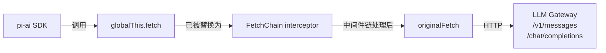
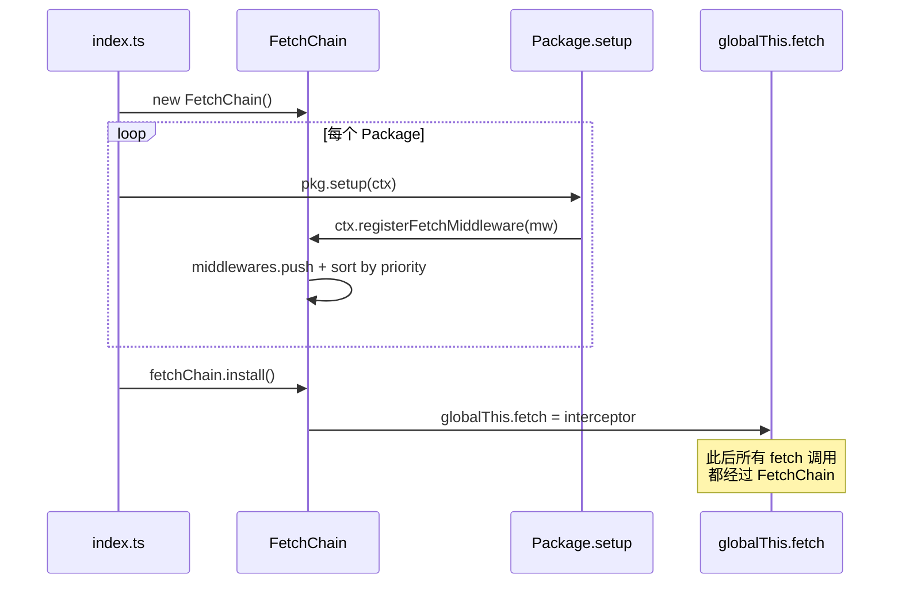
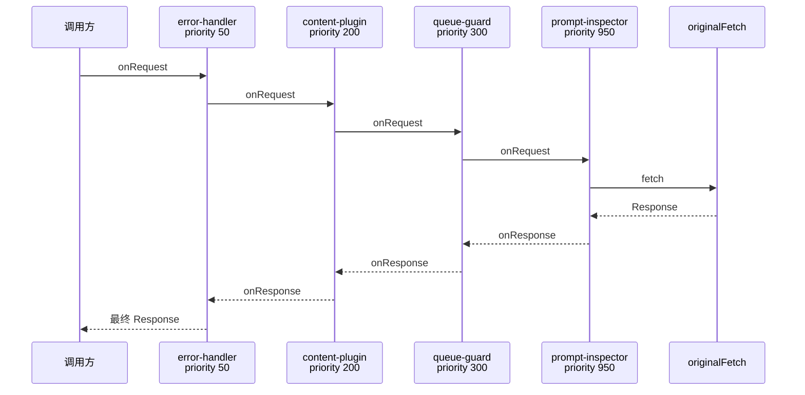
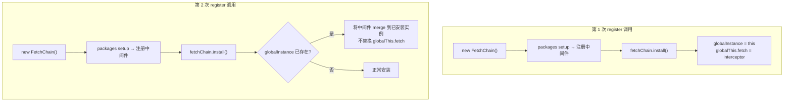
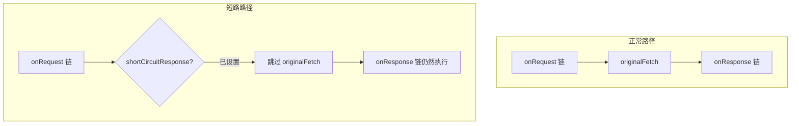
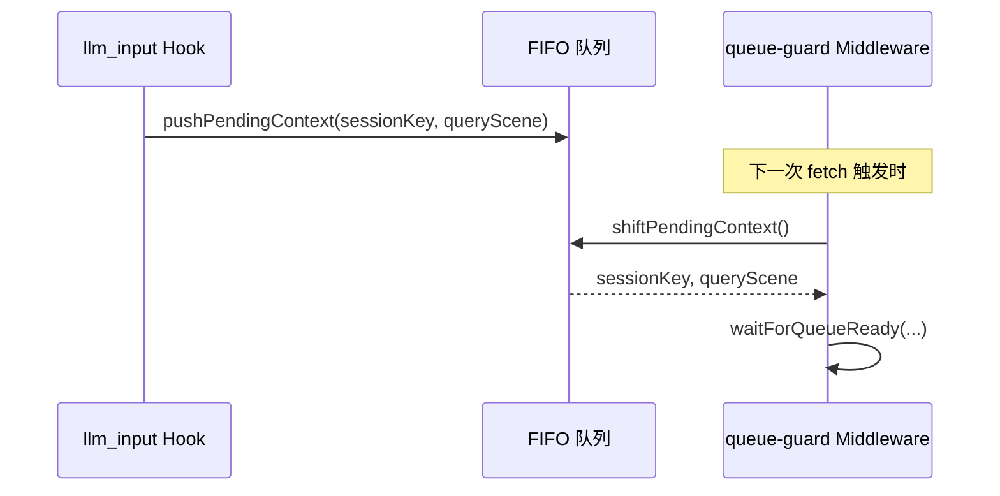

# FetchChain: 用洋葱模型统一管理 Fetch 中间件

> 本文基于 `qclaw-plugin/core/fetch-chain.ts` 源码分析

---

## 一、为什么需要 FetchChain

### 拦截 globalThis.fetch 的原理

OpenClaw 使用 `@mariozechner/pi-ai` SDK 发送 LLM 请求（Anthropic `/v1/messages` 和 OpenAI `/chat/completions`）。SDK 底层直接调用 `globalThis.fetch`。因此，**替换 `globalThis.fetch` 就能拦截所有出站的 LLM 请求和响应**——不需要侵入 OpenClaw 核心代码。




**为什么不用 Hook？**
Hook 事件（`llm_input`、`llm_output` 等）由 OpenClaw 在特定节点触发，**无法修改 HTTP 请求体或响应体**。Fetch 层中间件能做 Hook 做不到的事：


| 能力                     | Hook | FetchChain |
| ---------------------- | ---- | ---------- |
| 修改请求 headers / body    | -    | ✓          |
| 读取 / 替换 Response 对象    | -    | ✓          |
| 在请求发出前阻塞等待             | -    | ✓          |
| 跳过真实请求，返回伪造响应          | -    | ✓          |
| 获取会话级上下文（sessionKey 等） | ✓    | -          |


实际使用中两者互补——Hook 提供业务上下文，FetchMiddleware 做 HTTP 层操控。

### 封装 FetchChain

 封装 FetchChain 之后，方便管理维护和扩展， Package 通过统一管线接入：

| Package                  | priority | 阶段         | 职责                      |
| ------------------------ | -------- | ---------- | ----------------------- |
| `error-response-handler` | 50       | onResponse | HTTP 4xx/5xx → SSE 友好文案 |
| `qmemory`                | 100      | onRequest  | 注入任务恢复指令到 messages      |
| `content-plugin`         | 200      | onRequest  | 认证头、链路追踪、安全审核           |
| `pcmgr-ai-security`      | 250      | onRequest  | 内容安全检测，违规短路             |
| `trace-span-reporter`    | 250      | onRequest  | 注入 `x-agent-request-id` |
| `queue-guard`            | 300      | onRequest  | LLM 请求排队，资源不足时阻塞        |
| `prompt-optimizer`       | 900      | onRequest  | 改写 prompt 结构、路径重写       |
| `prompt-inspector`       | 950      | onResponse | 捕获原始 LLM 响应，全链路追踪       |


---

## 二、架构与执行模型

### 组件关系与生命周期

Package 不直接 `import FetchChain`，只通过 `QClawContext` 的三个方法操作，实现依赖隔离：

```typescript
ctx.registerFetchMiddleware(mw)   → fetchChain.register(mw)
ctx.getOriginalFetch()            → fetchChain.getOriginalFetch()
ctx.onMiddlewareExecuted(obs)     → fetchChain.onMiddlewareExecuted(obs)
```

完整生命周期：




### request-response 执行顺序

request 阶段按 priority **正序**执行，response 阶段按 priority **逆序**执行：




`execute()` 核心逻辑（简化）：

```typescript
private async execute(input, init): Promise<Response> {
  const matched = this.middlewares.filter(m => !m.match || m.match(input, init));
  if (matched.length === 0) return this.originalFetch!(input, init);

  let ctx = { input, init, extra: {} };

  // onRequest 正序
  for (const mw of matched) {
    if (mw.onRequest) ctx = await mw.onRequest(ctx);
  }

  // 短路检测 or 调用原始 fetch
  let response = ctx.shortCircuitResponse
    ?? await this.originalFetch!(ctx.input, ctx.init);

  // onResponse 逆序
  for (let i = matched.length - 1; i >= 0; i--) {
    if (matched[i].onResponse)
      response = await matched[i].onResponse({ ...ctx, response });
  }

  return response;
}
```
---

## 三、关键实现细节

### 3.0 Public API 总览

`FetchChain` 对外暴露的公共 API 共五个，各司其职：

```typescript
class FetchChain {
  // 注册中间件（按 id 去重，按 priority 升序排列）
  register(middleware: FetchMiddleware): void

  // 安装：替换 globalThis.fetch 为拦截器，含进程级单例保护
  install(): void

  // 获取原始 fetch 引用（绕过拦截链，供中间件自身发请求使用）
  getOriginalFetch(): typeof fetch

  // 订阅任意中间件 onResponse 执行完毕的事件，返回取消订阅函数
  onMiddlewareExecuted(observer: (ev: MiddlewareExecutedEvent) => void): () => void

  // 获取已注册的中间件列表（只读，用于调试/测试）
  getMiddlewares(): readonly FetchMiddleware[]
}
```

**各方法简介**

| 方法 | 核心行为 | 典型调用方 |
| --- | --- | --- |
| `register` | 按 `id` 去重，按 `priority` 升序插入；`install()` 前后均可调用 | `QClawContext.registerFetchMiddleware` |
| `install` | 保存 `originalFetch`，将 `globalThis.fetch` 替换为拦截闭包；进程内多次调用自动 merge | `qclaw-plugin/index.ts` 入口 |
| `getOriginalFetch` | 返回 `install()` 之前保存的原始 `fetch`；未安装时返回当前 `globalThis.fetch` | 中间件内部发辅助 HTTP 请求 |
| `onMiddlewareExecuted` | 观察者模式，无侵入地监听整条链的执行情况；返回值调用可取消订阅 | `prompt-inspector` 构建审计日志 |
| `getMiddlewares` | 返回只读快照，不暴露内部数组引用 | 测试断言、调试打印 |

**`register` 简化实现**

```typescript
register(middleware: FetchMiddleware): void {
  const idx = this.middlewares.findIndex(m => m.id === middleware.id);
  if (idx !== -1) {
    this.middlewares[idx] = middleware;   // 相同 id 覆盖替换
  } else {
    this.middlewares.push(middleware);
  }
  this.middlewares.sort((a, b) => a.priority - b.priority);
}
```

**`onMiddlewareExecuted` 简化实现**

```typescript
onMiddlewareExecuted(observer: (ev: MiddlewareExecutedEvent) => void): () => void {
  this.middlewareExecutedObservers.push(observer);
  return () => {
    const idx = this.middlewareExecutedObservers.indexOf(observer);
    if (idx !== -1) this.middlewareExecutedObservers.splice(idx, 1);
  };
}
```

> 此外还有两个**仅供测试**的方法：`uninstall()`（恢复 `globalThis.fetch`）和静态方法 `FetchChain._resetGlobalInstance()`（清除单例状态）。生产代码不应调用。

### 3.1 进程级单例保护

**问题**：OpenClaw 会为不同运行上下文（多 agent + gateway）多次调用插件 `register()`，每次都创建新的 `FetchChain` 实例，导致 `globalThis.fetch` 被多层嵌套替换。

**解法**：静态 `globalInstance`，第二个实例调用 `install()` 时，将中间件 merge 进已安装实例，不重复替换 `globalThis.fetch`。




```typescript
install(): void {
  if (FetchChain.globalInstance && FetchChain.globalInstance !== this) {
    const existing = FetchChain.globalInstance;
    for (const mw of this.middlewares) {
      existing.register(mw); // merge 到已安装实例，register() 按 id 去重
    }
    this.installed = true;
    this.originalFetch = existing.originalFetch;
    return; // 不替换 globalThis.fetch
  }
  // ... 正常安装路径
}
```

### 3.2 延迟注册（Late Registration）

**问题**：部分 package 的 `setup()` 是异步的，在 `fetchChain.install()` 之后才完成中间件注册。

**解法**：`execute()` 每次调用时动态读取 `this.middlewares`，而非在 install 时快照。`globalThis.fetch` 指向的闭包始终调用 `this.execute()`，新注册的中间件自动生效。

### 3.3 短路响应（Short-Circuit）

中间件在 `onRequest` 阶段设置 `ctx.shortCircuitResponse`，FetchChain 将**跳过 `originalFetch`**，直接进入 `onResponse` 阶段。




短路后仍然走完整的 `onResponse` 链——保证 `prompt-inspector` 等中间件能捕获每个响应做审计，不管它是真实的还是伪造的。

### 3.4 getOriginalFetch：逃生通道

中间件自身需要发 HTTP 请求（拉配置、调审核接口）时，不能被自己拦截。`getOriginalFetch()` 返回 `install()` 前保存的原始 `fetch` 引用：

```typescript
// packages/error-response-handler/index.ts
const originalFetch = ctx.getOriginalFetch();
await fetchRemoteErrorMessages(originalFetch, ctx.logger, ctx.reporter);
```

同样的模式在 `pcmgr-ai-security`（调用审核接口）和 `queue-guard`（轮询排队接口）中也被使用。

### 3.5 弹性错误隔离

每个阶段独立 try/catch，单个中间件异常不击穿整条链路：


| 阶段                 | 异常处理策略                             |
| ------------------ | ---------------------------------- |
| `onRequest` 异常     | catch 后 **继续执行** 后续中间件             |
| `originalFetch` 异常 | **逆序**尝试各中间件的 `onError`，第一个成功恢复即返回 |
| `onResponse` 异常    | catch 后 **继续执行** 后续中间件，通知 observer |


---

## 四、Package 实战解析

### 4.1 error-response-handler（priority=50）

**角色**：最外层兜底。priority 最小 → `onResponse` 最后执行，作为整条链的兜底错误处理。

```typescript
const middleware: FetchMiddleware = {
  id: 'error-response-handler',
  priority: 50,

  match(input) {
    return isOpenAIUrl(input) || isAnthropicMessagesUrl(input);
  },

  async onResponse(ctx) {
    if (ctx.response.ok) return ctx.response;
    const errorMsg = errorMessages[ctx.response.status] || DEFAULT_ERROR_MSG(status);
    return buildSseErrorResponse(errorMsg, ctx.input);
  },
};
```

**值得关注的细节**：

- `match()` 精确过滤——只处理 `/v1/messages`（Anthropic）和 `/chat/completions`（OpenAI），避免干扰内部 API
- SSE 伪响应要匹配 `pi-ai` SDK 的解析格式（Anthropic 走 `message_start → content_block_delta → message_stop`，OpenAI 走 `chat.completion.chunk`），否则 SDK 会抛 "request ended without sending any chunks"
- 用 `response.clone().text()` 读取 body，不消耗原始 Response 流

### 4.2 queue-guard（priority=300）

**角色**：在 `onRequest` 阶段阻塞 LLM 请求，等后端排队通过后才放行。

```typescript
const middleware: FetchMiddleware = {
  id: 'queue-guard',
  priority: 300,

  match: (input, init) => {
    if ((init?.method || 'GET').toUpperCase() === 'GET') return false;
    if (!init?.body) return false;
    return true;
  },

  onRequest: async (reqCtx) => {
    const jsonBody = tryParseBody(reqCtx.init?.body);
    if (!isLLMRequest(url, jsonBody, builtinLlmBaseUrl)) return reqCtx;

    try {
      const ready = await waitForQueueReady(queryId, queueConfig, ...);
    } catch {
      reqCtx.shortCircuitResponse = buildAbortedLlmResponse(
        jsonBody, '当前为高峰期，已为您暂停任务。');
    }
    return reqCtx;
  },
};
```

**值得关注的细节**：

- **fail-open 策略**：排队接口异常或超时时直接放行，不阻塞用户
- **Hook + Middleware 配合**：Fetch 层拿不到 sessionKey，通过 `llm_input` Hook + FIFO 队列桥接




### 4.3 prompt-inspector（priority=950）

**角色**：开发调试工具。priority 最高 → `onResponse` **最先执行**，捕获未经其他中间件修改的原始 LLM 响应。

```typescript
const middleware: FetchMiddleware = {
  id: 'prompt-inspector',
  priority: 950,

  async onResponse(resCtx) {
    if (!sharedEnabled) return resCtx.response;
    const runId = resCtx.extra?.runId as string | undefined;
    if (runId) {
      rawAssistantContents.set(runId, `[SSE stream captured]`);
    }
    return resCtx.response; // 不修改响应
  },
};
```

同时通过 `ctx.onMiddlewareExecuted()` 订阅所有中间件的 onResponse 执行事件，构建 **Response 修改链审计日志**，无需侵入其他中间件代码：

```typescript
ctx.onMiddlewareExecuted((ev: MiddlewareExecutedEvent) => {
  pendingFetchAuditEntries.push({
    middlewareId: ev.middlewareId,
    priority: ev.priority,
    modified: ev.modified,
    action: ev.action,
    detail: ev.detail,
  });
});
```

---

## 总结

FetchChain 用约 300 行代码解决了一个实际的工程问题：**多个功能模块需要有序、可观测地共享同一个 HTTP 拦截点**。


| 设计点  | 选择                        | 原因                            |
| ---- | ------------------------- | ----------------------------- |
| 拦截方式 | 替换 `globalThis.fetch`     | SDK 直接调用 fetch，这是最小侵入的拦截点     |
| 执行模型 | 洋葱模型 + priority 排序        | 保证 request/response 对称执行，顺序可控 |
| 注册方式 | 通过 QClawContext 间接操作      | Package 与 FetchChain 实现解耦     |
| 多实例  | 进程级单例 + middleware merge  | 应对 OpenClaw 多次调用 register()   |
| 可观测性 | Observer 模式               | 无侵入的执行链审计                     |
| 错误策略 | 逐层 try/catch + onError 恢复 | 单点故障不击穿整条链路                   |


